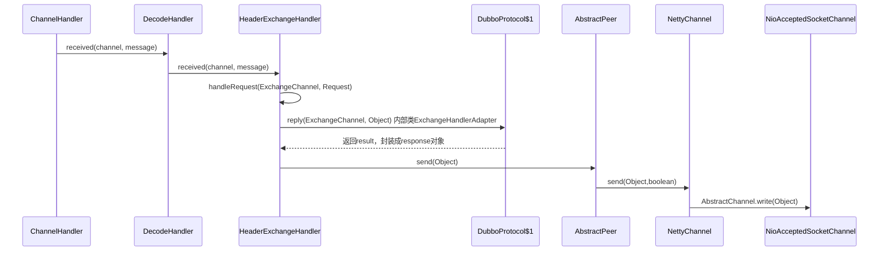

com.alibaba.dubbo.remoting.ChannelHandler

## hierarchy
```
ChannelHandler (com.alibaba.dubbo.remoting)
    AbstractPeer (com.alibaba.dubbo.remoting.transport)
        AbstractChannel (com.alibaba.dubbo.remoting.transport)
            GrizzlyChannel (com.alibaba.dubbo.remoting.transport.grizzly)
            MinaChannel (com.alibaba.dubbo.remoting.transport.mina)
            NettyChannel (com.alibaba.dubbo.remoting.transport.netty)
    AbstractEndpoint (com.alibaba.dubbo.remoting.transport)
        AbstractClient (com.alibaba.dubbo.remoting.transport)
            GrizzlyClient (com.alibaba.dubbo.remoting.transport.grizzly)
            MinaClient (com.alibaba.dubbo.remoting.transport.mina)
            NettyClient (com.alibaba.dubbo.remoting.transport.netty)
        AbstractServer (com.alibaba.dubbo.remoting.transport)
            GrizzlyServer (com.alibaba.dubbo.remoting.transport.grizzly)
            MinaServer (com.alibaba.dubbo.remoting.transport.mina)
            NettyServer (com.alibaba.dubbo.remoting.transport.netty)
    ChannelHandlerAdapter (com.alibaba.dubbo.remoting.transport)
        TelnetHandlerAdapter (com.alibaba.dubbo.remoting.telnet.support)
    ChannelHandlerDelegate (com.alibaba.dubbo.remoting.transport)
        AbstractChannelHandlerDelegate (com.alibaba.dubbo.remoting.transport)
            DecodeHandler (com.alibaba.dubbo.remoting.transport)
            HeartbeatHandler (com.alibaba.dubbo.remoting.exchange.support.header)
            MultiMessageHandler (com.alibaba.dubbo.remoting.transport)
        HeaderExchangeHandler (com.alibaba.dubbo.remoting.exchange.support.header)
            WrappedChannelHandler (com.alibaba.dubbo.remoting.transport.dispatcher)
            AllChannelHandler (com.alibaba.dubbo.remoting.transport.dispatcher.all)
            ConnectionOrderedChannelHandler (com.alibaba.dubbo.remoting.transport.dispatcher.connection)
            ExecutionChannelHandler (com.alibaba.dubbo.remoting.transport.dispatcher.execution)
            MessageOnlyChannelHandler (com.alibaba.dubbo.remoting.transport.dispatcher.message)
    ChannelHandlerDispatcher (com.alibaba.dubbo.remoting.transport)
    ExchangeHandler (com.alibaba.dubbo.remoting.exchange)
        ExchangeHandlerAdapter (com.alibaba.dubbo.remoting.exchange.support)
            1 in DubboProtocol (com.alibaba.dubbo.rpc.protocol.dubbo)
            1 in ThriftProtocol (com.alibaba.dubbo.rpc.protocol.thrift)
        ExchangeHandlerDispatcher (com.alibaba.dubbo.remoting.exchange.support)
```

## define
* connected
* disconnected
* sent
* received
* caught


## sequence
