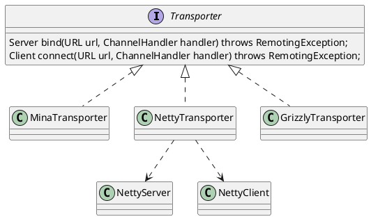

com.alibaba.dubbo.remoting.Transporter
## hierachy
```
Transporter (com.alibaba.dubbo.remoting)
    MinaTransporter (com.alibaba.dubbo.remoting.transport.mina)
    NettyTransporter (com.alibaba.dubbo.remoting.transport.netty)
    GrizzlyTransporter (com.alibaba.dubbo.remoting.transport.grizzly)
```

## define
* bind() 服务端绑定
* connect() 连接服务端

