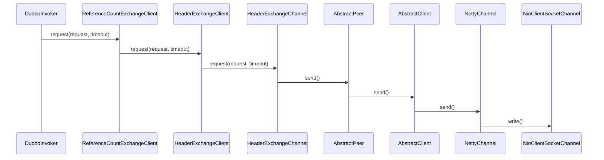

```
ExchangeClient (com.alibaba.dubbo.remoting.exchange)
    HeaderExchangeClient (com.alibaba.dubbo.remoting.exchange.support.header)
    LazyConnectExchangeClient (com.alibaba.dubbo.rpc.protocol.dubbo)
    ReferenceCountExchangeClient (com.alibaba.dubbo.rpc.protocol.dubbo)
```

## 交换层-传输层
