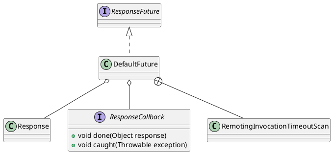

com.alibaba.dubbo.remoting.exchange.support.DefaultFuture

## hierarchy
```
ResponseFuture (com.alibaba.dubbo.remoting.exchange)
    DefaultFuture (com.alibaba.dubbo.remoting.exchange.support)
    SimpleFuture (com.alibaba.dubbo.remoting.exchange.support)
```

## define


