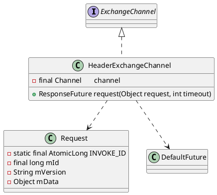

com.alibaba.dubbo.remoting.exchange.support.header.HeaderExchangeChannel

## hierarchy
```
ExchangeChannel (com.alibaba.dubbo.remoting.exchange)
    ExchangeClient (com.alibaba.dubbo.remoting.exchange)
        HeaderExchangeClient (com.alibaba.dubbo.remoting.exchange.support.header)
        LazyConnectExchangeClient (com.alibaba.dubbo.rpc.protocol.dubbo)
        ReferenceCountExchangeClient (com.alibaba.dubbo.rpc.protocol.dubbo)
    HeaderExchangeChannel (com.alibaba.dubbo.remoting.exchange.support.header)
```
## define



## method

### request
RpcInvocation -> Request