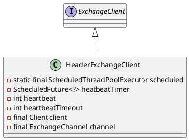

com.alibaba.dubbo.remoting.exchange.support.header.HeaderExchangeClient

## define

```plantuml
@startuml

interface ExchangeClient

class HeaderExchangeClient {
    - static final ScheduledThreadPoolExecutor scheduled
    - ScheduledFuture<?> heatbeatTimer
    - int heartbeat
    - int heartbeatTimeout
    - final Client client
    - final ExchangeChannel channel
}

ExchangeClient ^.. HeaderExchangeClient

@enduml
```
