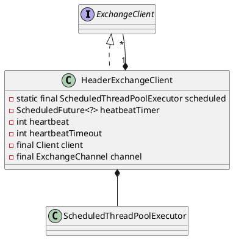

com.alibaba.dubbo.remoting.exchange.support.header.HeaderExchangeClient

* ScheduledThreadPoolExecutor
* ScheduledFuture

## define

## desc
提供心跳检查功能；
将send、request、close等事件转由HeaderExchangeChannel处理，HeaderExchangeChannel对象中的Channel为所选的NIO框架对应的client对象；
以request为例，调用流程如下：
HeaderExchangeClient.request(Object request)->
HeaderExchangeChannel.request(Object request)->
(NettyClient)AbstractPeer.send(Object message)->
(NettyClient)AbstractClient.send(Object message,boolean sent)。
