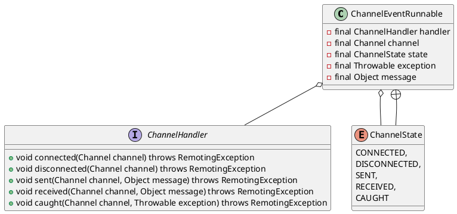

com.alibaba.dubbo.remoting.transport.dispatcher.ChannelEventRunnable


## define


## invoke
```
    at com.alibaba.dubbo.common.bytecode.Wrapper5.invokeMethod(Wrapper5.java)
	at com.alibaba.dubbo.rpc.proxy.javassist.JavassistProxyFactory$1.doInvoke(JavassistProxyFactory.java:46)
	at com.alibaba.dubbo.rpc.proxy.AbstractProxyInvoker.invoke(AbstractProxyInvoker.java:72)
	
	// 包装器
	at com.alibaba.dubbo.rpc.protocol.InvokerWrapper.invoke(InvokerWrapper.java:53)
	
	// 过滤器链
	at com.alibaba.dubbo.rpc.filter.ExceptionFilter.invoke(ExceptionFilter.java:64)
	at com.alibaba.dubbo.rpc.protocol.ProtocolFilterWrapper$1.invoke(ProtocolFilterWrapper.java:69)
	at com.alibaba.dubbo.monitor.support.MonitorFilter.invoke(MonitorFilter.java:65)
	at com.alibaba.dubbo.rpc.protocol.ProtocolFilterWrapper$1.invoke(ProtocolFilterWrapper.java:69)
	at com.alibaba.dubbo.rpc.filter.TimeoutFilter.invoke(TimeoutFilter.java:42)
	at com.alibaba.dubbo.rpc.protocol.ProtocolFilterWrapper$1.invoke(ProtocolFilterWrapper.java:69)
	at com.alibaba.dubbo.rpc.protocol.dubbo.filter.TraceFilter.invoke(TraceFilter.java:78)
	at com.alibaba.dubbo.rpc.protocol.ProtocolFilterWrapper$1.invoke(ProtocolFilterWrapper.java:69)
	at com.weidai.middleware.log.filter.DubboLogTraceFilter.invoke(DubboLogTraceFilter.java:23)
	at com.alibaba.dubbo.rpc.protocol.ProtocolFilterWrapper$1.invoke(ProtocolFilterWrapper.java:69)
	at com.alibaba.dubbo.rpc.filter.ContextFilter.invoke(ContextFilter.java:61)
	at com.alibaba.dubbo.rpc.protocol.ProtocolFilterWrapper$1.invoke(ProtocolFilterWrapper.java:69)
	at com.alibaba.dubbo.rpc.filter.GenericFilter.invoke(GenericFilter.java:132)
	at com.alibaba.dubbo.rpc.protocol.ProtocolFilterWrapper$1.invoke(ProtocolFilterWrapper.java:69)
	at com.alibaba.dubbo.rpc.filter.ClassLoaderFilter.invoke(ClassLoaderFilter.java:38)
	at com.alibaba.dubbo.rpc.protocol.ProtocolFilterWrapper$1.invoke(ProtocolFilterWrapper.java:69)
	at com.alibaba.dubbo.rpc.filter.EchoFilter.invoke(EchoFilter.java:38)
	at com.alibaba.dubbo.rpc.protocol.ProtocolFilterWrapper$1.invoke(ProtocolFilterWrapper.java:69)
	
	// dubbo协议处理
	at com.alibaba.dubbo.rpc.protocol.dubbo.DubboProtocol$1.reply(DubboProtocol.java:102)
	
	// 头部交换处理
	at com.alibaba.dubbo.remoting.exchange.support.header.HeaderExchangeHandler.handleRequest(HeaderExchangeHandler.java:98)
	at com.alibaba.dubbo.remoting.exchange.support.header.HeaderExchangeHandler.received(HeaderExchangeHandler.java:170)
	
	// 解码器处理
	at com.alibaba.dubbo.remoting.transport.DecodeHandler.received(DecodeHandler.java:52)
	
	// 通道事件
	at com.alibaba.dubbo.remoting.transport.dispatcher.ChannelEventRunnable.run(ChannelEventRunnable.java:81)
	at java.util.concurrent.ThreadPoolExecutor.runWorker(ThreadPoolExecutor.java:1149)
	at java.util.concurrent.ThreadPoolExecutor$Worker.run(ThreadPoolExecutor.java:624)
	at java.lang.Thread.run(Thread.java:748)
```