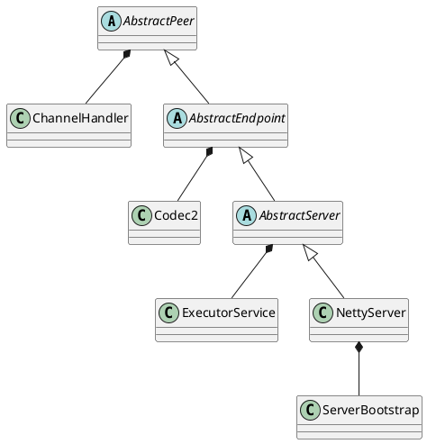

com.alibaba.dubbo.remoting.transport.netty.NettyServer

## hierarchy
```
AbstractPeer (com.alibaba.dubbo.remoting.transport)
    AbstractEndpoint (com.alibaba.dubbo.remoting.transport)
        AbstractServer (com.alibaba.dubbo.remoting.transport)
            NettyServer (com.alibaba.dubbo.remoting.transport.netty)
```
## define
