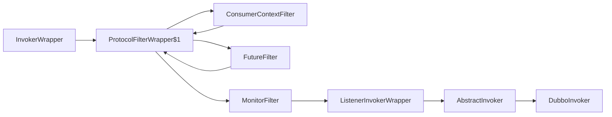

com.alibaba.dubbo.rpc.Filter

## hierarchy
```
Filter (com.alibaba.dubbo.rpc)
    ConsumerContextFilter (com.alibaba.dubbo.rpc.filter)
    FutureFilter (com.alibaba.dubbo.rpc.protocol.dubbo.filter)
    MonitorFilter (com.alibaba.dubbo.monitor.support)
    EchoFilter (com.alibaba.dubbo.rpc.filter)
    ContextFilter (com.alibaba.dubbo.rpc.filter)
    GenericImplFilter (com.alibaba.dubbo.rpc.filter)
    GenericFilter (com.alibaba.dubbo.rpc.filter)
    DeprecatedFilter (com.alibaba.dubbo.rpc.filter)
    ExecuteLimitFilter (com.alibaba.dubbo.rpc.filter)
    TokenFilter (com.alibaba.dubbo.rpc.filter)
    ActiveLimitFilter (com.alibaba.dubbo.rpc.filter)
    TraceFilter (com.alibaba.dubbo.rpc.protocol.dubbo.filter)
    AccessLogFilter (com.alibaba.dubbo.rpc.filter)
    CacheFilter (com.alibaba.dubbo.cache.filter)
    ClassLoaderFilter (com.alibaba.dubbo.rpc.filter)
    ExceptionFilter (com.alibaba.dubbo.rpc.filter)
    TimeoutFilter (com.alibaba.dubbo.rpc.filter)
    TpsLimitFilter (com.alibaba.dubbo.rpc.filter)
    DubboLogTraceFilter (com.weidai.middleware.log.filter)
    ValidationFilter (com.alibaba.dubbo.validation.filter)
    CompatibleFilter (com.alibaba.dubbo.rpc.filter)
```

## define

```yuml
// {type:class}
[Filter]^-.-[ConsumerContextFilter]
[Filter]^-.-[FutureFilter]
[Filter]^-.-[ExceptionFilter]
[Filter]^-.-[MonitorFilter]
[Filter]^-.-[ContextFilter]
```


## refer-invoke
