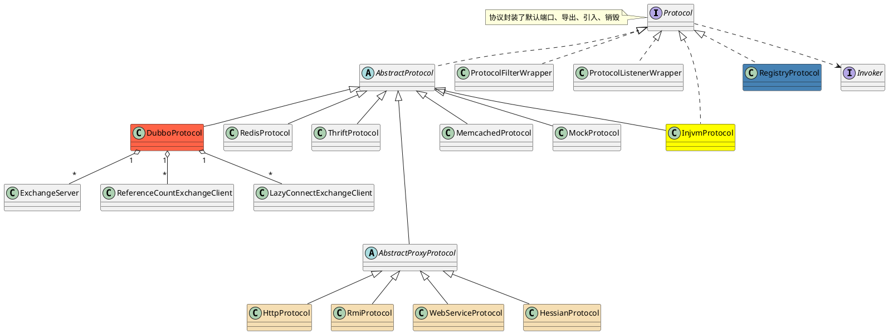

com.alibaba.dubbo.rpc.Protocol

## hierarchy
```
Protocol (com.alibaba.dubbo.rpc)
    AbstractProtocol (com.alibaba.dubbo.rpc.protocol)
        RedisProtocol (com.alibaba.dubbo.rpc.protocol.redis)
        InjvmProtocol (com.alibaba.dubbo.rpc.protocol.injvm)
        DubboProtocol (com.alibaba.dubbo.rpc.protocol.dubbo)
        ThriftProtocol (com.alibaba.dubbo.rpc.protocol.thrift)
        AbstractProxyProtocol (com.alibaba.dubbo.rpc.protocol)
            HttpProtocol (com.alibaba.dubbo.rpc.protocol.http)
            RmiProtocol (com.alibaba.dubbo.rpc.protocol.rmi)
            WebServiceProtocol (com.alibaba.dubbo.rpc.protocol.webservice)
            HessianProtocol (com.alibaba.dubbo.rpc.protocol.hessian)
        MemcachedProtocol (com.alibaba.dubbo.rpc.protocol.memcached)
        MockProtocol (com.alibaba.dubbo.rpc.support)
    ProtocolFilterWrapper (com.alibaba.dubbo.rpc.protocol)
    ProtocolListenerWrapper (com.alibaba.dubbo.rpc.protocol)
    InjvmProtocol (com.alibaba.dubbo.rpc.protocol.injvm)
    RegistryProtocol (com.alibaba.dubbo.registry.integration)
```

## define
* 定义了端口、导出、导入、销毁规约
* 基于netty的多协议开发
* 通信协议定义了通信中的语法学, 语义学和同步规则以及可能存在的错误检测与纠正

