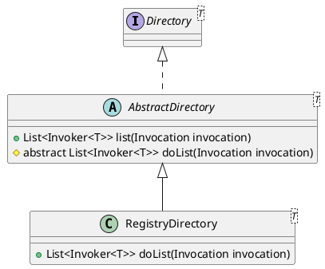

com.alibaba.dubbo.rpc.cluster.directory.AbstractDirectory

## hierachy
```
Directory (com.alibaba.dubbo.rpc.cluster)
    AbstractDirectory (com.alibaba.dubbo.rpc.cluster.directory)
        RegistryDirectory (com.alibaba.dubbo.registry.integration)
        StaticDirectory (com.alibaba.dubbo.rpc.cluster.directory)
```

## define

