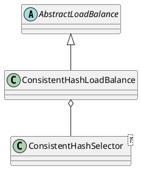

com.alibaba.dubbo.rpc.cluster.loadbalance.ConsistentHashLoadBalance

一致性 Hash，相同参数的请求总是发到同一提供者。
当某一台提供者挂时，原本发往该提供者的请求，基于虚拟节点，平摊到其它提供者，不会引起剧烈变动。

ConcurrentMap
TreeMap

## hierarchy
## define

```plantuml
@startuml

abstract class AbstractLoadBalance

AbstractLoadBalance ^-- ConsistentHashLoadBalance

class ConsistentHashLoadBalance {

}

ConsistentHashLoadBalance o-- ConsistentHashSelector

class ConsistentHashSelector<T>

@enduml
```