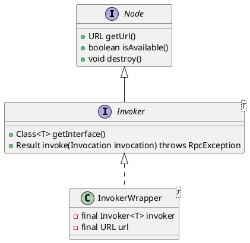

com.alibaba.dubbo.rpc.protocol.InvokerWrapper

## hierarchy
```
InvokerWrapper (com.alibaba.dubbo.rpc.protocol)
    InvokerDelegete in RegistryDirectory (com.alibaba.dubbo.registry.integration)
    InvokerDelegete in RegistryProtocol (com.alibaba.dubbo.registry.integration)
```

## define
