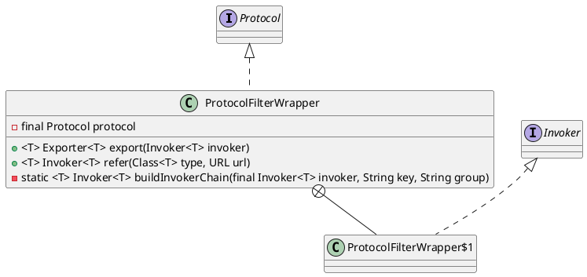

com.alibaba.dubbo.rpc.protocol.ProtocolFilterWrapper

## hierarchy
```
Protocol (com.alibaba.dubbo.rpc)
    AbstractProtocol (com.alibaba.dubbo.rpc.protocol)
    ProtocolFilterWrapper (com.alibaba.dubbo.rpc.protocol)
    ProtocolListenerWrapper (com.alibaba.dubbo.rpc.protocol)
    InjvmProtocol (com.alibaba.dubbo.rpc.protocol.injvm)
    RegistryProtocol (com.alibaba.dubbo.registry.integration)
```
## define
* 导出、引入时构建调用者链

