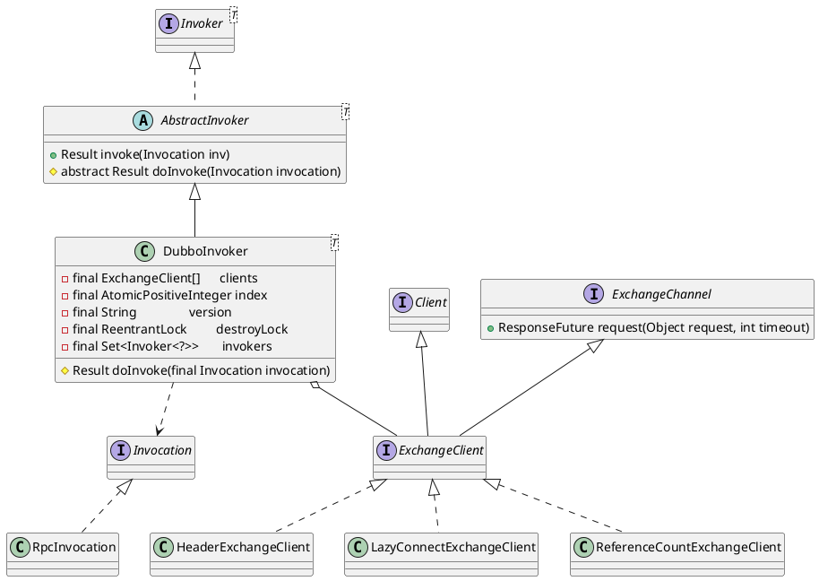

com.alibaba.dubbo.rpc.protocol.dubbo.DubboInvoker

* AtomicPositiveInteger 对AtomicInteger的包装
* ReentrantLock

## hierarchy
```
AbstractInvoker (com.alibaba.dubbo.rpc.protocol)
    ThriftInvoker (com.alibaba.dubbo.rpc.protocol.thrift)
    1 in RedisProtocol (com.alibaba.dubbo.rpc.protocol.redis)
    1 in MemcachedProtocol (com.alibaba.dubbo.rpc.protocol.memcached)
    2 in AbstractProxyProtocol (com.alibaba.dubbo.rpc.protocol)
    ChannelWrappedInvoker (com.alibaba.dubbo.rpc.protocol.dubbo)
    InjvmInvoker (com.alibaba.dubbo.rpc.protocol.injvm)
    DubboInvoker (com.alibaba.dubbo.rpc.protocol.dubbo)
```

## define
* doInvoke
  * isOneway 异步不带回调
  * isAsync 异步带回调
  * sync 同步



## invoke
* ReferenceCountExchangeClient
* HeaderExchangeClient
* HeaderExchangeChannel