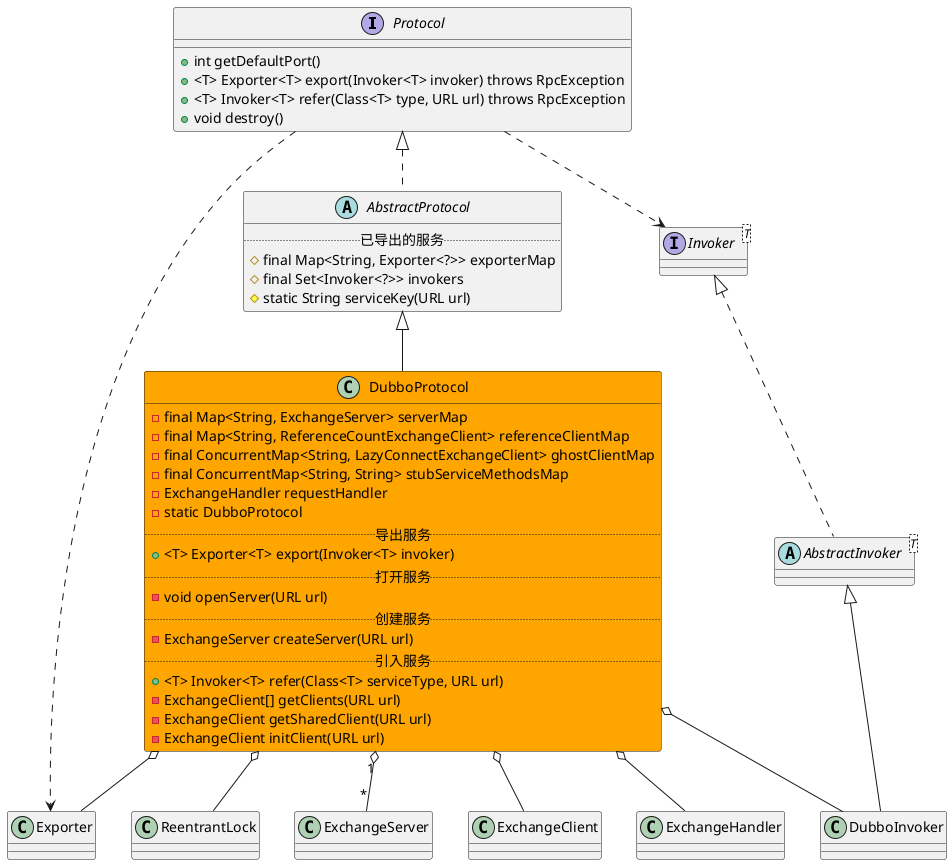

com.alibaba.dubbo.rpc.protocol.dubbo.DubboProtocol

* ReentrantLock
* ConcurrentHashMap
* ConcurrentHashSet

## hierarchy
```
AbstractProtocol (com.alibaba.dubbo.rpc.protocol)
    RedisProtocol (com.alibaba.dubbo.rpc.protocol.redis)
    InjvmProtocol (com.alibaba.dubbo.rpc.protocol.injvm)
    DubboProtocol (com.alibaba.dubbo.rpc.protocol.dubbo)
    ThriftProtocol (com.alibaba.dubbo.rpc.protocol.thrift)
    AbstractProxyProtocol (com.alibaba.dubbo.rpc.protocol)
    MemcachedProtocol (com.alibaba.dubbo.rpc.protocol.memcached)
    MockProtocol (com.alibaba.dubbo.rpc.support)
```

## define


## methods
openServer(URL url)

ExchangeServer createServer(URL url)

