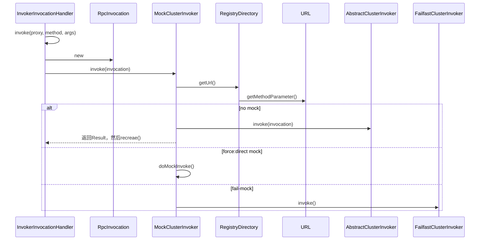
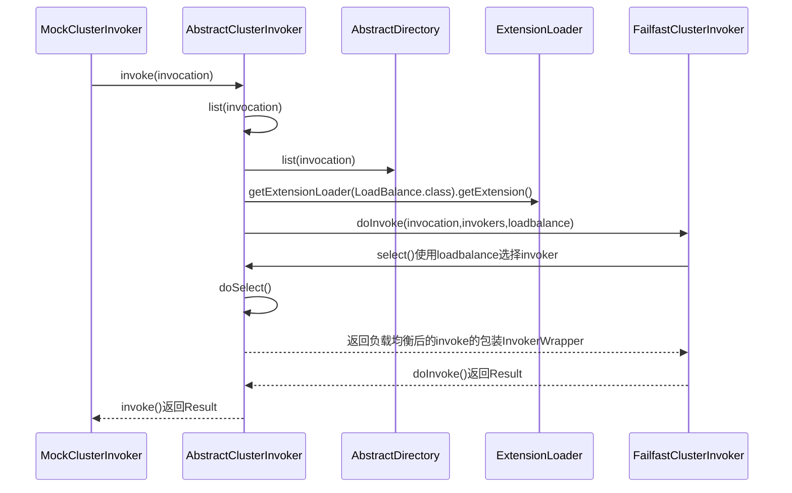
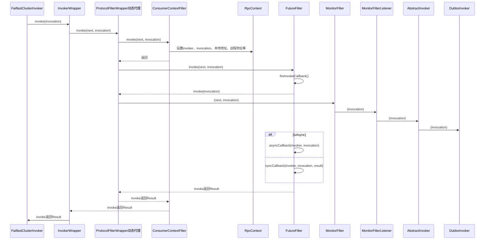
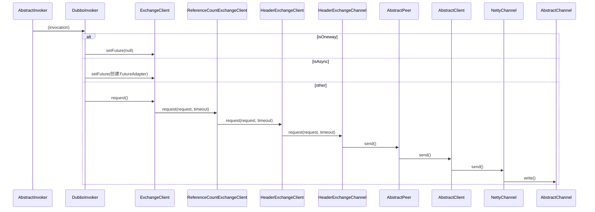

com.alibaba.dubbo.rpc.proxy.InvokerInvocationHandler

## refere调用过程

### 整体


### cluster-router-loadbalance


### protocol


### dubbo-invoker 交换层、传输层

###


### Invocation
* Invocation 封装了方法名称、方法参数类型、方法参数值、附加属性

```yuml
// {type:class}

[Invocation]^-.-[RpcInvocation]
[RpcInvocation]^-[DecodeableRpcInvocation]

[Node]^-[Invoker]
[Invocation]++->[Invoker]


```