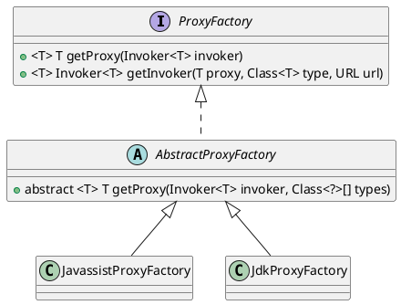

com.alibaba.dubbo.rpc.proxy.AbstractProxyFactory
## hierarchy
```
ProxyFactory (com.alibaba.dubbo.rpc)
    AbstractProxyFactory (com.alibaba.dubbo.rpc.proxy)
        JavassistProxyFactory (com.alibaba.dubbo.rpc.proxy.javassist)
        JdkProxyFactory (com.alibaba.dubbo.rpc.proxy.jdk)
```
## define
