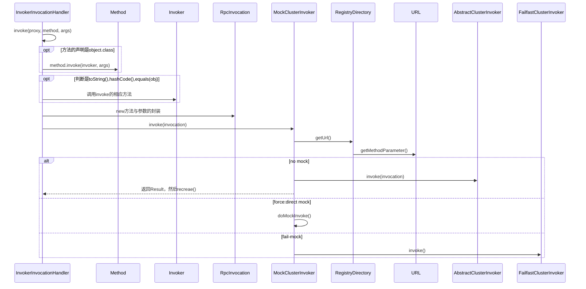
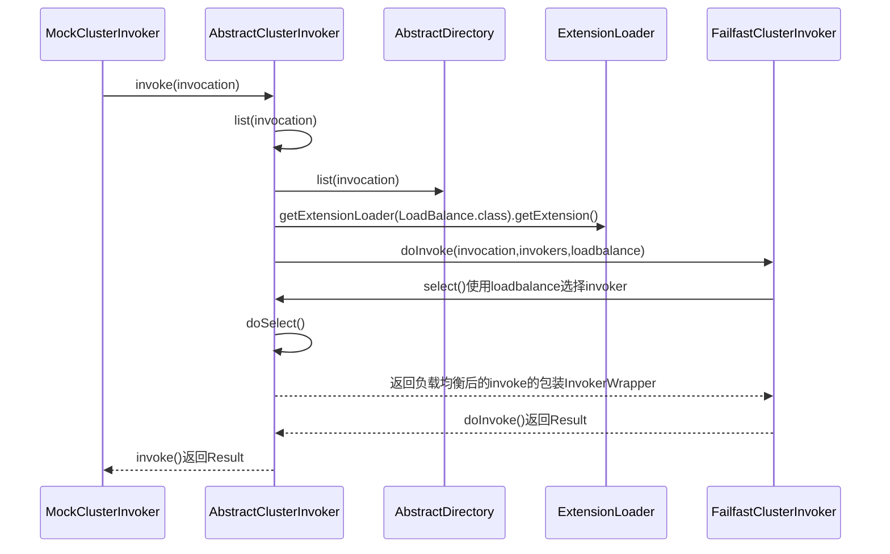
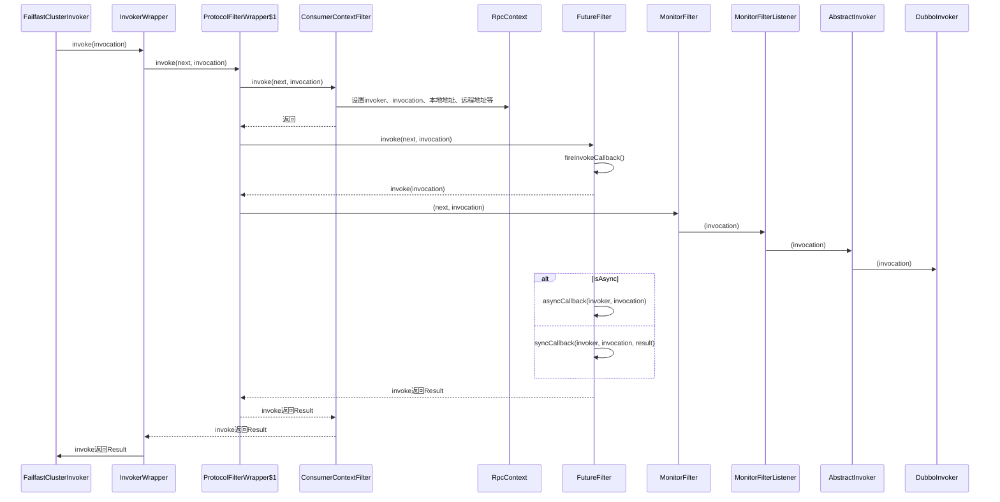
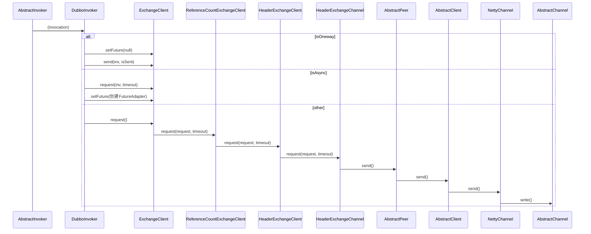

com.alibaba.dubbo.rpc.proxy.InvokerInvocationHandler

## refere调用过程

### 整体

```mermaid
sequenceDiagram
    %% 实现jdk的调用处理器
    InvokerInvocationHandler->>InvokerInvocationHandler:invoke(proxy, method, args)
    opt 方法的声明是object.class
        InvokerInvocationHandler->>Method:method.invoke(invoker, args)
    end
    opt 判断是toString(),hashCode(),equals(obj)
        InvokerInvocationHandler->>Invoker:调用invoke的相应方法
    end

    InvokerInvocationHandler->>RpcInvocation:new方法与参数的封装
    %% 这里的invoke封装了模拟数据、集群策略、负载均衡、异步同步处理、过滤链的invoke
    InvokerInvocationHandler->>MockClusterInvoker:invoke(invocation)
    
    %% 注册中心url
    MockClusterInvoker->>RegistryDirectory:getUrl()
    RegistryDirectory->>URL:getMethodParameter()
    
    %% 根据模拟集群调用器选择
    alt no mock
        MockClusterInvoker->>AbstractClusterInvoker:invoke(invocation)
        MockClusterInvoker-->>InvokerInvocationHandler:返回Result，然后recreae()
    else force:direct mock
        MockClusterInvoker->>MockClusterInvoker:doMockInvoke()
    else fail-mock
        MockClusterInvoker->>FailfastClusterInvoker:invoke()
    end 
```

### cluster-router-loadbalance

```mermaid
sequenceDiagram
    %% 集群策略
    MockClusterInvoker->>AbstractClusterInvoker:invoke(invocation)
    %% 路由选择
    AbstractClusterInvoker->>AbstractClusterInvoker:list(invocation)
    AbstractClusterInvoker->>AbstractDirectory:list(invocation)
    %% 负载均衡
    AbstractClusterInvoker->>ExtensionLoader:getExtensionLoader(LoadBalance.class).getExtension()
    AbstractClusterInvoker->>FailfastClusterInvoker:doInvoke(invocation,invokers,loadbalance)
    %% 负载均衡
    FailfastClusterInvoker->>AbstractClusterInvoker:select()使用loadbalance选择invoker
    AbstractClusterInvoker->>AbstractClusterInvoker:doSelect()
    AbstractClusterInvoker-->>FailfastClusterInvoker:返回负载均衡后的invoke的包装InvokerWrapper
    %% 返回
    FailfastClusterInvoker-->>AbstractClusterInvoker:doInvoke()返回Result
    AbstractClusterInvoker-->>MockClusterInvoker:invoke()返回Result
```

### protocol

```mermaid
sequenceDiagram
    %% 集群策略 快速失败
    FailfastClusterInvoker->>InvokerWrapper:invoke(invocation)
    %% 协议过滤器包装
    InvokerWrapper->>ProtocolFilterWrapper$1:invoke(next, invocation)
    
    %% 消息上下文过滤器
    ProtocolFilterWrapper$1->>ConsumerContextFilter:invoke(next, invocation)
    ConsumerContextFilter->>RpcContext:设置invoker、invocation、本地地址、远程地址等
    ConsumerContextFilter-->>ProtocolFilterWrapper$1:返回
    
    %% future
    ProtocolFilterWrapper$1->>FutureFilter:invoke(next, invocation)
    FutureFilter->>FutureFilter:fireInvokeCallback()

    FutureFilter-->>ProtocolFilterWrapper$1:invoke(invocation)
    ProtocolFilterWrapper$1->>MonitorFilter:(next, invocation)
    
    %% 监控器
    MonitorFilter->>MonitorFilterListener:(invocation)
    MonitorFilterListener->>AbstractInvoker:(invocation)

    %% dubboinvoker
    AbstractInvoker->>DubboInvoker:(invocation)
    
    %% future同步异步
    alt isAsync
        FutureFilter->>FutureFilter:asyncCallback(invoker, invocation)
    else
        FutureFilter->>FutureFilter:syncCallback(invoker, invocation, result)
    end

    %% 返回
    FutureFilter-->>ProtocolFilterWrapper$1:invoke返回Result
    ProtocolFilterWrapper$1-->>ConsumerContextFilter:invoke返回Result
    ConsumerContextFilter-->>InvokerWrapper:invoke返回Result
    InvokerWrapper->>FailfastClusterInvoker:invoke返回Result
```

### dubbo-invoker 交换层、传输层

```mermaid
sequenceDiagram
    %% dubboinvoker
    AbstractInvoker->>DubboInvoker:(invocation)
    
    alt isOneway
        DubboInvoker->>ExchangeClient:setFuture(null)
        DubboInvoker->>ExchangeClient:send(inv, isSent)
    else isAsync
        DubboInvoker->>ExchangeClient:request(inv, timeout)
        DubboInvoker->>ExchangeClient:setFuture(创建FutureAdapter)
    else other
        %% 交换层
        DubboInvoker->>ExchangeClient:request()
        ExchangeClient->>ReferenceCountExchangeClient:request(request, timeout)
        ReferenceCountExchangeClient->>HeaderExchangeClient:request(request, timeout)
        HeaderExchangeClient->>HeaderExchangeChannel:request(request, timeout)
        
        %% 传输层 tcp协议，端到端的、面向连接与字节流的、可靠的、全双工的传输协议
        HeaderExchangeChannel->>AbstractPeer:send()
        AbstractPeer->>AbstractClient:send()
        AbstractClient->>NettyChannel:send()
        NettyChannel->>AbstractChannel:write()
    end
```