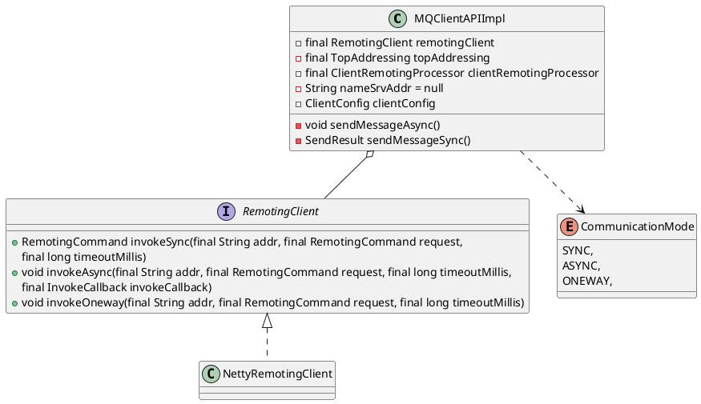

com.alibaba.rocketmq.client.impl.MQClientAPIImpl

## define

```plantuml
@startuml

class MQClientAPIImpl {
    - final RemotingClient remotingClient
    - final TopAddressing topAddressing
    - final ClientRemotingProcessor clientRemotingProcessor
    - String nameSrvAddr = null
    - ClientConfig clientConfig
    - void sendMessageAsync()
    - SendResult sendMessageSync()
}

''''''''''''''''域''''''''''''''''
MQClientAPIImpl o-- RemotingClient
interface RemotingClient {
    + RemotingCommand invokeSync(final String addr, final RemotingCommand request,
                                      final long timeoutMillis)
    + void invokeAsync(final String addr, final RemotingCommand request, final long timeoutMillis,
                            final InvokeCallback invokeCallback)
    + void invokeOneway(final String addr, final RemotingCommand request, final long timeoutMillis)
}
RemotingClient ^.. NettyRemotingClient
class NettyRemotingClient

''''''''''''''''依赖''''''''''''''''
MQClientAPIImpl ..> CommunicationMode
enum CommunicationMode {
    SYNC,
    ASYNC,
    ONEWAY,
}

@enduml
```