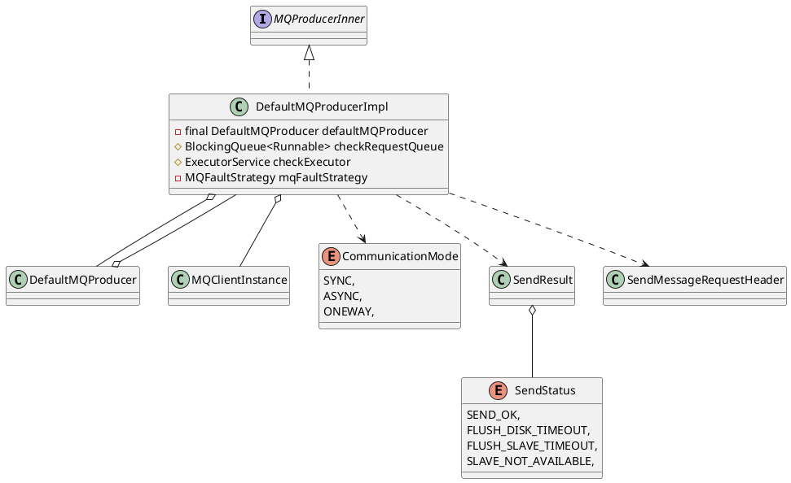

com.alibaba.rocketmq.client.impl.producer.DefaultMQProducerImpl

## define

```plantuml
@startuml

interface MQProducerInner
MQProducerInner ^.. DefaultMQProducerImpl

class DefaultMQProducerImpl {
    - final DefaultMQProducer defaultMQProducer
    # BlockingQueue<Runnable> checkRequestQueue
    # ExecutorService checkExecutor
    - MQFaultStrategy mqFaultStrategy
}

''''''''''''''''域''''''''''''''''
DefaultMQProducerImpl o-- DefaultMQProducer
DefaultMQProducer o-- DefaultMQProducerImpl

DefaultMQProducerImpl o-- MQClientInstance
class MQClientInstance {

}

''''''''''''''''依赖''''''''''''''''
DefaultMQProducerImpl ..> CommunicationMode
enum CommunicationMode {
    SYNC,
    ASYNC,
    ONEWAY,
}

DefaultMQProducerImpl ..> SendResult
class SendResult
SendResult o-- SendStatus
enum SendStatus {
    SEND_OK,
    FLUSH_DISK_TIMEOUT,
    FLUSH_SLAVE_TIMEOUT,
    SLAVE_NOT_AVAILABLE,
}

DefaultMQProducerImpl ..> SendMessageRequestHeader


@enduml
```