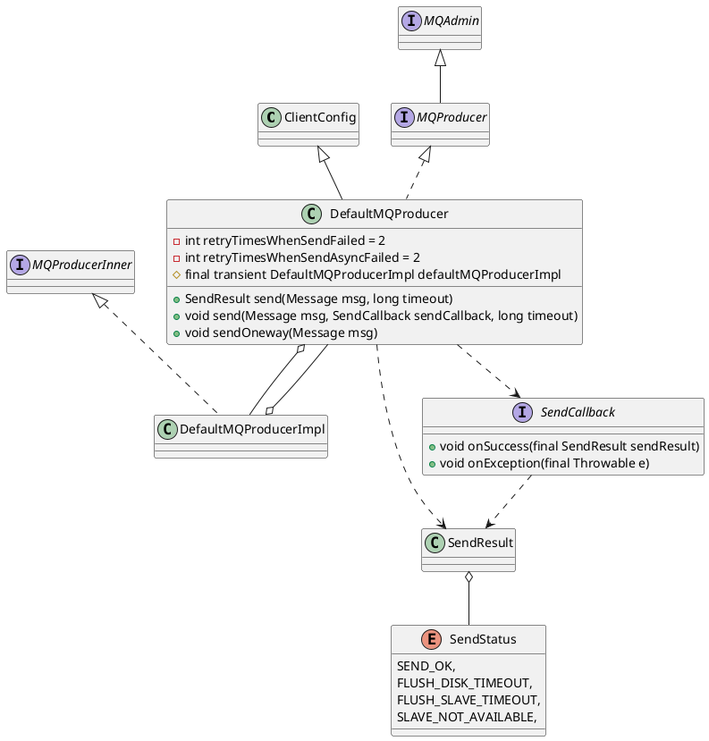

com.alibaba.rocketmq.client.producer.DefaultMQProducer

## hierachy
```
ClientConfig (com.alibaba.rocketmq.client)
    DefaultMQProducer (com.alibaba.rocketmq.client.producer)
        TransactionMQProducer (com.alibaba.rocketmq.client.producer)
```

## define

