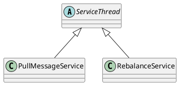

com.alibaba.rocketmq.common.ServiceThread

## hierarchy
```
ServiceThread (com.alibaba.rocketmq.common)
    PullMessageService (com.alibaba.rocketmq.client.impl.consumer)
    RebalanceService (com.alibaba.rocketmq.client.impl.consumer)
```
## define
