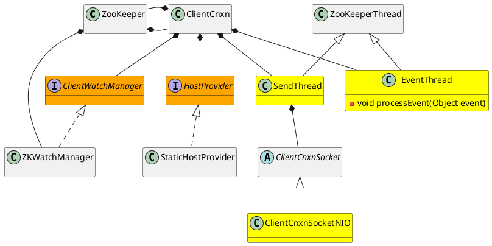

org.apache.zookeeper.ClientCnxn

* CopyOnWriteArraySet
* LinkedBlockingQueue

## define

```plantuml
@startuml

''''''''''''''''''''''''ZooKeeper'''''''''''''''''''''''''''
class ZooKeeper
ZooKeeper *- ClientCnxn
ZooKeeper *-- ZKWatchManager


''''''''''''''''''''''''ClientCnxn'''''''''''''''''''''''''''
class ClientCnxn

ClientCnxn *-- ZooKeeper
ClientCnxn *-- HostProvider
ClientCnxn *-- ClientWatchManager
ClientCnxn *-- SendThread
ClientCnxn *-- EventThread


''''''''''''''''''''''''ClientWatchManager'''''''''''''''''''''''''''
interface ClientWatchManager #orange
ClientWatchManager ^.. ZKWatchManager


''''''''''''''''''''''''HostProvider'''''''''''''''''''''''''''
interface HostProvider #orange
class StaticHostProvider
HostProvider ^.. StaticHostProvider


class ZooKeeperThread
class SendThread #yellow
class EventThread #yellow {
    - void processEvent(Object event)
}

ZooKeeperThread ^-- SendThread
ZooKeeperThread ^-- EventThread

''''''''''''''''''''''''SendThread'''''''''''''''''''''''''''
abstract class ClientCnxnSocket
class ClientCnxnSocketNIO #yellow

SendThread *-- ClientCnxnSocket
ClientCnxnSocket ^-- ClientCnxnSocketNIO

@enduml
```