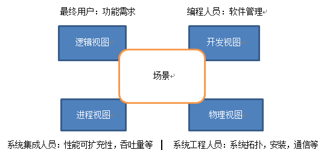

## 架构风格
软件体系结构风格是描述某一特定应用领域中系统组织方式的惯用模式。

代码模式、设计模式、架构模式

管道过滤器风格、面向对象风格、分布式架构、SOA风格、微服务风格

## 架构视图
4 + 1

* 逻辑视图（Logical View），设计的对象模型（使用面向对象的设计方法时）。
* 过程视图（Process View），捕捉设计的并发和同步特征。
* 物理视图（Physical View），描述了软件到硬件的映射，反映了分布式特性。
* 开发视图（Development View），描述了在开发环境中软件的静态组织结构。
* 架构的描述，即所做的各种决定，可以围绕着这四个视图来组织，然后由一些用例 （use cases）或场景(scenarios)来说明，从而形成了第五个视图。

| 视图     | 分解             | 作用               | uml                                      |
| :------- | :--------------- | :----------------- | :--------------------------------------- |
| 逻辑视图 | 面向对象的分解   | 描述系统的功能需求 | 类图                                     |
| 过程视图 | 过程分解         | 并发、同步、通信   | 交互图（序列图、顺序图）、活动图、状态图 |
| 物理视图 | 子系统分解       |                    | 部署图                                   |
| 开发视图 | 软件至硬件的映射 |                    | 类图，组件图                             |
| 场景     | 综合所有的视图   |                    | 用例图                                   |

[“4+1”视图模型](https://www.cnblogs.com/qixin/p/3163536.html)