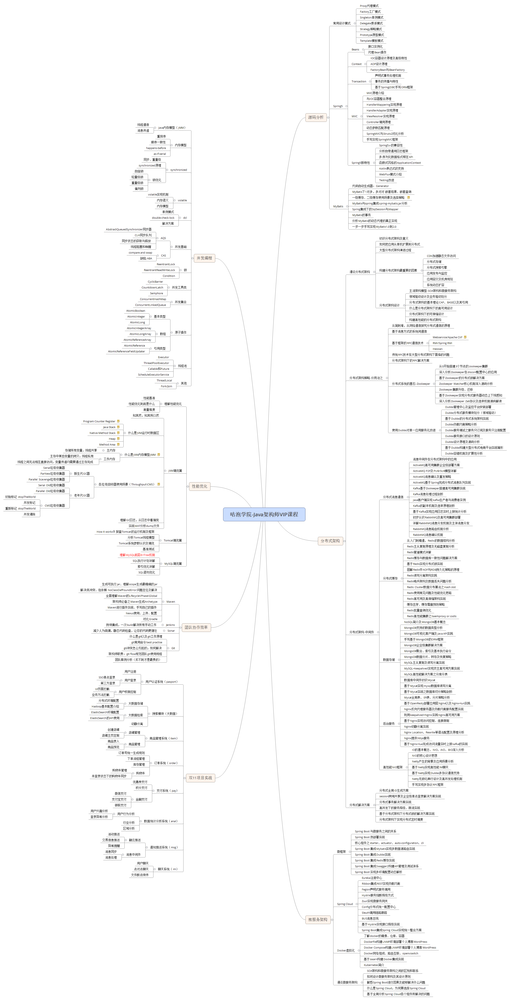
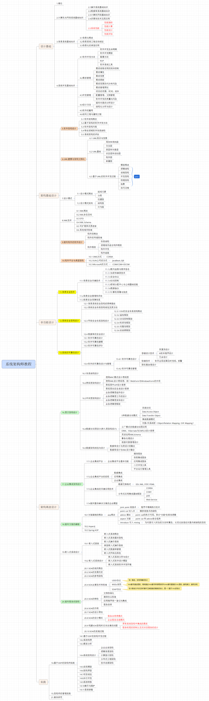
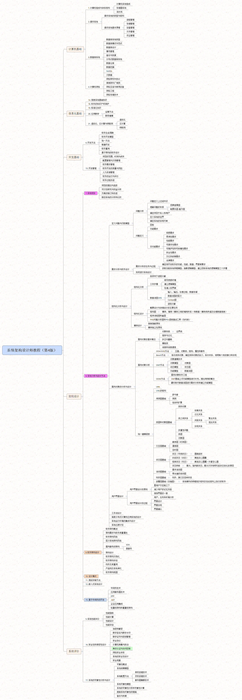

# View Image

this is generated files, just for view image conveniently...

## aliyun-architecture.jpg

## aliyun-architecture.png

## aliyun-ict.jpg

## aliyun-service-product.png

## cloud-it-ict.pg.JPEG

## cloud-saas.jpg

## Java大纲.png

## java高级内容大纲.png

## network-architecture-technology.gif

## uml视图.png

## 咕泡学院-Java架构师VIP课程.png

## 咕泡学院.jpg

## 大型网站架构模式.png

## 大型网站核心架构要素.png

## 未来软件.png

## 系统架构师教程.png

## 系统架构设计师教程（第4版）.png

## 高可用可伸缩架构经验谈.png

