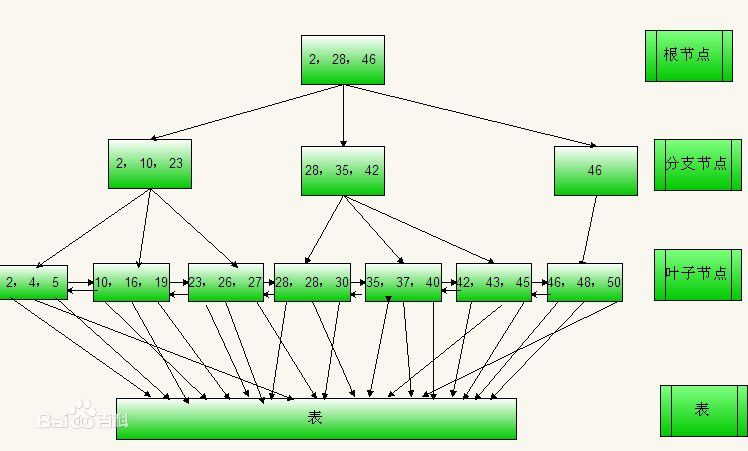

## 索引的概念
索引：在对表需要进行查询或者排序操作时，可以对表中某个或者某几个字段添加索引，对一个字段添加索引就是单个索引，对多个字段添加索引时就是组合索引。

不要滥用索引。因为过多的索引不仅仅会增加物理存储的开销，对于插入、删除、更新操作也会增加处理上的开销，而且会增加优化器在选择索引时的计算代价。

### 存储引擎工作原理

 

## 磁盘
磁道、扇区、柱面和柱头数

* Btree索引
* hash索引
* 空间数据索引
* 全文索引