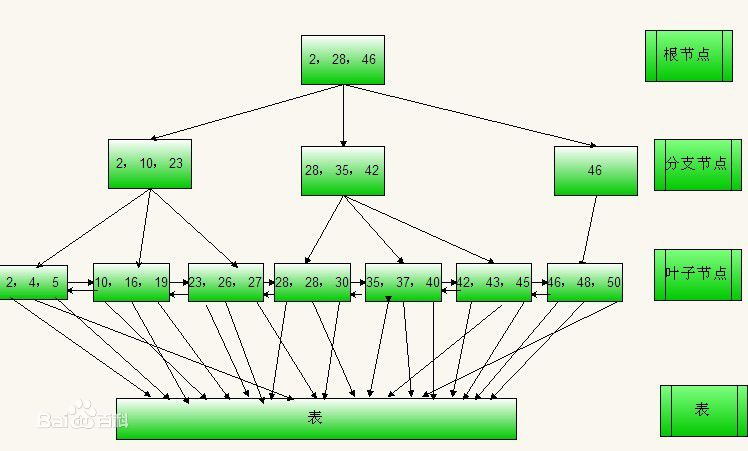

## 索引

## 概念
索引：在对表需要进行查询或者排序操作时，可以对表中某个或者某几个字段添加索引，对一个字段添加索引就是单个索引，对多个字段添加索引时就是组合索引。

不要滥用索引。因为过多的索引不仅仅会增加物理存储的开销，对于插入、删除、更新操作也会增加处理上的开销，而且会增加优化器在选择索引时的计算代价。

## 存储引擎工作原理
 

## 磁盘
磁道、扇区、柱面和柱头数

* Btree索引
* hash索引
* 空间数据索引
* 全文索引

## 聚簇索引

> “聚簇” 表示数据行和相邻的键值进错的存储在一起

* 聚簇索引（Clustered Index） 		索引顺序就是数据的物理存储顺序，一个表最多只能有一个聚簇索引
* 非聚簇索引（Non- Clustered Index） 	索引顺序与数据物理排列顺序无关。