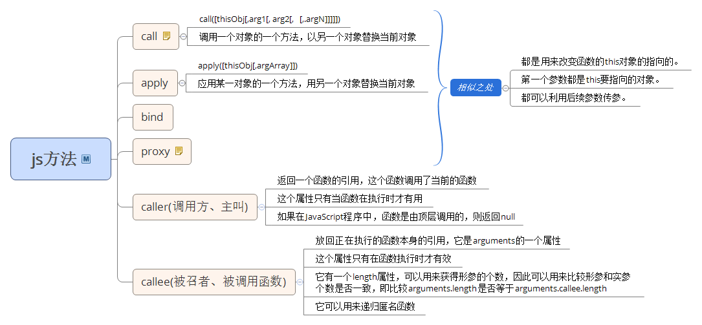

## 原型链

### 函数对象

1.	所有引用类型（函数，数组，对象）都拥有__proto__属性（隐式原型）
2.	所有函数拥有prototype属性（显式原型）（仅限函数）
3.	原型对象：拥有prototype属性的对象，在定义函数时就被创建

凡是通过new Function()创建的都是函数对象，拥有__proto__、prototype属性（指向原型对象）

>	查找属性，如果本身没有，则会去__proto__中查找，也就是构造函数的显式原型中查找，如果构造函数中也没有该属性，因为构造函数也是对象，也有__proto__，那么会去它的显式原型中查找，一直到null，如果没有则返回undefined

## 事件冒泡

*	事件捕获    事件从最上一级标签开始往下查找，直到捕获到事件目标(target)。
*	事件冒泡	事件从事件目标(target)开始，往上冒泡直到页面的最上一级标签。

e.stopPropagation();

## 闭包

*	作用域
*	函数作为返回值，函数作为参数传递
*	匿名函数

## js方法

1.	call
2.	apply
3.	bind
4. 	proxy
5.	caller
6.	callee

 

## js 函数式编程

## js 模块化

## js 加载
