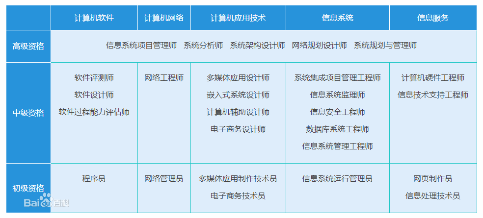

## 软考

* 计算机软件
* 计算机网络
* 计算机应用技术
* 信息系统
* 信息服务

## 软考中级资格

#### 软件评测师

#### 多媒体应用设计师
#### 嵌入式系统设计师
#### 计算机辅助设计师
#### 电子商务设计师

#### 系统集成项目管理工程师
#### 信息安全工程师
#### 信息系统监理师
#### 数据库系统工程师
通过数据库系统工程师级别（中级资格/工程师）考试的合格人员能参与应用信息系统的规划、设计、构建、运行和管理，能按
照用户需求，设计、建立、运行、维护高质量的数据库和数据仓库；作为数据管理员管理信息系统中的数据资源，作为数据库管
理员建立和维护核心数据库；担任数据库系统有关的技术支持，同时具备一定的网络结构设计及组网能力；具有工程师的实际工
作能力和业务水平，能指导计算机技术与软件专业助理工程师（或技术员）工作。
#### 信息系统管理工程师
通过本考试的合格人员能对信息系统的功能与性能、日常应用、相关资源、运营成本、安全等进行监控、管理与评估，并为用户
提供技术支持；能对信息系统运行过程中出现的问题采取必要的措施或对系统提出改进建议；能建立服务质量标准，并对服务的
结果进行评估；能参与信息系统的开发，代表用户和系统管理者对系统的分析设计提出评价意见，对运行测试和新旧系统的转换
进行规划和实施；具有工程师的实际工作能力和业务水平，能指导信息系统运行管理员安全、高效地管理信息系统的运行。

## 软考高级资格
规划、项管、分析、设计、网络

#### 系统规划与管理师
系统规划与管理师是指在组织中承担：参与组织的IT战略规划；策划组织的IT服务目标和内容；确定服务成本，配置服务资源；
评估、分析信息系统的运营成本和效益；制定IT服务计划和IT服务方案；制定组织的IT服务标准和制度；监控IT服务计划和方案
的执行；提升IT服务能力和服务质量；管理IT服务团队等职责的高级管理人员。

#### 信息系统项目管理师 PM
通过本考试的合格人员能够掌握信息系统项目管理的知识体系，具备管理大型、复杂信息系统项目和多项目的经验和能力；能根
据需求组织制订可行的项目管理计划；能够组织项目实施，对项目的整体、采购、干系人、成本、范围、风险、沟通、人力资源、
进度和质量等10大知识领域进行管理，并能根据实际情况及时做出调整，系统地监督项目实施过程的绩效，保证项目在一定的约
束条件下达到既定的项目目标；能分析和评估项目管理计划和成果；具有高级工程师的实际工作能力和业务水平，可聘任副高级
工程师职务。

* [考试要求](/80-project/exam/30-pm-require.md)
* [主要内容](/80-project/exam/31-pm.md)
* [案例分析](/80-project/exam/32-pm-case.md)
* [论文](/80-project/exam/33-pm-papers.md)
* [前沿技术](/80-project/exam/34-pm-innovative.md)

#### 系统分析师 SA
系统分析员又称系统分析师，英文system analyst，简称SA。 是指具有从事计算机应用系统的分析和设计工作能力及业务水平，
能指导系统设计师和高级程序员的工作的一族。在软件开发流程中主要从事需求分析、信息系统项目架构设计（包括概要设计和
详细设计）、开发阶段的主要模块的规划、设计和测试，同时也涉及可行性分析的工作。系统分析师(SA)是负责设计与开发应用
软件系统．使其正确的反应出有效的信息，协助企业经营者管理、营运公司的运作者。系统分析师是抽象模型的建立者，他们需
要专业的conceptionmodel（概念模型）知识和基础编程技巧。

#### 系统架构设计师 AD
系统架构设计师是一个最终确认和评估系统需求，给出开发规范，搭建系统实现的核心构架，并澄清技术细节、扫清主要难点的
技术人员。

* [考试要求](/80-project/exam/40-ad-require.md)
* [综合基础](/80-project/exam/41-ad-base.md) 计、信、开、标、数、英
* [案例分析](/80-project/exam/42-ad-case.md) 规、架、模、建、系、分、嵌、可靠、安全
* [论文](/80-project/exam/43-ad-papers.md)
* [软件开发方法](/80-project/exam/44-ad-dev.md)
* [企业集成架构设计](/80-project/exam/45-ad-design.md)

#### 网络规划设计师
