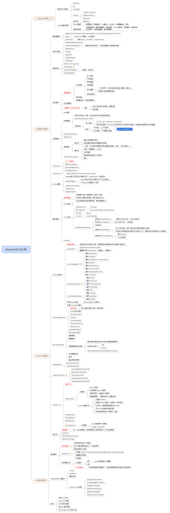

# View Image

this is generated files, just for view image conveniently...

## dubbo源码解析2.0.png

## java-performance.png

## Java8函数式编程.png

## Java8实战.png

## JavaScript模式.png

## Java并发编程的艺术.png

## Mybatis技术内幕.png

## Netty权威指南.png

## nosql.png

## RocketMQ原理简介.png

## SpringCloud与Docker微服务架构实战.png

## spring技术内幕.png

## Spring源码深度解析.png

## Tomcat架构解析.png

## 企业IT架构转型之道.png

## 分布式数据一致性.png

## 分布式数据库架构及企业实践-基于Mycat中间件.png

## 大型分布式网站架构设计与实践.png

## 大型网站技术架构.png

## 大型网站系统与Java中间件实践.png

## 大数据之路-阿里巴巴大数据实践.png

## 深入理解Java虚拟机.png

## 逆流而上阿里巴巴技术成长之路.png

## 高性能MyQL.png

