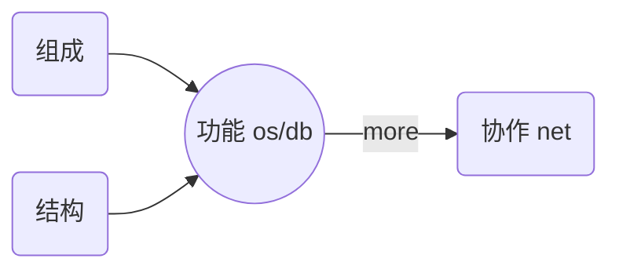

> 路漫漫其修远兮，吾将上下而求索
// TODO 

# 浙大2018级计算机科学与技术专业培养方案

## 2. 专业课程
### 2.1 学科基础课程
### 2.2 专业必修课程
### 2.3 专业模块课程
#### 2.3.1 计算机科学
#### 2.3.2 计算机系统
#### 2.3.3 计算机软件技术
#### 2.3.4 信息安全技术
### 2.4 实践教学环节
### 2.5 毕业论文

# 浙大2018级软件工程专业培养方案
## 2. 专业课程
### 2.1 学科基础课程
### 2.2 专业必修课程
#### 2.2.1 专业前导课程
#### 2.2.2 专业核心课程
### 2.3 专业模块课程
#### 2.3.1 核心理论
#### 2.3.2 开发技术
#### 2.3.3 领域知识

#### 2.4.1 核心理论
#### 2.4.2 开发技术
#### 2.4.3 领域知识
#### 2.4.4 其它专业选修课程
### 2.5 实践教学环节
### 2.6 毕业论文

### 浙大精品课程
* 国家级精品课程
  * C程序设计基础与实验
  * 操作系统
  * 计算机辅助工业设计
  * 嵌入式系统
  * 软件工程
  * 整合与创新设计
  * 并行计算与多核程序设计
  * 计算机游戏程序设计
  * 用户体验与产品创新设计
* 双语示范
  * 数据结构
  * 计算机网络
* 省级精品课程
  * 大学计算机基础
  * 数据结构与算法
* 教育部-微软精品课程
  * 嵌入式系统
  * 数据库系统
* 教育部-INTEL
  * 并行计算与多核程序设计
  * 计算机组成
  * 智能终端软件开发
* 教育部-IBM
  * 服务科学导论
  * 计算机安全
* 教育部-SUN
  * 服务信任与信誉
  * 计算机体系结构

##### PS 计算机体系课程
| source\core | cpu                            | memeory            | io                    | net        | file          |
| ----------- | ------------------------------ | ------------------ | --------------------- | ---------- | ------------- |
| 数据结构    | tree                           | abt                |                       |            | tree          |
| 组成原理    | ALU,CU,Register,Interrupt,Bus  | 外存               | 程序查询,DMA,IO处理机 |            | 外存、磁盘    |
| 体系结构    | 指令集、流水线、并行、多处理机 | 存储层次           | 输入输出、总线        |            | 外存、磁盘    |
| 操作系统    | 进程管理，处理机调度           | 存储器管理         | 设备管理              | Socket接口 | 文件管理      |
| 计算机网络  |                                |                    |                       |            |               |
| 编译原理    |                                |                    |                       |            |               |
| 数据库系统  |                                |                    |                       |            | 索引          |
| 分布式系统  | 控制节点、运算节点             | 分布式数据库、缓存 | bio,nio,aio           |            | HDFS, FastDFS |
| 云计算      | MapReduce,Brog                 |                    |                       |            | GFS, CFS      |

##### PS 计算机分析角度
| 分析角度 | 组成原理 | 课程       |
| :------- | :------- | :--------- |
| 运算     | cpu      | 操作系统   |
| 内存     | mem      | 数据结构   |
| 网络     | net/bus  | 计算机网络 |
| 数据库   | db       | 数据库概论 |

组成
      功能  网络
结构

