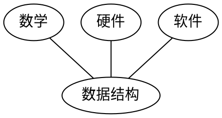
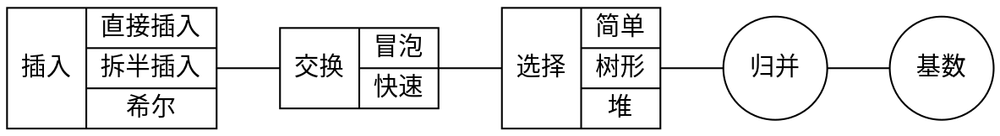

《数据结构(C语言版)》 严蔚敏 吴伟民 编著 清华大学出版社

* 线性表、栈、队列、串
* 树、图
* 查找排序、动态存储、文件（顺序文件、索引文件）

## 1. 绪论
> 数据结构是一门研究非数值计算的程序设计文中计算机的操作对象以及他们之间的关系和操作等的学科
### 1.1 什么是数据结构
计算机解决问题的步骤：具体问题 --抽象--> 数学模型 --> 算法 --> 编写程序 --> 测试、调整，解答。  
寻组数学模型的实质是分析问题，从中提取操作的对象，并找出这些操作对象之间含有的关系，然后用数学语言加以描述。  
数据结构是一门研究非数值计算的程序设计问题中计算机的操作对象以及他们之间的关系和操作等的学科。 
数据结构的研究不仅设计到计算机硬件的研究范围，而且和计算机软件的研究有更密切的关系，无论是编译程序还是操作系统，都涉及到数据元素在存储器中的分配问题。介于数学、计算机硬件和计算机软件三者之间的一门核心课程。

### 1.2 基本概念和术语
* 数据 客观事物的符号表示
* 数据元素 数据的基本单元。可有若干个数据项组成。
* 数据项 不可分割的最小单元
* 数据对象 性质相同的数据元素的集合，是数据的一个子集。
* 数据结构 相互之间存在一种或多种特定关系的数据元素的集合。**数据之间的关系**称为结构。
    - 集合                  松散
    - 线性结构              一对一，线性表、栈和队列、串
    - 树形结构              一对多，树和二叉树
    - 图状结构或网状结构     多对多
* 逻辑结构  逻辑关系 --> 逻辑结构
* 物理结构 数据结构在计算机中的表示（又称映像）称为数据的物理结构，又称为存储结构。
* 数据类型 数据类型是一个值的集合和定义在这个值集上的一组操作的总称。抽象数据类型是指一个数学模型以及定义在该模型上的一组操作。
  - 原子类型 不可分解
  - 结构类型 由若干成分按某种结构组成，可以分解，可以是非结构的，可以是结构的。

> 引入数据类型，从硬件的角度看，是作为解释计算机内存中信息含义的一种手段，而对使用数据类型的用户来说，实现了**信息的隐蔽**，即将一切用户不必了解的细节都封装类型中。例如，用户在使用“整数”类型时，不必了解“整数”在计算机内部如何表示，其操作如何实现。“两个整数求和”，程序设计者注重“数学上上求和”的抽象特性，而不是硬件的“位”操作如何进行。

* 抽象数据结构ADT 指一个数学模型以及定义在该模型上的一组操作。抽象数据类型和数据类型实质上是一个概念，抽象的意义在于数据类型的数学抽象。
  - 原子类型
  - 固定聚合类型
  - 可变聚合类型
* 多形数据类型 指其值的成分不确定的数据类型

```
// D是数据对象 S是D上的关系集 P是对D基本操作集
(D, S, P)

ADT 抽象数据类型名 {
    数据对象:<>
    数据关系:<>
    基本操作:<>
} ADT 抽象数据类型名
```

### 1.3 抽象数据类型的表示和实现
抽象数据类型可通过固有数据类型来表示和实现，即利用处理器中已经存在的数据类型来说明新的结构，用已经实现的操作来组合新的操作。
### 1.4 算法和算法分析
#### 1.4.1 算法
算法是对特定问题求解步骤的一个描述，它是指令的有限序列，其中每一条指令表示一个或多个操作；此外，一个算法还具有5个重要特性：
* <font color="#00ffff">有穷性</font>
* <font color="#00ffff">确定性</font>
* <font color="#00ffff">可行性</font>
* 输入 零个或多个输入
* 输出 一个或多个输出
#### 1.4.2 算法设计的要求 
* 正确
* 可读性
* 健壮性
* 效率与低存储量需求

#### 1.4.3 算法效率的度量
* 时间复杂度  
一般情况下，算法中的基本操作**重复执行的次数**是问题规模n的某个函数f(n)，算法的时间度量记作 T(n) = O(f(n))，表示随着问题规模n的增大，算法执行时间的增长率和f(n)的增长率相同。
语句的频度指的是语句重复执行的次数。
```
O(1)    1条语句
O(n)    1个循环
O(n^2)  2个循环
O(logn)
O(2^2)
```
有些情况下，算法中基本操作重复执行的次数还随问题的输入数据集不同而不同。讨论算法在最坏情况下的时间复杂度，即分析最坏情况下以估算算法执行时间的一个上界。

#### 1.4.4 算法的存储空间需求
* 空间复杂度
算法所需存储空间的度量，记作 S(n) = O(f(n))，其中n为问题规模的大小。

## 2. 线性表
线性结构的特点（线性表、栈和队列、串）
1. 存在唯一的一个“第一个”的数据元素
2. 存在唯一的一个“最有一个”的数据元素
3. 除第一个外，集合中的每个元素均只有一个前驱
4. 除最后一个外，集合中的每个元素均只有一个后继

### 2.1 线性表的类型和定义
一个线性表是n个数据元素的有限序列。复杂线性表中，一个数据元素可以有若干个数据项（item）组成，常把数据元素成为记录（record），含有大量记录的线性表又称为文件（file）。如数据库表、记录。  
线性表中元素的个数n(n>=0)定义为线性表的长度，n=0时称为空表。

### 2.2 线性表的顺序表示和实现
用一组连续的存储单元一次存储线性表的数据元素。线性表的顺序存储结构是一种随机存取的存储结构。逻辑上相邻的数据元素在物理位置上也是相邻的。  
插入或删除一个数据元素时，其时间主要耗费在移动元素上。

### 2.3 线性表的链式表示和实现
失去了随机存取的优点。
#### 2.3.1 线性链表
用一组任意的存储单元存储线性表的数据元素（存储单元可以连续也可以不连续）。结点（node）包括数据域，指针域。尾节点的指针为空（NULL）。

#### 2.3.2 循环链表
最后一个结点的指针指向头结点，真格链表形成一个环。

#### 2.3.3 双向链表
单向链表结点只有一个指示直接后继的指针域，由此，从某个结点出发只能**顺着指针往后**需找其他结点。
双向链表结点有两个指针域，其一只想直接后继，另一指向直接前趋。

### 2.4 一元多项式的表示及相加

## 3. 栈和队列
### 3.1 栈
#### 3.1.1 抽象数据类型栈的定义
限定在表尾进行插入或删除操作的线性表。表尾端称为栈顶（top）、表头端称为栈底（bottom）。后进先出的线性表（LIFO结构）
#### 3.1.2 栈的表示和实现
顺序存储结构是利用一组地址连续的存储单元一次存放自栈底到栈顶的数据元素。
链式表示。
### 3.2 栈的应用举例
#### 3.2.1 数制转换
#### 3.2.2 括号匹配的检验
#### 3.2.3 行编辑程序
#### 3.2.4 迷宫求解
#### 3.2.5 表达式求解
任何一个表达式都是由操作数、运算符和界限符组成的，称它们为单词。运算符和界限符统称为算符，它们构成的集合命名为OP（编译原理-词法分析-语法分析）
* 操作数 常数、变量或常量的标识符
* 运算符 算法运算符、关系运算符、逻辑运算符
* 界限符 左右括号、表达式结束符

### 3.3 栈与递归的实现
一个直接调用直接或者通过一系列的调用语句间接地调用自己的函数，称作递归函数。
一个递归函数的运行过程类似于多个函数的嵌套调用，只是调用函数和被调用函数是同一个函数。

### 3.4 队列
#### 3.4.1 抽象数据类型队列的定义
一端插入、一端删除元素。允许插入的一端叫做队头、允许删除的一端称为队尾。先进先出FIFO。  
操作系统中的作业队列，分布式系统中的消息队列。
#### 3.4.2 链队列--队列的链式表示和实现
#### 3.4.3 循环队列--队列的顺序表示和实现（环行队列）
### 3.5 离散事件模拟

## 4. 串
计算机上的非数值处理对象基本上是字符串数据。
### 4.1 串类型的定义
串（string）（或字符串）是由零个或多个字符组成的有限序列。空串、空格串。
两个串相等，当且仅当这两个串的值相等。两个串的长度相等，并且各个对应位置的字符都相等。
### 4.2 串的表示和实现
#### 4.2.1 定长顺序存储表示
用一组地址连续的存储单元存储串值的字符序列。不便于串联接、求子串等操作。
#### 4.2.2 堆分配存储表示
仍以一组地址连续的存储单元存放串值字符序列，但它们的存储空间是在程序执行过程中动态分配而得。
```c
malloc(); // 动态分配函数
free();
```
#### 4.2.3 串的块链存储表示
链式存储。结构中的每个数据元素是一个字符，则用链表存储串值。
### 4.3 串的模式匹配算法
### 4.4 串操作应用举例
#### 4.4.1 文本编辑
#### 4.4.2 建立词索引表

## 5. 数组和广义表
### 5.1 数组的定义
### 5.2 数组的顺序表示和实现
### 5.3 矩阵的压缩存储
### 5.4 广义表的定义
### 5.5 广义表的存储结构
### 5.6 m元多项式的表示
### 5.7 广义表的递归算法
### 5.7.1 求广义表的深度
### 5.7.2 复制广义表
### 5.7.3 建立广义表的存储结构

## 6. <font color="#00ffff">树和二叉树</font>
### 6.1 树的基本定义和术语
* 结点拥有的子树数称为结点的度
* 度为0的结点称为叶子
* 树中结点的最大层次称为树的深度或高度

### 6.2 二叉树
#### 6.2.1 二叉树的定义
* 每个结点至多只有两颗子树
* 子树有左右之分，次序不能颠倒

#### 6.2.2 二叉树的性质
#### 6.2.3 二叉树的存储结构

### 6.3 遍历二叉树和线索二叉树
#### 6.3.1 遍历二叉树
#### 6.3.2 线索二叉树

### 6.4 树和森林
#### 6.4.1 树的存储结构
#### 6.4.2 森林与二叉树的转换
#### 6.4.3 树和森林的遍历
### 6.5 树与等价问题
### 6.6 赫夫曼树及其应用
### 6.7 回溯法与树的遍历
### 6.8 树的计数

## 7. 图
### 7.1 图的定义和术语
### 7.2 图的存储结构
#### 7.2.1 数组表示法 
#### 7.2.2 领接表
#### 7.2.3 十字链表
#### 7.2.4 邻接多重表
### 7.3 图的遍历
从图中某一顶点出发访遍图中其余顶点，且使每一个顶点仅被访问一次。
图的遍历算法是求解图的连通性问题、拓扑排序和求关键路径等算法的基础。

#### 7.3.1 深度优先搜索
类似于树的先根遍历，是树的先根遍历的推广。

#### 7.3.2 广度优先搜索
类似于树的按层次遍历的过程

### 7.4 图的连通性问题
#### 7.4.1 无向图的连通分量和生成树
#### 7.4.2 有向图的强连通分量
#### 7.4.3 最小生成树
#### 7.4.4 关节点和重连通分量

### 7.5 有向无环图及其应用
#### 7.5.1 拓扑排序
#### 7.5.2 关键路径
### 7.6 最短路径

## 8. 动态存储管理
### 8.1 概述
程序中使用的存储单元有逻辑变量（标识符）来表示，它们对应的内存地址有编译程序或者操作系统进行分配。
空闲块、占用块、交叉状态
### 8.2 可利用空间表及分配方法
可利用空间表结构形式：
1. 分配固定存储大小
2. 分配若干种大小规格的存储
3. 内存块大小随请求变化

分配策略：
1. 首次拟合法 从表头指针开始查找可利用空间表，将找到的第一个大小不小于n的空间块的一部分分配给用户
2. 最佳拟合法 将可利用空间表中一个不小于n且2最接近n的空闲快的一部分分配给用户
3. 最差拟合法 将可利用空间表中不小于n且是链表中最大的空间块的一部分分配给用户

### 8.3 边界标识法
#### 8.3.1 可利用空间表的结构
#### 8.3.2 分配算法
#### 8.3.3 回收算法
### 8.4 伙伴系统
无论是占用块还是空闲块，其大小均为2的k次幂。
#### 8.4.1 可利用空间表的结构
#### 8.4.2 分配算法
#### 8.4.3 回收算法
### 8.5 无用单元收集

```c
// 无用单元指那些用户不再使用而系统没有回收的结构和变量。
p = malloc(size);
p = NULL;

// 悬挂访问指所释放的结点被再分配而继续访问指针q所指向的结点。
p = malloc(size);
q = p;
free(p);
```

收集无用单元分两步进行：对所有占用的结点加上标志；对整个可利用存储空间顺序扫描一遍，链接新的可利用空间表。

标志算法：
1. 递归算法 遍历广义表
2. 非递归算法 程序中蝮蛇栈或队列实现广义表的遍历
3. 利用表结点本身的指针域标记遍历路径算法

### 8.6 存储紧缩
不管哪个时刻，可利用空间都是一个地址连续的存储区，编译程序里称之为“堆”，每次分配都是从这个可利用空间中划出一块。
分配算法简单，回收算法麻烦。回收时必须将所释放的空闲块合并到整个堆上去才能重新使用，称为“存储紧缩”任务。
mark-compact

## 9. 查找
> 查找表（Search Table）是由同一类型的数据元素（或记录）构成的集合。由于“集合”中的数据元素之间存在着完全松散的关系，因此查找表是一种非常灵便的数据结构。

* 静态查找表
* 动态查找表 查找过程中同事插入或者删除数据元素

PS：查找、查询、搜索；search、query、inquiry、select、find、get、visitor

### 9.1 静态查找表
#### 9.1.1 顺序表的查找
顺序查找（Sequential Search）
#### 9.1.2 有序表的查找
拆半查找（Binary Search）
#### 9.1.3 静态树表的查找
静态最优查找树
#### 9.1.4 索引顺序表的查找
分块查找

### 9.2 动态查找表
#### 9.2.1 二叉排序树和平衡二叉树
#### 9.2.2 B树和B+树
#### 9.2.3 键树

### 9.3 哈希表
#### 9.3.1 什么是哈希表
#### 9.3.2 哈希函数的构造方法
#### 9.3.3 处理冲突的方法
#### 9.3.4 哈希表的查找及其分析

## 10. 内部排序
由于待排序的记录数量不同，使得排序过程中涉及的存储器不同
* 内部排序 待排序记录存放在计算机随机存储器中进行
* 外部排序 待排序记录数量打，内存不能容纳全部记录，需要对外存进行访问

### 10.1 概述
排序是为了更快的查找。建造树表（二叉树或者B树）的过程本身是一个排序的过程。
* 内部排序：待排序记录存放在计算机随机存储器中进行的排序过程
* 外部排序：待排序记录的数量很大，以致内存一次不能容纳全部记录，在排序过程中尚需对外存进行访问的排序过程。
> insert -> cas -> select -> merge -> radix;


### 10.2 插入排序
#### 10.2.1 直接插入排序
直接插入排序（Straight Insertion Sort），基本操作是将一个记录插入到**已经排好序的有序表**中，从而得到一个新的、记录数增1的有序表。
#### 10.2.1 其他插入排序
记录数量n很大时，直接插入效率低。
1. 拆半插入排序
2. 2-路插入排序

#### 10.2.1 希尔排序
Shell's Sort 现将整个待排记录序列分割成为若干子序列分别进行直接插入排序，待整个序列中的记录“基本有序”时，再对全体记录进行一次直接插入排序。

### 10.3 快速排序
藉助“交换”进行排序。
* 冒泡排序（Bubble Sort）
* 快速排序（Quick Sort） 是对冒泡排序的一种改进。基本思想，通过一趟排序将待排记录分割成独立的两部分，其中一部分记录的关键字均比另一部分记录的关键字小，则可以分别对这两部分记录继续进行排序，以达到整个序列有序。

### 10.4 选择排序
Selection Sort, 每一趟 n-i+1(i=1,2,...,n-1)个记录中取关键字最小的记录作为有序序列中第i个记录。
#### 10.4.1 简单选择排序
#### 10.4.2 树形选择排序
#### 10.4.3 堆排序
Heap Sort, 只需要一个记录大小的辅助空间，每个待排序的记录仅占有一个存储空间。
堆排序在最坏的情况下，其时间复杂度也为O(nlogn)。相对于快速排序来说，这是堆排序的最大优点。此外，堆排序仅需一个记录大小供交换用的辅助存储空间。

### 10.5 归并排序
Merging Sort，“归并”含义是将两个或两个以上的有序表组合成一个新的有序表。

### 10.6 基数排序
Radix Sorting，一般实现排序主要是通过关键字间的比较和移动记录这两种操作，而实现基数排序不需要进行记录关键字间的比较。基数排序是一种借助多关键字排序的思想对单逻辑关键字进行排序的方法。
#### 10.6.1 多关键字的排序
#### 10.6.2 链式基数排序
基数排序是借助“分配”和“收集”两种操作堆单逻辑关键字进行排序的一种内部排序方法。
### 10.7 各种内部排序方法的比较讨论

| 排序方法 |  平均时间  |  最坏情况  | 辅助存储 |
|:--------:|:----------:|:----------:|:--------:|
| 简单排序 |   O(n^2)   |   O(n^2)   |   O(1)   |
| 快速排序 |  O(nlogn)  |   O(n^2)   | O(logn)  |
|  堆排序  |  O(nlogn)  |  O(nlogn)  |   O(1)   |
| 归并排序 |  O(nlogn)  |  O(nlogn)  |   O(n)   |
| 基数排序 | O(d(n+rd)) | O(d(n+rd)) |  O(rd)   |

## 11. 外部排序
### 11.1 外存信息的存取
### 11.2 外部排序的方法
### 11.3 多路平衡归并的实现
### 11.4 置换-选择排序
### 11.5 最近归并树

## 12. 文件
### 12.1 基本概念
### 12.2 顺序文件
### 12.3 索引文件

> 除了文件本身之外，另建立一张指示逻辑记录和物理记录之间一一对应关系的表----索引表

### 12.4 ISAM文件和VSAM文件
* 索引顺序存取方法 Indexed Sequential Access Methed
* 虚拟存储存取方法 Virtual Storage Access Method

### 12.5 直接存取文件（散列文件）
### 12.6 多关键字文件
#### 12.6.1 多重表文件
#### 12.6.2 倒排文件