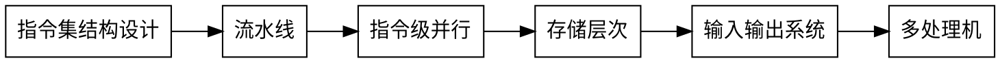

《计算机体系结构》 张晨曦 高等教育出版社

## 第一章 计算机体系结构的基本概念
### 1.1 引论
### 1.2 计算机体系结构的概念
#### 1.2.1 计算机系统中的层次概念
#### 1.2.2 计算机体系结构
计算机语言由低级语言想高级语言发展，高一级语言的语句相对于低级语言功能更强、更便于应用，但又是以低级语言为基础。

Amdahl：计算机体系结构是程序员所看到的的计算机的属性，即概念性结构与功能特性。
机器语言程序员所看到的，对于通过用寄存器型机器来说的属性：
1. 数据表示
2. 寻址规则
3. 寄存器定义
4. 指令集
5. 中断系统
6. 机器工作状态的定义和切换
7. 存储系统
8. 信息保护
9. IO结构

#### 1.2.3 计算机组成和计算机实现技术

### 1.3 计算机体系结构的发展
### 1.4 计算机体系结构中并行性的发展
### 1.5 定量分析技术基础
#### 1.5.1 计算机性能的评测
#### 1.5.2 测试程序
#### 1.5.3 性能设计和评测的基本原则
1. 大概率时间优先原则
2. Amdahl定律
3. 程序的局部性原理

#### 1.5.4 CPU的性能
* 时钟频率
* CPI 指令时钟树
* IC 指令数 反映了计算机指令集和编译技术

### 1.6 影响计算机体系结构的成本和价格因素
#### 1.6.1 集成电路的成本
#### 1.6.2 计算机系统的成本和价格

## 第二章 计算机指令集结构设计
### 2.1 指令集结构的分类
#### 2.1.1 指令集结构的分类
CPU中用来存储操作数的存储单元主要有：堆栈、累加器或一组寄存器。
#### 2.1.2 通用寄存器型指令集结构的分类
主要优点就是能够使编译器有效地使用寄存器。
### 2.2 寻址技术
### 2.3 指令集结构的功能设计
#### 2.3.1 CISC计算机指令集结构的功能设计
#### 2.3.2 RISC计算机指令集结构的功能设计
#### 2.3.3 控制指令
### 2.4 操作数的类型、表示和大小
### 2.5 指令集格式的设计
指令集中的每条指令由操作码和地址码组成，指令集格式的设计就是要确定操作码和字段和地址码**字段的大小**及其**组合形式**，以及各种寻址方式的编码方法。
#### 2.5.1 寻址方式的表示方法
#### 2.5.2 指令集格式的选择

### 2.6 编译技术与计算机体系结构设计
### 2.7 DLX指令集结构

## 第三章 流水线技术
### 3.1 流水线的基本概念
#### 3.1.1 流水线的基本概念
将各个工人的操作时间重叠在一起

所谓流水线技术，就是将一个重复的时序过程，分解成为若干个子过程，而每一个子过程都可有效地在其专用功能段上与其他子过程同时执行。

#### 3.1.2 流水线的分类
1. 单功能流水线和多功能流水线
2. 静态流水线和动态流水线
3. 部件级、处理机级及处理机间流水线
4. 标量流水处理机和向量流水处理机
5. 线性流水线和非线性流水线

### 3.2 DLX的基本流水线
### 3.3 流水线中的相关
### 3.4 流水线计算机实例分析（MIPS R4000）
### 3.5 向量处理机

## 第四章 指令级并行
### 4.1 指令集并行的概念
### 4.2 指令的动态调度
### 4.3 控制相关的动态解决技术
### 4.4 多指令流出技术

## 第五章 存储层次
### 5.1 存储器的层次结构
cpu -> -> L0(寄存器) -> L1 -> L2 -> L3 -> memory -> disk cache -> disk
### 5.2 Cache基本知识
#### 5.2.1 映像规则
#### 5.2.2 查找方法
#### 5.2.3 替换算法
#### 5.2.4 写策略
#### 5.2.5 Cache的结构
#### 5.2.6 Cache性能分析
#### 5.2.7 改进Cache性能

### 5.3 降低Cache失效率的方法
#### 5.3.1 增加Cache的大小
#### 5.3.2 提高相联度
#### 5.3.3 Victim Cache
#### 5.3.4 伪相联 Cache
#### 5.3.5 硬件预取技术
#### 5.3.6 由编译器控制的预取
#### 5.3.7 编译器优化

### 5.4 减少Cache失效开销
### 5.5 减少命中时间
### 5.6 主存
### 5.7 虚拟存储器
### 5.8 进程保护和虚存实例
### 5.9 Alpha AXP 21064存储层次

## 第六章 输入输出系统
### 6.1 概述
### 6.2 存储设备
#### 6.2.1 磁盘设备
1.磁盘  
磁盘由一组绕轴旋转的盘片组成，盘片的数量为1-20片，目前磁盘系统的转速一般在每分钟3600转到12000转之间，即3600 r/min - 1200 r/min（r/min又记为rpm）。

2.半导体盘

3.盘阵列

#### 6.2.2 磁带设备
#### 6.2.3 光盘设备
### 6.3 总线
总线将许多子系统连接起来，如存储器、CUP、IO设备等，作为各子系统之间**共享的通信链路**。缺点是必须独占使用，造成设备信息交换的瓶颈。
#### 6.3.1 总线分类
* 按用途分类： cup-存储器总线、io总线
* 按设备定时方式分类：同步总线、异步总线
  
#### 6.3.2 总线基本工作原理
#### 6.3.3 总线使用
总线的任务就是进行信息交换，主要包括读和写操作。
对于CPU-存储器总线，“读”是将存储器的数据送到CPU或外围设备，“写”是将数据写入存储器。
一次总线传输分为两个部分：地址操作和数据传送。
#### 6.3.4 总线标准和实例
#### 6.3.5 设备的连接
#### 6.3.6 CPU与IO处理的匹配
### 6.4 通道处理机
IO管理外围设备方式，程序控制、中断和DMA性能低，通道处理器Channel
#### 6.4.3 通道种类
1. 字节多路通道
2. 数组多路通道
3. 选择通道 selector channel
   
### 6.5 IO与操作系统
#### 6.5.1 IO和Cache数据一致性
与多处理机中的Cache一致性问题时相同的，IO设备可以看做是多处理机中的特殊处理机。
#### 6.5.2 DMA和虚拟存储器

### 6.6 IO系统设计

## 第七章 多处理机
### 7.1 引言
### 7.2 多处理机的存储器体系结构
### 7.3 互连网络
互连网络是将集中式系统或分布式系统中的结点连接起来所构成的网络，这些结点可能是处理器、存储模块或者其他设备，他们通过互连网络进行信息交换。

### 7.4 同步与通信
### 7.5 并行化技术
#### 7.5.1 并行化的基本策略
1. 共享变量模型
2. 消息传递模型
3. 数据并行模型
4. 面向对象模型
5. 函数和逻辑模型

#### 7.5.2 并行语言与编译器
1. 并行性的语言特征
2. 并行语言结构
3. 并行优化编译器

### 7.6 多处理机实例
#### 7.6.1 Challenge多处理机系统
SGI（Silicon Graphics Inc.）多处理机系统Chanllenge具有共享内存基于总线的Cache一致性结构，高速总线上课容纳最多36个MIPS R4400处理器。

#### 7.6.2 Origin 2000
Origin是SGI公司分布式共享存储器结构的大规模并行多处理机系统，采用超结点（每个结点2个处理器）的模块结构，可以从1个处理器扩展到128个处理器而维持系统的性能价格比不变，因此具有良好的可扩展性。