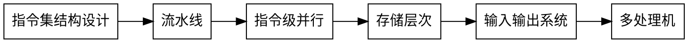

《计算机体系结构》 张晨曦 高等教育出版社

## 第一章 计算机体系结构的基本概念

### 1.2 计算机体系结构的概念
计算机语言由低级语言想高级语言发展，高一级语言的语句相对于低级语言功能更强、更便于应用，但又是以低级语言为基础。

Amdahl：计算机体系结构是程序员所看到的的计算机的属性，即概念性结构与功能特性。
机器语言程序员所看到的，对于通过用寄存器型机器来说的属性：
1. 数据表示
2. 寻址规则
3. 寄存器定义
4. 指令集
5. 中断系统
6. 机器工作状态的定义和切换
7. 存储系统
8. 信息保护
9. IO结构

### 1.5 定量分析技术基础
#### CPU的性能
* 时钟频率
* CPI 指令时钟树
* IC 指令数 反映了计算机指令集和编译技术

## 第二章 计算机指令集结构设计

## 第三章 流水线技术

## 第四章 指令级并行

## 第五章 存储层次
### 5.1 存储器的层次结构
cpu -> -> L0(寄存器) -> L1 -> L2 -> L3 -> memory -> disk cache -> disk
### 5.2 Cache基本知识
### 5.3 降低Cache失效率的方法
### 5.4 减少Cache失效开销
### 5.5 减少命中时间
### 5.6 主存
### 5.7 虚拟存储器
### 5.8 进程保护和虚存实例
### 5.9 Alpha AXP 21064存储层次

## 第六章 输入输出系统
### 6.3 总线
总线将许多子系统连接起来，如存储器、CUP、IO设备等，作为各子系统之间**共享的通信链路**。缺点是必须独占使用，造成设备信息交换的瓶颈。
#### 6.3.1 总线分类
* 按用途分类： cup-存储器总线、io总线
* 按设备定时方式分类：同步总线、异步总线
### 6.4 通道处理机
IO管理外围设备方式，程序控制、中断和DMA性能低，通道处理器Channel
#### 6.4.3 通道种类
1. 字节多路通道
2. 数组多路通道
3. 选择通道 selector channel
## 第七章 多处理机