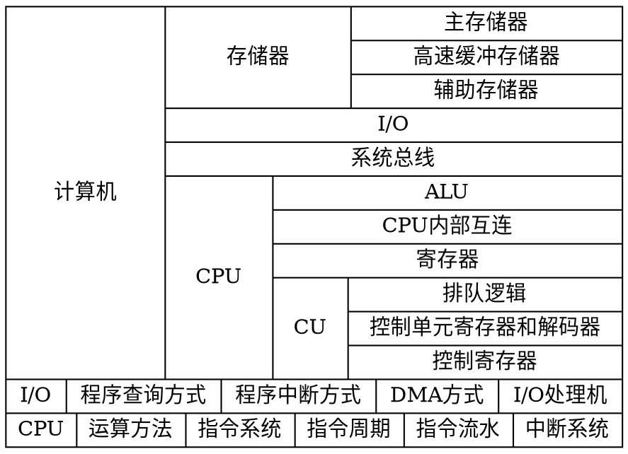

《计算机组成原理》第2版 唐朔飞 编著

* storage mem, disk
* i/o 程序查询方式 程序中断方式 DMA方式 I/O处理机
* bus 总线
* cpu 运算方法 指令系统 指令周期 指令流水 中断系统
  * ALU CPU内部互连 寄存器
  * CU 排队逻辑 控制单元寄存器和解码器 控制寄存器

# 第1篇 概论
## 1. 计算机系统概论
* 存储器
* IO
* 系统总线
* cpu ALU、CU（排队逻辑、控制单元寄存器和解码器、控制存储器）、寄存器、cpu内部互连

## 2. 计算机的发展及引用
电子管 --> 晶体管 --> 集成电路

# 第2篇 计算机系统的硬件结构

## 3. 系统总线
### 3.2 总线的分类
#### 3.2.1 片内总线 
芯片内部的总线
#### 3.2.1 系统总线 
cpu、主存、IO设备之间的信息传输线；按传输信息不同分为数据总线、地址总线、控制总线
#### 3.2.1 通信总线 
计算机系统之间或计算机与其他系统之间的通信
* 串行通信 数据在单条1位宽的传输线上，一位一位地按地址顺序分时传送
* 并行通信 数据在多条并行1位宽的传输线上，同事由源传送到目的地址

### 3.3 总线的特性及性能指标
#### 3.3.4 总线标准
* PCI Peripheral Component Interconnect 外围部件互连
* USB Universal Serial Bus 通用串行总线

### 3.4 总线结构
#### 3.4.1 单总线结构
#### 3.4.2 多总线结构
* 双总线 主存总线（cpu与主存之间）、IO总线
* 三总线 主存总线、IO总线、DMA总线（高速IO设备与主存之间）
* 四总线 高速总线（高速IO设备）

### 3.5 总线控制
#### 3.5.1 总线判优控制
主设备
从设备
#### 3.5.2 总线通信控制
完成一次总线操作的时间成为总线周期。4个阶段
1. 申请分配阶段
2. 寻址阶段
3. 传数阶段
4. 结束阶段

控制方式
* 同步控制
* 异步控制
* 半同步控制
* 分离式通信

## 4. 存储器
### 4.2 主存储器
MAR memory address register 存储器地址寄存器
MDR memory data register    存储器数据寄存器
### 4.3 高速缓冲存储器
### 4.4 辅助存储器

## 5. 输入输出系统
### 5.1 概述
#### 5.1.1 输入输出系统的发展概况
1. 早期阶段 IO设备与主存交换信息都必须通过CPU
2. 接口模块和DMA阶段
3. 具有通道结构的阶段
4. 具有IO处理机的阶段

#### 5.1.4 IO设备与主机信息传送的控制方式
* 程序查询方式 cpu通过程序不断的查询
* 程序中断方式 io就绪向cpu发出中断请求
* DMA方式 Direct Memory Access，直接内存存取

### 5.2 IO设备
### 5.3 IO接口
### 5.4 程序查询方式
核心问题在于每时每刻需不断查询IO设备是否准备就绪。
### 5.5 程序中断方式
出现异常或特殊请求，CPU停止现行程序，转向对异常或特殊请求处理，处理结束再返回现行程序间断处。
#### 5.5.5 中断服务程序的流出
1. 保护现场
2. 中断服务
3. 恢复现场
4. 中断返回

### 5.7 DMA方式
主存和DMA接口之间有一条数据通路，因此主存和设备交换信息时，不通过CPU，也不需要CPU暂停现行程序为设备服务，省去了保护现场和恢复现场。适合高速IO或辅存与主存之间的信息交换。

# 第3篇 中央处理器
CPU的内部结构，基本功能包括计算机的运算、指令系统、指令流水、时序系统、中断系统及控制单元。

## 6. 计算机的运算方法
### 6.1 无符号数和有符号数
### 6.2 数的定点表示和浮点表示
### 6.3 定点运算
### 6.4 浮点四则运算
### 6.5 算术逻辑运算

## 7. 指令系统
### 7.1 机器指令
人们习惯把每一条机器语言的语句成为机器指令，而又将全部机器指令的集合成为指令系统。
#### 7.1.1 指令的一般格式
1. 操作码 用来指明该指令要完成的操作，如加法、减法、传位、移位、转移等。
2. 地址码 用来指出该指令的源操作数的地址、结果的地址以及下一条指令的地址。这里的“地址”可以是主存的地址、也可以是寄存器的地址，甚至是IO设备的地址。

### 7.2 操作数类型和操作类型
#### 7.2.1 操作数类型
1. 地址
2. 数字
3. 字符
4. 逻辑数据

#### 7.2.2 数据在存储器中的存放方式
边界对准、不对准边界
#### 7.2.3 操作类型
1. 数据传送
2. 算术逻辑操作
3. 移位
4. 转移
   1. 无条件转移 jmp x
   2. 条件转移 bro x; brc y; skp dz
   3. 调用与返回 call, return
   4. 陷进与陷进指令
5. 输入输出
6. 其他 等待指令、停机指令、空操作指令、开中断指令、关中断指令、置条件码指令等

### 7.3 寻址方式
寻址方式是指确定本条指令的数据地址以及下一条将要执行的指令地址的方法，它与硬件结构紧密相关，而且直接影响指令格式和指令功能。
#### 7.3.1 指令寻址
#### 7.3.2 数据寻址
### 7.4 指令格式举例
### 7.5 RISC技术

## 8. CPU的结构和功能
### 8.1 CPU的结构
#### 8.1.1 CPU的功能
取指令、分析指令、执行指令
#### 8.1.2 CPU结构框图
bus 控制总线、数据总线、地址总线
cpu ALU, register, interrupt, cu, inner bus

CPU的内部结构：
1. ALU 状态标志、移位、取反、算术和逻辑运算
2. 内部CPU数据总线
3. 寄存器
4. CU 控制单元
5. 中断系统

#### 8.1.3 CPU的寄存器
速度最快、容量最小、位价最贵，CPU内部
* 用户可见寄存器 用户可对这类寄存器编程，可以通过优化减少CPU访问主存次数
   1. 通用寄存器 可由程序设计者指定许多功能，存放操作数、寻址方式
   2. 数据寄存器 存放操作数
   3. 地址寄存器 存放地址
   4. 条件码寄存器 存放条件码
* 控制和状态寄存器 被控制部件使用，控制CPU操作
   1. MAR 存储器地址寄存器
   2. MDR 存储器数据寄存器
   3. PC  程序计数器，存放现行指令的地址，通常有计数的功能。
   4. IR  指令计数器，存放当前欲执行的指令
   
#### 8.1.4 控制单元和中断系统
### 8.2 指令周期
### 8.3 指令流水
### 8.4 中断系统
#### 8.4.1 概述
#### 8.4.2 中断请求标记和中断判优逻辑
#### 8.4.3 中断服务程序入口地址的寻找
#### 8.4.4 中断响应
#### 8.4.5 保护现场和恢复现场
#### 8.4.6 中断屏蔽技术

# 第4篇 控制单元
计算机之所以能自动协调地工作，是由控制单元（CU）的统一指挥。
## 9. 控制单元的功能
### 9.1 微操作命令的分析
#### 9.1.1 取值周期 
#### 9.1.2 间址周期

#### 9.1.3 执行周期
不同指令执行周期的微操作是不同的。
1. 非访存指令 这类指令在执行周期不访问存储器
2. 访存指令 这类指令在执行阶段都需要访问存储器
3. 转移类指令 这类指令在执行阶段不访问存储器

#### 9.1.4 中断周期

### 9.2 控制单元的功能
#### 9.2.1 控制单元的外特性 
#### 9.2.2 控制信号举例
#### 9.2.3 多级时序系统
#### 9.2.4 控制方式
#### 9.2.5 多级时序系统实例分析

## 10. 控制单元的设计
### 10.1 组合逻辑的设计
### 10.2 微程序设计

| 规模      | 集成电路                             |
| :-------- | :----------------------------------- |
| SSI  小   | Small Scale Integration              |
| MSI  中   | Medium Scale Integration             |
| LSI  大   | Large Scale Integrated circuits      |
| VLSI 超大 | Very Large Scale Integrated circuits |
| ULSI 特大 | Ultra Large-Scale Integration        |
| GSI  巨大 | Giga Scale Integration               |