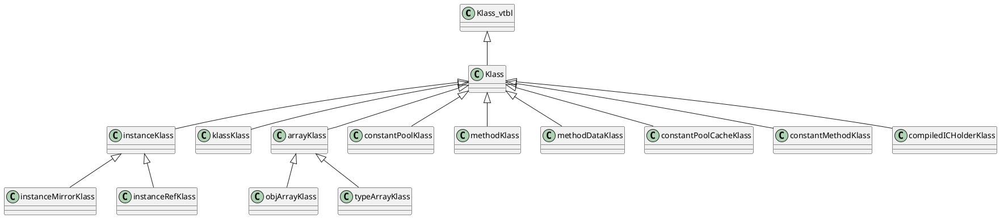
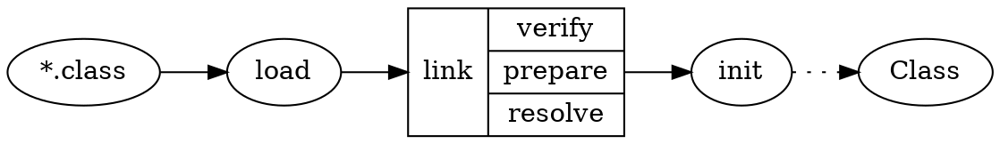

《HotSpot实战》 陈涛 著 人民邮电出版社

网易宝

* 内核
  * 启动 Prims Services Runtime
  * 类与对象 对象表示机制（OOP-Klass Klass与instanceKlass）、类加载、对象创建
* 内存管理
  * 运行时数据区 堆 线程私有区域 方法区 性能监控数据区：PerfData 转储
  * 垃圾收集 堆与GC 垃圾收集器
  * 栈 硬件寄存器、Java栈、栈帧、栈顶缓存
* 解释器和即时编译器、指令集
* 虚拟机监控工具

## 第1章 初试HotSpot
### 1.1 JDK概述
### 1.2 动手编译虚拟机
### 1.3 实战：在Hotspot内调试Helloworld

## 第2章 启动
### 2.1 HotSpot内核
数据结构包括结构体、枚举、类和接口，它定义了数据成员，用以支撑算法的实现。算法反应了功能的实现逻辑。
#### 2.1.2 HotSpot内核框架
HotSpot由多个顶层模块组成，主要包括Service、Prims、Rutime、Classfile、Interperter、Code、Memory、Compiler、Oops、C1/Opto/Shark和GC。

#### 2.1.3 Prims
定义外部接口
1. JNI jni_*为前缀命名的函数，允许JDK或外部程序调用由c/c++实现的库函数。
2. JVM模块 JVM_*
3. JVMTI模块 虚拟机工具接口
4. Perf模块 监控虚拟机内部Perf Data

#### 2.1.4 Services
提供JMX等工具，JVM为支持对Java应用程序进行管理和监控的一套体系结构、设计模式、API以及服务。
1. Management模块
2. MemoryService模块 内存管理，堆的分配和内存池的管理
3. MemoryPool模块 内存池管理模块。内存池表示由JVM管理的内存区域，是内存管理的基本单元。
4. MemoryManger模块 内存管理器。一个内存管理负责管理一个或多个内存池。垃圾收集器也是一个内存管理器，它负责回收不可达对象的内存空间。
   * CopyMemoryManager
   * MSCMemoryManager
   * ParNewMemoryManager 
   * CMSMemoryManager
   * PSSacvengeMemoryManager
   * PSMarkSweepMemeoryManager
   * G1YoungGenMemoryManager
   * G1OldGenMemoryManager
5. RuntimeServices模块 提供Java运行时的性能监控和管理服务，如applicationTime、JVMCapabilities等。
6. ThreadService模块 提供线程和内部同步系统的性能监控和管理服务，包括维护线程列表、线程相关的性能统计、线程快照、线程堆栈跟踪和线程转储等功能。
7. ClassLoadingService模块 提供累加载模块的性能监控和管理服务
8. AttachListener模块 为客户端的JVM监控工具提供连接（attach）服务
9.  HeapDumper模块

#### 2.1.5 Runtime
运行时模块，为其他系统组件提供运行时支持。线程、安全点、PerfData、Stub例程、反射、VMOperation以及互斥锁等。
1. Thread模块
2. Arguments模块 记录和传递VM参数和选项
3. StubRoutines和StubCodeGenerator模块
4. Frame模块 物理栈帧（活动记录），定义了表示物理栈帧的数据结构frame
5. CompilationPolicy模块 配置编译策略
6. Init模块 用于系统初始化
7. VmThread模块 单例原生线程VM Thread（虚拟机线程），派生其他的线程。维护一个虚拟机操作队列，接受其他线程请求虚拟机级别的操作。
8. VMOperation模块

### 2.2 启动
#### 2.2.1 Launcher

### 2.3 系统初始化

## 第3章 类与对象
* OOP-Klass二分模型
* 对象的创建
* 对象的内存布局
* 对象的访问定位
* 类的加载
* 系统字典
  
面向对象如何在HotSpot里实现？对象与类如何实现？
### 3.1 对象的表示机制
#### 3.1.1 OOP-Klass二分模型
* OOP：ordinary object pointer, oops 普通对象指针，用来描述对象实例信息
* Klass：Java类的C++对等体，用来描述Java类  
对于OOPS对象来说，主要职能在于表示对象的是实例数据，没必要持有任何虚函数；而在描述Java累的Klass对象中含有VTBL，那么Klass就能够根据Java对象的实际类型
进行C++分发（dispatch）。  
Klass对象向JVM提供两个功能：实现语言层面的Java类；实现Java对象的分发功能。

#### 3.1.2 Oops模块
OOP框架和Klass框架
* oop
  * constantPoolOop
  * cpCacheOop
  * arrayOop
  * instanceOop 表示一个Java类型实例
  * methodOop 表示一个Java方法
  * markOop 表示对象头
  * typeArrayOop
  * constMehodOop
  * methodOop
  * klassOop 描述一个与Java类对等的C++类
  * objArrayOop
* Klass
  * instanceKlass 在虚拟机层面描述一个Java类
  * methodDataKlass
  * constMethodKlass
  * methodKlass
  * klassKlass
  * instanceKlassKlass
  * instanceRefKlass
  * instanceMirrorKlass
  * arrayKlassKlass
  * objArrayKlassKlass
  * typeArrayKlassKlass
  * arrayKlass
  * objArrayKlass
  * typeArrayKlass
  * constantPoolKlass
  * constantPoolCacheKlass

#### 3.1.3 OOP框架与对象访问机制
在Java应用程序运行过程中，每创建一个Java对象，在JVM内部也会相应创建一个OOP对象来表示Java对象。OOPS类的共同基类为oopDesc。
```c++
class oopDesc {
    private:
        volatile markOop _mark;
        union _metadata {
            wideKlassOop _klass;
            narrowOop _compressed_klass;
        } _metadata;
}
```
instanceOopDesc表示类实例，arrayOopDesc表示数组

在虚拟机内部，通过instanceOopDesc表示一个Java对象。对象在内存中的布局可以分为连续的两部分：instanceOopDesc和实例数据。
其中，instanceOopDesc或arrayOopDesc又被称为对象头，instanceOopDesc对象头包括以下两部分信息。
* mark word：
* 元数据指针：指向描述类型的Klass对象的指针。

在对象引用（栈）中存放的是指向对象（instanceOop，堆）的指针，对象本身则持有指向类（instanceKlass，方法区）的指针。

#### 3.1.4 Klass与instanceKlass


1. 核心数据结构：Klass  

2. 黑心数据结构：instanceKlass  
JVM在运行时，需要一种用来标识Java内部类型的机制。在Hotspot中的解决方案是：为每一个已加载的Java类创建一个instanceKlass对象，用来
在JVM表示Java类。

3. 实例数据的存储顺序  


#### 3.1.5 实战：用HSDB雕饰HotSpot

### 3.2 类的状态转换
#### 3.2.1 入口：Class文件
class文件格式：
* magic
* minior version, major version
* constant pool
* access flags
* this class
* super class
* interfaces
* fields
* methods
* attributes

1. 常量池
2. 字段表
3. 方法表
4. 属性表

#### 3.2.2 类的状态


#### 3.2.3 加载
1. 初始化类加载器
类加载器在初始化时，首先将初始化与类加载相关的一些PerfData计数器。接下来搜索lib库，先确保加载本地库libverify（verify.dll
或libverify.so）和libjava（java.dll或libjava.so），紧接着加载libzip库（zip.dll或libzip.so）。  
加载libzip库完毕，接下来在sun.boot.class.path表示的类路径下初始化启动类加载路径。  

2. 加载
加载的含义是从class文件字节流中提取类型信息。
* ClassFileParser 类解析器
* Verifier 验证器
* ClassLoader 类加载器
* SystemDictionary 系统字典
* SymboleTable 字符表

#### 3.2.4 链接
1. 验证
2. 准备 类静态变量分配内存空间并准备好初始化类中的静态变量
3. 解析 将常量池中的符号引用转换为直接引用，即运行时实际内存地址

#### 3.2.5 初始化
#### 3.2.6 实战：类的“族谱”
#### 3.2.7 实战：系统字典
系统字典记录了系统加载的所有的类。系统字典持有系统已经加载类、类加载器、公共类klass等重要信息。
* 加载 ClassFileParser类ParseClassFile()函数

### 3.3 创建对象
字节码new 
* 常量池中索引，定位目标对象类型
* 内存分配
* 对象头和实例数据初始化
  
#### 3.3.1 实例对象的创建流程
* 快速分配 类已被加载和正确解析 TLAB(UseTLAB) -> Eden需要加锁；对象头（设置MarkWord，设置类型指针）
* 慢速分配 尚未解析

#### 3.3.2 实战：探测JVM内部对象

## 第4章 运行时数据区
堆与方法区所占的内控空间，由JVM负责管理，内存分配由HotSpot的内存管理模块维护，内存释放有垃圾收集器自动完成。
### 4.1 堆
#### 4.1.1 Java的自动内存管理
#### 4.1.2 堆的管理
1. 分代
2. Universe模块

### 4.2 线程私有区域
#### 4.2.1 PC
#### 4.2.2 JVM栈

### 4.3 方法区
#### 4.3.1 纽带作用
方法区存储信息：类型基本描述信息和域（字段域和方法域）信息
#### 4.3.2 常量池
#### 4.3.3 常量池缓存：ConstantPollCache
#### 4.3.4 方法的表示：methodOop
#### 4.3.5 方法的解析：将符合引用转换成直接引用
#### 4.3.6 代码放在哪里：ConstMethodOop
#### 4.3.7 实战：探测运行时常量池

### 4.4 性能监控数据区：PerfData
JVM中开辟的共享内存，存放关于性能统计的计数器。使用共享内存的方式向外部进程提供通信手段，允许外部监控进程attach至虚拟机进程，并从共享内存中读取这些PerfData
### 4.5 转储

## 第5章 垃圾收集
### 5.1 堆与GC
#### 5.1.1 垃圾收集
1. 垃圾收集器
2. 收集算法

#### 5.1.2 分代收集
#### 5.1.3 快速分配
大量连续内存，**碰撞指针**
#### 5.1.4 栈上分配和逸出分析
分析局部变量的作用域仅限于方法内部，则JVM直接在栈帧内分配对象空间，避免在堆中分配。
#### 5.1.5 GC公共模块

### 5.2 垃圾收集器
#### 5.2.1 设计演进
1. 串行收集器：Serial
2. 并行收集器：ParNew
3. 吞吐量优先收集器：Parallel Scanvenge
4. 堆的类型
5. 收集策略

#### 5.2.2 CMS收集器
#### 5.2.3 G1收集器

### 5.3 实战：性能分析方法
#### 5.3.1 获取GC日志
#### 5.3.2 GC监控信息
#### 5.3.3 内存分析工具
#### 5.3.4 选择合适的收集器与GC性能评估
#### 5.3.5 不要忽略JVM Crash日志

## 第6章 栈
### 6.1 硬件背景：了解真实机器
#### 6.1.1 程序是如何运行的
#### 6.1.2 x86与栈帧
真实机器中处理器、寄存器与栈
寄存器是CPU计算单元的存储单元，用来保存计算过程中的各种操作数：立即数、整数、存储器引用地址等。
多数指令具有一个或多个操作数（operand），操作数表示执行该指令操作中要引用的**源数据值**，以及放置指令执行结果的目标数据。
x86支持3种操作数格式：
1. 立即数（），即常量；
2. 寄存器（register），表示寄存器中存的值；
3. 存储器引用，根据某个有效地址访问某个存储器
指令读取操作数方式的不同决定了指令具有不同的寻址模式。

#### 6.1.3 ARM对Java硬件级加速：Jazelle技术
### 6.2 Java栈
寄存器式指令集：许多硬件体系围绕着寄存器存取中间运算数据，相应地，在寻址方式上也是围绕着寄存器进行设计。
#### 6.2.1 寄存器式指令集与栈式指令集
寄存器的优点是访问效率高，缺点是数量有限。
#### 6.2.2 HotSpot中的栈
1. 栈帧 用于支持虚拟机进行方法调用和方法执行的数据结构，它是JVM运行时数据区中的虚拟机栈元素。

#### 6.2.3 栈帧
#### 6.2.4 充分利用寄存器资源
#### 6.2.5 虚拟机如何调用Java函数
1. 入口：JavaCalls
2. 实际例程：CallStub
3. Stub Rountiness
4. CallStub的运行过程

#### 6.2.6 优化：栈顶缓存
栈顶缓存（Top of Stack Cashing，TOSCA/TOS）。将频繁访问的栈顶元素存储在CPU硬件寄存器中，大幅减少内存访问次数，提升性能。

## 第7章 解释器和即时编译器
```
java编译器  .java  -> .class(bytecode)
解释器      .class -> machine code
即时编译器   .class -> machine code
```

### 7.1 概述
解释器 解释器，代码生成器，InterpreterCodelet，转发表（dispatch table）
JIT编译器 C1：client，C2：server
### 7.2 解释器如何工作
#### 7.2.1 Interpreter模块
#### 7.2.2 Code模块
#### 7.2.3 字节码表
#### 7.2.4 CodeCache
#### 7.2.5 InterpreterCodelet与Stub队列
#### 7.2.6 Code生成器
#### 7.2.7 模板表与转发表
### 7.3 即时编译器
#### 7.3.1 概述
#### 7.3.2 编译器模块
#### 7.3.3 编译器的基本结构
字节码 -> HIR -> LIR -> 机器码
1. 编译器前端将Java字节码解释成一种抽象格式HIR（High-level Intermediate Representation，高级中间表示）
2. 编译器后端将HIR转换成LIR
3. 对完成底层优化后的LIR，采用线性扫描寄存器分配算法，进行寄存器的分配。将物理寄存器替换掉LIR中的虚拟寄存器后，生成符合目标机器体系结构的机器码

## 第8章 指令集
JVM指令集
### 8.1 再说栈式指令集
### 8.2 数据传送
### 8.3 类型转换
### 8.4 对象的创建和操作
### 8.5 程序流程控制
### 8.6 运算
#### 8.6.1 加法：iadd
#### 8.6.2 取负：ineg
### 8.7 函数的调用和返回
#### 8.7.1 Java函数分发机制：VTABLE与ITABLE
#### 8.7.2 invoke系列指令
#### 8.7.3 动态分发：覆盖
面向对象特点：抽象，封装，继承，多态
函数的覆盖和重载是多态性的不同表现。覆盖描述的是父类与子类直接的多态性，重载描述的一个类多个函数直接的多态性。
#### 8.7.4 静态分发：重载
### 8.8 异常

## 第9章 虚拟机监控工具
### 9.1 Attach机制
连接机制监控访问虚拟机进程
连接到目标JVM的过程，建立一个进程间通信通道，通过通道，由客户进程向JVM进程下发命令，JVM进程向客户进程返回数据的过程。
### 9.2 查看JVM进程
jsp
### 9.3 查看和配置JVM
jinfo
### 9.4 堆内存转储工具
jmap
#### 9.4.1 Heap Dump
head dump文件是二进制文件，保持了某一时刻JVM堆中对象的内存使用情况，可分析是否存在内存溢出等情况。
#### 9.4.2 原理
### 9.5 堆转储分析
jhat, mat, jstat
#### 9.5.1 Heap Dump分析工具：jhat
分析heap dump文件，启动一个http服务器，将堆中对象的信息以动态网页的形式呈现
#### 9.5.2 实战：MAT分析过程
1. 生成heap dump
2. 查看对象分配了多少空间
3. 内存泄漏

### 9.6 线程转储分析
#### 9.6.1 jstack
#### 9.6.2 实战：如何分析资源等待
1. 获取线程转储信息
2. 判断是否死锁
3. 定位资源瓶颈 明确应用程序所等待的资源
4. 对症下药
