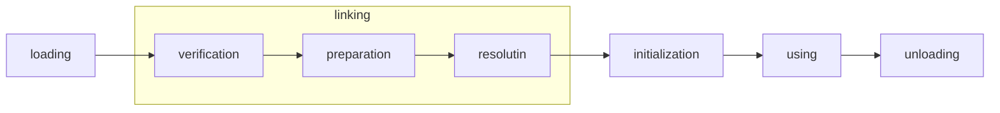
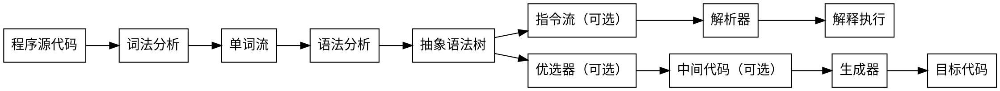

《深入理解Java虚拟机 JVM高级特性与最佳实践》 周志明 著 机械工业出版社

远光软件股份有限公司 研发部总经理兼架构师
国家电网、南方电网、ERP

* 一、走进Java
* 二、自动内存管理机制 Java内存区域与内存溢出异常、垃圾收集器与内存分配策略、虚拟机性能监控与故障处理工具
* 三、虚拟机执行子系统 类文件结构、虚拟机类加载机制、虚拟机字节码执行引擎、类加载及执行子系统的案例与实战
* 四、程序编译与代码优化 早期（编译器）优化、晚期（运行期）优化
* 屋、高效并发 Java内存模型与线程、线程安全与锁优化

# 第一部分 走进Java
## 第1章 走进Java
### 1.2 Java技术体系
Sun官方定义的Java技术体系包括：
1. Java程序设计语言
2. 各种硬件平台上的Java虚拟机
3. Class文件格式
4. Java API类库
5. 来自商业机构和开源社区的第三方Java类库

Java程序设计语言、Java虚拟机、Java API类库这三部分统称为JDK（Java Development Kit）

### 1.3 Java发展史
### 1.4 Java虚拟机发展史
### 1.5 展望Java技术的未来
### 1.6 实战：自己编译JDK

# 第二部分 自动内存管理机制

## 第2章 Java内存区域与内存溢出异常

### 2.2 运行时数据区域
#### 2.2.1 程序计数器
#### 2.2.2 Java虚拟机栈
#### 2.3.3 本地方法栈
#### 2.3.4 Java堆
#### 2.3.5 方法区
#### 2.3.6 运行时常量池
#### 2.3.7 直接内存

### 2.3 HotSpot虚拟机对象探秘
#### 2.3.1 对象的创建
1. new指令，首先检查这个指令的参数是否在常量池中定位到一个类的符号引用，检查类是否已被加载、解析和初始化
2. 为新生对象分配内存
   * 指针碰撞 连续空间将指针移动一段与对象大小相等的空间；seral、parNew等带compact过程的收集器
   * 空闲列表 不连续空间，维护内存列表；cms基于mark-sweep的收集器，通常采用
#### 2.3.2 对象的内存布局
#### 2.3.3 对象的访问定位

### 2.4 实战：OutOfMemoryError异常
#### 2.4.1 Java堆溢出
#### 2.4.2 虚拟机栈和本地方法栈溢出
#### 2.4.3 方法区和运行时常量池溢出
#### 2.4.4 本地直接内存溢出

## 第3章 垃圾收集器与内存分配策略
### 3.2 对象已死吗
#### 3.2.1 引用计数算法
#### 3.2.2 可达性算法分析
图论，广度优先、深度优先
GC Roots对象：
1. 虚拟机栈中引用的对象
2. 方法区中静态属性引用的对象
3. 方法区中常量引用的对象
4. 本地方法栈中引用的对象

#### 3.2.3 再谈引用
#### 3.2.4 生存还是死亡
#### 3.2.5 回收方法区
### 3.3 垃圾收集算法
#### 3.3.1 标记-清除算法
#### 3.3.2 复制算法
#### 3.3.3 标记-整理算法
#### 3.3.4 分代收集算法
根据对象存活周期的不同将内存划分为几块。

### 3.4 HotSpot的算法实现
#### 3.4.1 枚举根结点
#### 3.4.2 安全点
#### 3.4.3 安全区域

### 3.5 垃圾收集器
#### 3.5.1 Serial收集器
#### 3.5.2 ParNew收集器
#### 3.5.3 Paralle Scavenge收集器
#### 3.5.4 Serial Old收集器
#### 3.5.5 Paralle Old收集器
#### 3.5.6 CMS收集器
#### 3.5.7 G1收集器

### 3.6 内存分配与回收策略
#### 3.6.1 对象优先在Eden分配
#### 3.6.2 大对象直接进入老年代
#### 3.6.3 长期存活的对象将进入老年代
#### 3.6.4 动态对象年龄判定
#### 3.6.5 空间分配担保

## 第4章 虚拟机性能监控与故障处理工具

### 4.2 JDK的命令行工具
#### 4.2.1 jps
#### 4.2.2 jstat
#### 4.2.3 jinfo
#### 4.2.4 jmap
#### 4.2.5 jhat
#### 4.2.6 jstack
#### 4.2.7 HSDIS:JIT生成代码反汇编

### 4.3 JDK的可视化工具
#### 4.3.1 jconsole
#### 4.3.2 VisualVM

## 第5章 调优案例分析与实战
## 5.2 案例分析

# 第三部分 虚拟机执行子系统
## 第6章 类文件结构
### 6.3 Class类文件结构
#### 6.3.1 魔数与Class文件的版本
#### 6.3.2 常量池
#### 6.3.3 访问标志
#### 6.3.4 类索引、父类索引与接口索引集合
#### 6.3.5 字段表集合
#### 6.3.6 方法表集合
#### 6.3.7 属性表集合
### 6.4 字节码指令简介
Java虚拟机的指令由一个字节长度的、代表着某种特定操作含义的数字（称为操作码，Opcode）以及跟随其后的零至多个代表此操作所需参数（称为操作数，Operands）而构成。
1. 一个字节，即0 - 255
2. 操作码 某种特定操作
3. 操作数 此操作所需参数

#### 6.4.1 字节码与数据类型
#### 6.4.2 加载和存储指令
加载和存储指令用于将数据在栈帧中的局部变量表和操作数栈之间来回传输
* 将一个局部变量加载到操作数栈 iload, ilaod_<n>, lload, lload_<n>, fload, fload_<n>, dload, dload_<n>, aload, aload_<n>
* 将一个数值从操作数栈存储到局部变量表 istore, istore_<n>, lstore, lstore_<n>
* 将一个常量加载到操作数栈 bipush, sipush, acounst_null, iconst_ml
* 扩充局部变量表的访问索引的指令 wide

#### 6.4.3 运算指令
运算或算术指令用于对两个操作数栈上的值进行某种特定运算，并发结果重新存入到操作栈顶。
* 加法指令 iadd, ladd, fadd, dadd
* 减法指令 isub, lsub, fsub, dsub
* 乘法指令 imul
* 除法指令 idiv
* 求余指令 irem
* 取反指令 ineg, lneg, fneg, dneg
* 位移指令 ishl, ishr, iushr, lshl, lshr, lushr
* 按位或指令 ior, lor
* 按位与指令 iand, land
* 按位异或指令 ixor, lxor
* 局部变量自增指令 iinc
* 比较指令 dcmpg, dcmpl, fcmpg, fcmpl , lcmp

#### 6.4.4 类型转换指令
* 宽化类型转移（小范围类型向大范围类型）直接支持 int -> l, f, d; long -> f, d; float -> double;
* 窄化类型转移（大范围类型向小范围类型）显示地使用转换指令 i2b, i2c, i2s, l2i, f2i, f2l, d2i, d2l, d2f

#### 6.4.5 对象创建与访问指令
* 创建类实例指令 new
* 创建数组的指令 newarray, anewarray, multianewarray
* 访问类字段和实例字段的指令 getfield, putfield, getstatic, putstatic
* 把一个数组元素加载到操作数栈的指令 baload, caload, saload, iaload, laload, faload, daload, aaload
* 把一个操作数栈的值存储到数组元素中的指令 bastore, castore, sastore, iastore, fastore, fastore, aastore
* 取数组长度的指令 arraylength
* 检查类实例类型的指令 instanceof, checkcast

#### 6.4.6 操作数栈管理指令
* pop, pop2
* dup, dup2, dup_x1, dup2_x2, dup_x2, dup2_x2
* swap

#### 6.4.7 控制转移指令
控制转移指令可以让Java虚拟机有条件或者无条件地从指定的位置指令而不是控制转移指令的下一条指令继续执行程序。
* 条件分支 ifeq, iflt, ifle, ifne, ifgt, ifge, ifnull, ifnonnull, if_icmpeq, inf_icmpne...
* 复合条件分支 tableswitch, lookupswitch
* 无条件分支 goto, goto_w, jsr, jsr_w, ret

#### 6.4.8 方法调用和返回指令
* invokevirtual 调用对象的实例方法，根据对象的实际类型进行分派
* invokeinterface
* invokespecial 调用需要特殊处理的方法，包括实例初始化方法、私有方法和父类方法
* invokestatic
* invokedynamic
* 方法返回指令根据返回值的类型区分。ireturn, lreturn, freturn, dreturn, areturn, (void return)

#### 6.4.9 异常处理指令
* Java中显示抛出异常的操作（throw语句）都由athrow指令来实现
* Java虚拟机规范规定了许多运行时异常在其他Java虚拟机指令检测到异常情况时自动抛出。

#### 6.4.10 同步指令
Java虚拟机支持方法级的同步和方法内部一段指令序列的同步，使用管程Monitor来支持。
1. 方法级的同步是隐式的，即无须通过字节码指令来控制，它实现在方法调用和返回操作之中。方法常量池的方法表结构中的ACC_SYNCHRONIZED访问标志
2. 同一段指令集序列通常是由Java语言中的synchronized语句块来表示，Java虚拟机指令集中游monitorenter和monitorexit两条指令支持，需要javac编译器与Java虚拟机两者共同协作支持

### 6.5 公有设计和私有实现
Java虚拟机规范描绘了Java虚拟机应有的共同程序存储格式：Class文件格式以及字节码指令集。

### 6.6 Class文件结构的发展

## 第7章 虚拟机类加载机制
### 7.1 概述
虚拟机把描述类的数据从Class文件加载到内存，并对数据进行校检、转换解析和初始化，最终形成可以被虚拟机直接使用的Java类型，这就是虚拟机的类加载机制。

### 7.2 类加载的时机


有且仅有的5种情况必须立即对类进行**初始化**
1. 遇到new、getstatic、putstatic、invokestatic这4条字节码指令时
2. 使用java.lang.reflect包的方法对类进行反射调用时
3. 在对类的某个子类进行初始化时
4. 虚拟机启动，用户指定一个要执行的主类
5. 使用jdk1.7，如果一个java.lang.invoke.Mehtodhandle实例最后的解析结果


### 7.3 类加载的过程
加载、验证、准备、解析、初始化

#### 7.3.1 加载
从哪里加载：
1. zip包，jar、ear、war
2. 网络中，applet
3. 运行时计算生成，动态代理
4. 其他文件生成，jsp
5. 数据库中读取

加载步骤：
1. 通过一个类的全限定名来获取定义此类的二进制字节流
2. 将这个字节流所代表的静态存储结构转化为**方法区的运行时数据结构**
3. 在内存中生成一个代表这个类的java.lang.Class对象，作为方法区这个类的个找那个数据的访问入口


#### 7.3.2 验证
确保class文件的字节流中包含的信息符合当前虚拟机的要求，并且不会危害虚拟机自身的安全。
1. 文件格式验证
2. 元数据验证
3. 字节码验证
4. 符号引用验证

#### 7.3.3 准备
准备阶段是正式为类变量分配内存并设置类变量初始值的阶段，这些变量所使用的内存都将在方法区中分配。
* 类变量赋予初始值
* 常量赋予最终值

#### 7.3.4 解析
解析阶段是虚拟机将常量池内的符号引用替换为直接引用的过程。
* 符号引用 一组符号描述其所引用的目标，任何形式的字面量
* 直接引用 直接指向目标的指针、相对偏移量或是一个能简介定位到目标的句柄

1. 类或接口的解析
2. 字段解析
3. 类方法解析
4. 接口方法解析

#### 7.3.5 初始化

### 7.4 类加载器
#### 7.4.1 类与类加载器
#### 7.4.2 双亲委派模型

优点：
1. 各个类加载器的基础类统一
2. 保证Java程序的稳定运作
#### 7.4.3 破坏双亲委派模型

## 第8章 虚拟机字节码执行引擎
### 8.1 概述
物理机的执行引擎是直接建立在处理器、硬件、指令集和操作系统层面上的，而虚拟机的执行引擎则是由自己实现的。
### 8.2 运行时栈帧结构
栈帧（Stack Frame）是用于支持虚拟机进行**方法调用**和**方法执行**的数据结构，它是虚拟机运行时数据区中的虚拟机的栈元素。

#### 8.2.1 局部变量表
Local Variable Table，一组变量值存储空间，用于存放方法参数和方法内部定义的局部变量。在Java程序编译为Class文件时，就在方法的Code属性的
max_locals数据项中确定了为方法所需要分配的局部变量表的最大容量。

局部变量表的容量以变量槽（Variable Slot）为最小单位。Slot长度可随处理器、操作系统或虚拟机不同而变化。32位，64位。

1. 一个Slot可以存放一个32位以内的数据类型。
2. 对于64位数据类型，虚拟机以高位对齐的方式分配两个连续的Slot空间。long和double的非原子性协定。局部变量表是线程私有的，不会引起并发问题。
3. 虚拟机通过索引定位的方式使用局部变量表，索引值的范围就是从0开始至局部变量表的最大Slot数量。
4. 实例方法的局部变量表第0位索引的Slot默认是用于传递方法所属对象实例的引用（this）。
5. 为了节省栈帧空间，Slot可以重用，方法体中定义的变量，其作用域并不一定会覆盖整个方法体。某些情况下Slot的复用直接影响GC的行为。
6. 局部变量对于类变量，没有“准备阶段”。必须赋予初始值才能使用。

#### 8.2.2 操作数栈
Operand Stack，常称为操作栈，后入先出LIFO的栈。最大深度在编译时写入到Code属性的max_stacks数据项中。
1. 操作数栈的每一个元素可以是任意的Java数据类型，包括long和double
2. 方法刚开始时，这个方法的操作数栈是空的，方法执行的过程，各种字节码执行往操作数栈中写入和操作内容，就是出栈/入栈的操作。
3. 操作数栈总元素的数据类型必须与字节码指令的序列严格匹配，编译器严格保证这一点，类校检阶段数据流分析中再次验证。
4. 一些优化处理，两个栈帧出现一部分重叠。
5. 基于栈的执行引擎，“栈”就是操作数栈。

#### 8.2.3 动态连接
每个栈帧都包含一个指向运行时常量池中该栈帧所属方法的引用，持有这个引用是为了支持方法调用过程中的动态连接（Dynamic Linking）。
1. 符号引用一部分会在类加载阶段或者第一次使用的时候转化为指向方法的直接应用，静态解析
2. 每一次运行期间转化为直接引用，动态连接 

#### 8.2.4 方法返回地址
1. 正常完成出口
2. 异常完成出口

返回到方法被调用的位置。
#### 8.2.5 附加信息
### 8.3 方法调用
#### 8.3.1 解析
#### 8.3.2 分派
#### 8.3.3 动态语言支持
### 8.4 基于栈的字节码解释执行引擎


* 指令集架构

* 基于栈的指令集
1. 优点：可移植；代码相对更加紧凑；编译器实现简单
2. 缺点：执行速度稍慢（指令数量和内存访问的原因）；栈实现在内存之中，频繁的栈访问意味着频繁的内存访问。
```js
    // 1 + 1
    iconst_1    // 把常量1压入栈
    iconst_1    // 把常量1压入栈
    iadd        // iadd指令把栈顶的两个值出栈、相加，然后把结果放回栈顶
    istore_0    // 把栈顶的值放到局部变量表的第0个Slot中
```

* 基于寄存器的指令集

```js
    // 1 + 1
    mov eax, 1  // mov指令把EAX寄存器的值设为1
    add eax, 1  // add指令把这个值加1，结果就保存在EAX寄存器里
```

基于寄存器的虚拟机，Google Android平台的Dalvik VM。

## 第9章 类加载及执行子系统的案例与实战

# 第四部分 程序编译与代码优化

## 第10章 早期（编译器）优化
### 10.1 概述
Java语言的编译期，可能是指一个前端编译器把*.java文件转换成*.class文件的过程；也可能是把虚拟机的后端运行期编译器把字节码转变成机器码的过程；
还可能是指使用提前编译器直接把*.java编译成本地机器码的过程。
* 前端编译器 sun的javac
* JIT编译器 HotSpot VM的c1、c2编译器
* AOT编译器

### 10.2 Javac编译器
#### 10.2.1 Javac的源码与调试
JDK_SRC_HOME/langtools/src/share/classes/com/sun/tools/javac  
sun javac的编译过程
1. 解析与填充符号表过程
2. 插入式注解处理器的注解处理过程
3. 分析与字节码生成过程

#### 10.2.2 解析与填充符号表
1. 词法、语法分析
2. 填充符号表

#### 10.2.3 注解处理器
#### 10.2.4 语义分析与字节码生成
1. 标注检查
2. 数据及控制流分析
3. 解语法糖 语法糖指在计算机语言中添加的某种语法，这种语法对语言的功能并没有影响，但是更方便程序员的使用。
4. 字节码生成 代码添加和转换工作

### 10.3 Java语法糖的味道
#### 10.3.1 泛型与类型擦除
#### 10.3.2 自动装箱、拆箱与遍历循环
#### 10.3.3 条件编译
### 10.4 实战：插入式注解处理器

## 第11章 晚期（运行期）优化
### 11.1 概述
### 11.2 HotSpot虚拟机内的即时编译器
#### 11.2.1 解释器与编译器
运行模式：解释模式 -Xint；编译模式 -Xcomp；混合模式 默认
编译器选择：-client c1编译器；-server c2编译器（opto编译器）
#### 11.2.2 编译对象与触发条件
热点代码：
* 被多次调用的方法
* 被多次执行的循环体

判断一段代码是不是热点代码，是不是需要触发即时编译，这样的行为成为热点探测
* 基于采样的热点探测
* 基于计数器的热点探测  

HotSpot中使用基于计数器的热点探测方法，因此它为每个方法准备了两类计数器：方法调用计数器和回边计数器。  
回边计数器的作用是统计一个方法中循环体代码的执行次数，在字节码中遇到控制流向后跳转的指令称为“回边”。
#### 11.2.3 编译过程
c1编译器三段式编译
1. 一个平台独立的前端将字节码构造成一种高级中间代码表示HIR
2. 一个平台相关的后端从HIR中产生低级中间代码表示LIR
3. 在平台相关的后端使用线性扫描算法在LIR上分配寄存器，并在LIR上做窥孔优化，然后产生机器码

#### 11.2.4 查看及分析即时编译结果
### 11.3 编译优化技术
#### 11.3.1 优化技术概览
方法内联的目的，一是去除方法调用的成本（建立栈帧等），二是为其他优化建立良好的基础。
* 语言无关的经典优化技术之一：公共子表达式消除
* 语言相关的经典优化技术之一：数组范围检查消除
* 最重要的优化技术之一：方法内联
* 最前沿的优化技术之一：逃逸分析

#### 11.3.2 公共子表达式消除
#### 11.3.3 数组边界检查消除
#### 11.3.4 方法内联
#### 11.3.5 逃逸分析
逃逸分析基本行为就是分析对象的动态作用域；
当一个对象在方法中被定义后，它可能被外部方法所引用，例如作为调用参数传递到其他方法中，成为方法逃逸。
甚至还有可能被外部线程访问到，譬如赋值给类变量或可以在其他线程中访问的实例变量，成为线程逃逸。

1. 栈上分配
2. 同步消除
3. 标量替换 标量是指一个数据已经无法再分解成更小的数据来表示。Java虚拟机中的原始数据类型。聚合量（Aggregate）

### 11.4 Java与C/C++的编译器对比

# 第五部分 高效并发

## 第12章 Java内存模型与线程
### 12.2 硬件的效率与一致性
### 12.3 Java内存模型
#### 12.3.1 主内存与工作内存
#### 12.3.2 内存间交互操作
#### 12.3.3 对于volatile型变量的特殊规则
#### 12.3.4 对于long和double型变量的特殊规则
#### 12.3.5 原子性、可见性、有序性
#### 12.3.6 先行发生原则
### 12.4 Java与线程

## 第13章 线程安全与锁优化
### 13.2 线程安全
#### 13.2.1 Java语言中的线程安全
前提：多个线程之间存在共享数据访问
1. 不可变
2. 绝对线程安全
3. 相对线程安全
4. 线程兼容
5. 线程对立 无论调用端是否采用同步措施，都无法在多线程环境中并发使用的代码。Thread的suspend(), resume()

#### 13.2.2 线程安全的实现方法

##### 1.互斥同步
同步是指在多个线程并发访问共享数据时，保证共享数据在同一时刻只被一个（或者一些，使用信号量的时候）线程使用。临界区、互斥量、信号量。

主要问题：进行线程阻塞和唤醒所带来的性能问题。悲观的并发策略。用户态核心态转换、维护锁计数器和检查是否有被阻塞的线程需要唤醒等操作。

1. synchronized关键字，原生语法层面， monitorenter和monitorexit。涉及用户态与核心态转换。
2. ReentrantLock，API层面。等待可中断、可实现公平锁、锁可以绑定多个条件

##### 2.非阻塞同步 
基于冲突检测的乐观并发策略。

先进行操作，如果没有其他线程征用共享数据，那操作就成功了；
如果共享数据有郑永，产生了冲突，那就在采用其他的补偿措施（最常见的补偿措施就是**不断的重试，直到成功为止**）。

1. 需要硬件指令集支持。因为需要操作和冲突检测这两个步骤具备原子性。
   * 测试并设置 test-and-set 20世纪已存在
   * 获取并增加 fetch-and-increment 20世纪已存在
   * 交换 swap 20世纪已存在
   * 比较并交换 compare-and-swap, CAS；现代处理器新增；IA64、x86指令集中游cmpxchg指令；sparc-TSO有casa指令
   * 加载链接/条件存储 load-linked/store-condition, LL/SC；现代处理器新增；ARM和PowerPC架构，一对ldrex/strex指令
2. CAS指令 3个操作数，内存位置V、旧的预期值A、新值B；jdk1.5之后，sun.misc.Unsafe
3. AtomicInteger原子变量
4. ABA问题，带有标记的原子引用类AtomicStampedReference

##### 3.无同步方案
不涉及共享数据，那无须任何同步措施。
1. 可重入代码 Reentrant Code
2. 线程本地存储 Thread Local Storage 共享数据的可见范围限制在同一个线程之内；java.lang.ThreadLocal

### 13.3 锁优化

#### 13.3.1 自旋锁与自适应自旋
#### 13.3.2 锁消除
#### 13.3.3 锁粗化
#### 13.3.4 轻量级锁
1. 代码进入同步块时，如果此同步对象没有被锁定，虚拟机首先将当前线程的栈帧中建立一个名为琐记录（Lock Record）的空间，用于存储锁对象目前的Mark Word的拷贝。
2. 虚拟机将使用CAS操作尝试将对象的Mark Word更新为指向Lock Record的指针。
3. 如果更新动作成功了，那么这个线程就拥有了该对象的锁，并且将对象Mark Word的锁标志位将转变为“00”，即表示此对象处于轻量级锁定状态。
4. 如果更新操作失败了，虚拟机首先检查对象的Mark Word是否指向当前线程的栈帧，如果指向说明了当前线程已经拥有这个对象的锁，那就可以至二级进入同步块执行，否则要膨胀为重量级锁，锁状态标志值变为“10”

#### 13.3.5 偏向锁
偏向于第一个获得它的线程，如果在接下来的执行过程中，该锁没有被其他线程获取，则持有偏向锁的线程将永远不需要再进行同步。
1. 锁对象第一次被线程获取时，虚拟机会把对象头中的标志位设为“01”，即偏向模式。同时使用CAS操作把获取到的这个锁的线程ID记录在对象的mark word之中。
如果CAS操作成功，持有偏向锁的线程以后每次进入这个锁相关的同步块时，可以不再进行任何同步操作。
2. 当有另外一个线程去尝试获取这个锁时，偏向模式就宣告结束。
3. -XX:-UseBiasedLocking