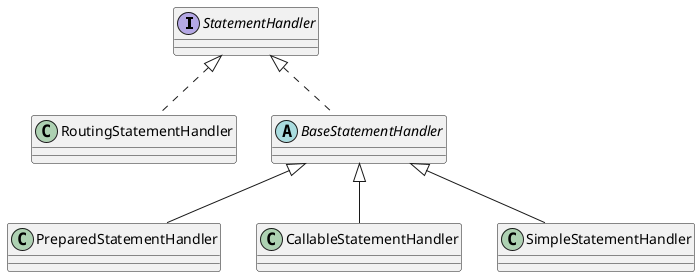
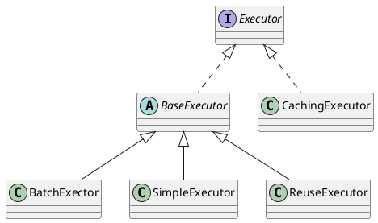

《MyBatis技术内幕》徐郡明 中国工信出版集团 电子工业出版社

## 第1章 Mybatis快速入门

### 1.4 Mybatis整体架构
#### 1.4.1 基础支持层
* 反射模块
* 类型转换模块
* 日志模块
* 资源加载模块
* 数据源模块
* 事务管理
* 缓存模块
* Binding模块
* 解析器模块

#### 1.4.2 核心处理层
* 配置解析
* 参数映射
* sql解析与scripting模块
* sql执行
* 结果集映射
* 插件

#### 1.4.3 接口层
* SqlSession

## 第2章 基础支持层
### 2.1 解析器模块
* DOM document object model 基于树形结构的XML解析方式，将整个XML文档读入内存中并构建一个DOM树
* SAX simple api for xml 基于事件模型的xml解析方式，不需要将整个xml加载，当sax解析到某个类型节点事，触发注册到该类型节点上的回调函数
* StAX streaming api for xml JAXP是JDK提供，支持DOM和SAX解析方式。

#### 2.1.1 XPath简介
是使用DOM解析，并结合使用Xpath解析XML。XPath之于XML好比SQL语言之于数据库。  
XPath使用路径表达式来选取XML文档中指定的节点或节点集合。  

### 2.2 反射工具箱
### 2.3 类型转换
### 2.4 日志模块
### 2.5 资源加载
### 2.6 DataSource
### 2.7 Transaction
### 2.8 binding模块
### 2.9 缓存模块
#### 2.9.1 装饰器模式
装饰器模块可以动态的为对象添加功能，基于组合的方式实现。
#### 2.9.2 Cache接口及其实现
* PerpetualCache HashMap实现
* BlockingCache 加锁，保证只有一个线程到数据库中查询指定key对应的数据
* FifoCache & LruCache 
  * LinkedList 
  * LinkedHashMap get()方法访问到元素，会将这个元素移动到队列尾部
* SoftCache & WeakCache
  * ReferenceQueue 引用队列收集一个对象的可达性变化
  * SoftReference 创建SoftReference对象时，可以为其关联到一个引用队列，当ReferenceQueue所引用的对象被GC回收时，
  jvm就会将SoftReference对象添加到与之关联的引用队列中。
  * WeakReference

#### 2.9.4 Cachekey

## 第3章 核心处理层
### 3.1 Mybatis初始化
#### 3.1.1 建造者模式
#### 3.1.2 BaseBuilder
#### 3.1.3 XMLConfigBuilder
#### 3.1.4 XMLMapperBuilder
#### 3.1.5 XMLStatementBuilder
#### 3.1.6 绑定Mapper接口
#### 3.1.7 处理incomplete*集合

### 3.2 SqlNode&SqlSource
sql节点被解析成MappedStatement对象，sql语句呗解析成SqlSource对象，sql语句中的动态sql节点、文本节点，由SqlNode接口的相应实现表示
DynamicSqlSource处理动态sql，RawSqlSource处理静态语句，两者最终都会被处理后的sql语句封装成staticSqlSource返回。

#### 3.2.1 组合模式
将对象组合成树形结构，已表示“部分--整体”的层次结构，用户可以像处理一个简单对象一样来处理一个复杂对象。
#### 3.2.2 OGNL表达式简介
在Mybatis中，使用OgnlCache对原生的OGNL进行封装。
#### 3.2.3 DynamicContext
用于记录sql语句之后产生的sql语句片段，可以认为他是一个用于记录动态sql语句解析结果的容器。
#### 3.2.4 SqlNode
#### 3.2.5 SqlSourceBuilder
#### 3.2.6 DynamicSqlSource
#### 3.2.7 RawSqlSource

### 3.3 ResultSetHandler
#### 3.3.1 handleResultSets()方法
#### 3.3.2 ResultSetWrapper
#### 3.3.3 简单映射
#### 3.3.4 嵌套映射
#### 3.3.5 嵌套查询&延迟加载
#### 3.3.6 多结果集处理
#### 3.3.7 游标
#### 3.3.8 输出类型的参数

### 3.4 KeyGenerator
### 3.4.1 Jdbc3keyGenerator
### 3.4.2 SelectkeyGenerator

### 3.5 StatementHandler
StatementHandler 接口中的功能很多，例如创建 Statement 对象，为 SQL 语句绑定实参，执行 select、 insert、 update 、 delete 等多
种类型的 SQL 语句，批量执行 SQL 语句，将结果集映射成结果对象。

#### 3.5.1 RoutingStatementHandler
#### 3.5.2 BaseStatementHandler
#### 3.5.3 ParameterHandler
#### 3.5.4 SimpleStatementHandler
#### 3.5.5 PreparedStatementHandler

StatementHandler 依赖 ParameterHandler 和 ResultSetHandler完成了 MyBatis 的核心功能，它控制着参数绑定 、 SQL 语句执行、结果集
映射等一系列核心流程。

### 3.6 Executor

#### 3.6.1 模板方法模式
将模板方法一起固定不变的基本方法同一封到父类中，而将变化的部分封装到子类中实现。
#### 3.6.2 BaseExecutor
1. 一级缓存 会话级别
   伴随一次session的打开与关闭。
   PrepetualCache

#### 3.6.3 SimpleExecutor
#### 3.6.4 ReuseExecutor
#### 3.6.5 BatchExecutor
#### 3.6.5 CachingExecutor
1. 二级缓存 应用级别
   
### 3.7 接口层
#### 3.7.1 策略模式
#### 3.7.2 SqlSession
#### 3.7.3 DefaultSqlSessionFactory
#### 3.7.4 SqlSessionManager
SqlSessionManager 同时实现了 SqlSession 接口和 SqlSessionFactory 接口 ，也就同时提供了SqlSessionFactory 创建 SqlSession 对象
以及 SqlSession 操纵数据库的功能。

## 第4章 高级主题
### 4.1 插件模块
### 4.2 Mybatis与Spring集成
### 4.3 拾遗