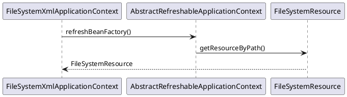
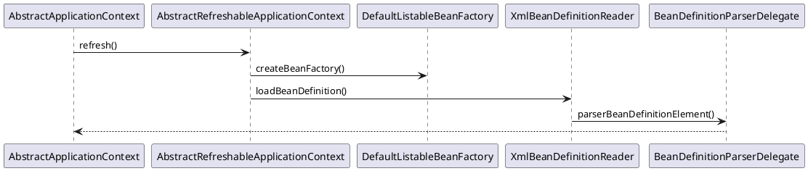
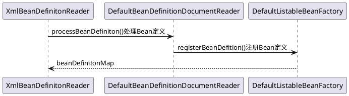
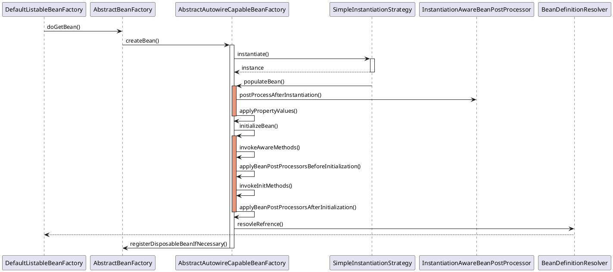
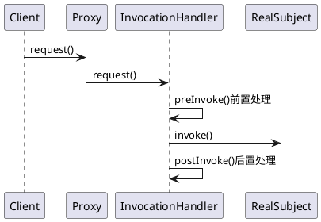
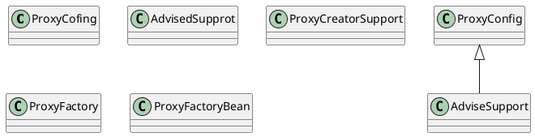
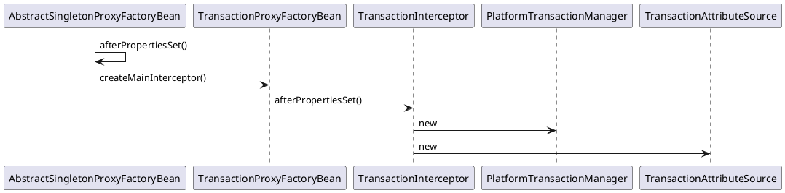
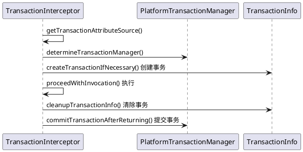
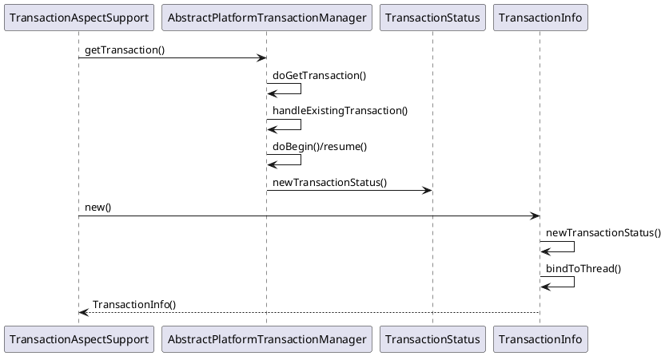

《Spring技术内幕：深入解析Spring架构与设计原理(第2版)》 计文柯

* 核心 ioc, aop
* 组件 mvc, db, tx, http-invoker
* 应用 acegi, dm, flex

## 第1章 Spring的设计理念和整体架构
### 1.1 Spring的各个子项目
### 1.2 Spring的设计目标
### 1.3 Spring的整体架构
### 1.4 Spring的应用场景
### 1.5 小结

# 第一部分 Spring核心实现篇

## 第2章 Spring Framework的核心：IoC容器的实现

### 2.1 Spring IoC容器概述
#### 2.1.1 IoC容器和依赖反转模式
#### 2.1.2 Spring IoC的应用场景

### 2.2 IoC容器系列的设计与实现：BeanFactory和ApplicationContext
BeanFactory接口的简单容器系列，这系列容器只实现了容器的基本功能；
ApplicationContext应用上下文，它作为容器的高级形态存在，添加了许多面向框架的特性，同时对应用环境做了许多适配。
#### 2.2.1 Spring的IoC容器系列
Spring通过定义BeanDefinition来管理基于Spring的应用中的各种对象以及它们之间的相互依赖关系。
BeanDefinition抽象了对Bean的定义，是让容器起作用的主要数据类型。
对IoC容器来说，BeanDefinition就是对依赖反正模式中管理的对象依赖关系的数据抽象，也是容器实现依赖反转功能的核心**数据结构**。
#### 2.2.2 Spring IoC容器的设计
1. BeanFactory的应用场景
2. BeanFactory容器的设计原理
3. ApplicationContext的应用场景
4. ApplicationContext容器的设计原理

### 2.3 IoC容器的初始化过程
#### 2.3.1 BeanDefinition的Resource定位


#### 2.3.2 BeanDefinition的载入和解析


#### 2.3.3 BeanDefinition在IoC容器中的注册



### 2.4 IoC容器的依赖注入


### 2.5 容器其他相关特性的设计与实现
#### 2.5.1 ApplicationContext和Bean的初始化及销毁
#### 2.5.2 lazy-init属性和预实例化
#### 2.5.3 FactoryBean的实现
#### 2.5.4 BeanPostProcessor的实现
#### 2.5.5 autowiring（自动依赖装配）的实现
#### 2.5.6 Bean的依赖检查
#### 2.5.7 Bean对IoC容器的感知
### 2.6 小结

## 第3章 Spring AOP的实现

### 3.1 Spring AOP概述
#### 3.1.1 AOP概念回顾
#### 33.1.2 Advice通知
定义在连接点做什么，为切面增强提供织入接口

#### 33.1.3 Pointcut切点
决定Adavice通知应该作用于哪些连接点，也就是说Pointcut来定义需要增强的方法的集合，这些集合的选取可以按照一定的规则来完成。

#### 33.1.4 Advisor通知器
完成对目标方法的切面增强设计（Advice）和关注点的设计（Pointcut）以后，需要一个对象把他们结合起来，完成这个作用的就是Advisor（通知器）。

### 3.2 Spring AOP的设计与实现
#### 3.2.1 JVM的动态代理特性




#### 3.2.2 Spring AOP的设计分析
1. advice，pointcut
2. 为目标对象建立代理对象，jdk，cglib
3. 启动代理对象的拦截器完成横切面的织入，adapter

#### 3.2.3 Spring AOP的应用场景
日志、事务、缓存

### 3.3 建立AopProxy代理对象
#### 3.3.1 设计原理
围绕ProxyFactory设计
```yuml
// {type:class}

[ProxyConfig{bg:thistle}]
[AdvisedSupport{bg:wheat}]
[ProxyCreatorSupport{bg:steelblue}]
[ProxyFactory{bg:tomato}]

// ProxyConfig数据基类，提供配置属性
[ProxyConfig]^-[AdvisedSupport]

// AdvisedSupport封装了通知和通知器的操作
[TargetClassAware]^-[Advised]
[Advised]^-.-[AdvisedSupport]
[AdvisedSupport]^-[ProxyCreatorSupport]

[AdvisedSupport]^-[AbsractSingletonProxyFactoryBean]
[AbsractSingletonProxyFactoryBean]^-[TransactionProxyFactoryBean]

// ProxyCreatorSupport为子类创建代理的辅助类
// ProxyFactory编程式的使用
[ProxyCreatorSupport]^-[ProxyFactory]
[ProxyCreatorSupport]^-[AspectJProxyFactory]
// ProxyFactoryBean可以在容器中完成声明式配置
[ProxyCreatorSupport]^-[ProxyFactoryBean]
```


#### 3.3.2 配置ProxyFactoryBean
1. 定义使用的通知器Advisor，把它定义为一个bean
2. 定义ProxyFactoryBean，把它作为另一个bena来定义
   1. 封装aop功能的主要类。设置proxyInterface、interpreterNames和target等。
   2. interpreterNames往往设置为需要定义的通知器
3. 定义target属性，作为target属性注入的bean

#### 3.3.3 ProxyFactoryBean生成AopProxy代理对象
* 通过interpreterNames属性来配置已经定义好的通知器。
* 为目标对象target生成代理对象proxy


#### 3.3.4 JDK生成AopProxy代理对象
#### 3.3.5 CGLIB生成AopProxy代理对象

### 3.4 Spring AOP拦截器调用的实现
#### 3.4.1 设计原理
#### 3.4.2 JdkDynamicAopProxy的invoke拦截
#### 3.4.3 Cglib2AopProxy的intercept拦截
#### 3.4.4 目标对象方法的调用
#### 3.4.5 AOP拦截器链的调用
#### 3.4.6 配置通知器
#### 3.4.7 Advice通知的实现
#### 3.4.8 ProxyFactory实现AOP

### 3.5 Spring AOP的高级特性
使用spring aop时，对目标对象的增强是通过拦截器来完成的。

### 3.6 小结

# 第二部分 Spring组件实现篇

## 第4章 Spring MVC与Web环境
### 4.1 Spring MVC概述
#### 4.2 Web环境中的Spring MVC
### 4.3 上下文在Web容器中的启动
#### 4.3.1 IoC容器启动的基本过程
#### 4.3.2 Web容器中的上下文设计
#### 4.3.3 ContextLoader的设计与实现
### 4.4 Spring MVC的设计与实现
#### 4.4.1 Spring MVC的应用场景
#### 4.4.2 Spring MVC设计概览
#### 4.4.3 DispatcherServlet的启动和初始化
#### 4.4.4 MVC处理HTTP分发请求
### 4.5 Spring MVC视图的呈现
#### 4.5.1 DispatcherServlet视图呈现的设计
#### 4.5.2 JSP视图的实现
#### 4.5.3 ExcelView的实现
#### 4.5.4 PDF视图的实现
### 4.6 小结

## 第5章 数据库操作组件的实现
### 5.1 Spring JDBC的设计与实现
#### 5.1.1 应用场景
#### 5.1.2 设计概要
### 5.2 Spring JDBC中模板类的设计与实现
#### 5.2.1 设计原理
#### 5.2.2 JdbcTemplate的基本使用
#### 5.2.3 JdbcTemplate的execute实现
#### 5.2.4 JdbcTemplate的query实现
#### 5.2.5 使用数据库Connection
### 5.3 Spring JDBC中RDBMS操作对象的实现
#### 5.3.1 SqlQuery的实现
#### 5.3.2 SqlUpdate的实现
#### 5.3.3 SqlFunction
### 5.4 Spring ORM的设计与实现
#### 5.4.1 应用场景
#### 5.4.2 设计概要
### 5.5 Spring驱动Hibernate的设计与实现
#### 5.5.1 设计原理
#### 5.5.2 Hibernate的SessionFactory
#### 5.5.3 HibernateTemplate的实现
#### 5.5.4 Session的管理
### 5.6 Spring驱动iBatis的设计与实现
#### 5.6.1 设计原理
#### 5.6.2 创建SqlMapClient
#### 5.6.3 SqlMapClientTemplate的实现
### 5.7 小结

## 第6章 Spring事务处理的实现
### 6.1 Spring与事务处理
* ACID。涉及并发和数据一致性问题。
* 单库事务
* 分布式事务

### 6.2 Spring事务处理的设计概览
* ProxyConfig
  * AbstractSingletonProxyFactoryBean
    * TransactionProxyFactoryBean
* TransactionAspectSupport
  * TransactionInterceptor 
* PlatformTransactionManager TransactionStatus
  * ResoureceManager
  * AbstractPlatformTransactionManager

### 6.3 Spring事务处理的应用场景

### 6.4 Spring声明式事务处理
#### 6.4.1 设计原理与基本过程
* 读取和处理IoC容器中配置的事务处理属性，并转化为Spring事务处理需要的内部数据结构。
  * TransactionAttributeSourceAdvisor
* 统一的事务处理过程。事务处理属性配置，线程绑定。TransactionInfo、TransactionStatus
* 底层事务处理的实现。具体的事务处理器。

#### 6.4.2 实现分析
1.事务处理拦截器的配置



2.事务处理配置的读入
3.事务处理拦截器的设计与实现
  * TransactionProxyFactoryBean.getObject()
  * TransactionInterceptor.invoke()




### 6.5 Spring事务处理的设计与实现
#### 6.5.1 Spring事务处理的编程式使用
#### 6.5.2 事务的创建


#### 6.5.3 事务的挂起
#### 6.5.4 事务的提交
#### 6.5.5 事务的回滚
### 6.6 Spring事务处理器的设计与实现
#### 6.6.1 Spring事务处理的应用场景
* PlatformTransactionManager
  * AbstractPlatformManager doGetTransaction(),doBegin(),doCommit(),doRollback()
    * DataSourceTransactionManager
    * JpaTransactionManager

#### 6.6.2 DataSourceTransactionManager的实现
#### 6.6.3 HibernateTransactionManager的实现
### 6.7 小结

## 第7章 Spring远端调用的实现
### 7.1 Spring远端调用的应用场景
### 7.2 Spring远端调用的设计概览
### 7.3 Spring远端调用的实现
#### 7.3.1 Spring HTTP调用器的实现
#### 7.3.2 Spring Hession
#### 7.3.3 Spring RMI的实现
### 7.4 小结

# 第三部分 Spring应用实现篇

## 第8章 安全框架ACEGI的设计与实现
### 8.1 Spring ACEGI安全框架概述
#### 8.1.1 概述
#### 8.1.2 设计原理与基本实现过程
#### 8.1.3 ACEGI的Bean配置
### 8.2 配置Spring ACEGI
### 8.3 ACEGI的Web过滤器实现
### 8.4 ACEGI验证器的实现
#### 8.4.1 AuthenticationManager的authenticate
#### 8.4.2 DaoAuthenticationProvider的实现
#### 8.4.3 读取数据库用户信息
#### 8.4.4 完成用户信息的对比验证
### 8.5 ACEGI授权器的实现
#### 8.5.1 与Web环境的接口FilterSecurityInterceptor
#### 8.5.2 授权器的实现
#### 8.5.3 投票器的实现
### 8.6 小结

## 第9章 Spring DM模块的设计与实现
### 9.1 Spring DM模块的应用场景
### 9.2 Spring DM的应用过程
### 9.3 Spring DM设计与实现
### 9.4 小结

## 第10章 Spring Flex的设计与实现
### 10.1 Spring Flex模块的应用场景
### 10.2 Spring Flex的应用过程
### 10.3 Spring Flex的设计与实现
### 10.4 小结

## 附录A Spring项目的源代码环境
## 附录B 构建Spring项目的发布包
## 附录C 使用Spring IDE
## 附录D Spring Pet Clinic应用实例