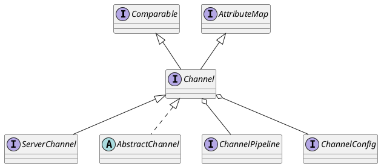

《Netty实战》 何品 译 人民邮电出版社

* 概念及体系结构 传输Channel、ByteBuf、ChannelHandler、ChannelPipeline、EventLoop和线程模型、引导
* 编解码 编解码框架
* 网络协议 websocket udp

# 第一部分Netty的概念及体系结构
## 第1章　Netty——异步和事件驱动
* 关注点分离——业务和网络逻辑解耦；
* 模块化和可复用性；
* 可测试性作为首要的要求

### 1.1  Java网络编程
socket
selector
### 1.2  Netty简介
### 1.3  Netty的核心组件
#### 1.3.1  Channel
#### 1.3.2  回调
#### 1.3.3  Future
#### 1.3.4  事件和ChannelHandler

## 第2章　你的第一款Netty应用程序
## 第3章　Netty的组件和设计
### 3.1  Channel、EventLoop和ChannelFuture
* Channel—Socket；
* EventLoop—控制流、多线程处理、并发；
* ChannelFuture—异步通知

可以将 ChannelFuture 看作是将来要执行的操作的结果的占位符。
### 3.2  ChannelHandler和ChannelPipeline
ChannelPipeline 提供了 ChannelHandler 链的容器，并定义了用于在该链上传播入站
和出站事件流的 API。当 Channel 被创建时，它会被自动地分配到它专属的 ChannelPipeline。

### 3.3  引导
Netty 的引导类为应用程序的网络层配置提供了容器，这涉及将一个进程绑定到某个指定的
端口， 或者将一个进程连接到另一个运行在某个指定主机的指定端口上的进程。

## 第4章　传输
### 4.1  案例研究：传输迁移
Java NIO和IO之间第一个最大的区别是，IO是面向流的，NIO是面向缓冲区的。
* OIO BIO
* NIO
* OioEventLoopGroup OioServerSocketChannel
* NioEventLoopGroup NioServerSocketChannel

### 4.2  传输API
核心 Channel，被用于所有IO操作
* Channel
* ChannelPipeline
* ChannelHandler

Channel的方法

| 方法名        | 描述                                                            |
|:--------------|:----------------------------------------------------------------|
| eventLoop     | 返回分配给Channel的EventLoop                                    |
| pipeline      | 返回分配给Channel的ChannelPipeline                              |
| isActive      | 如果Channel是活动的，则返回ture。活动的意义可能依赖于底层的传输 |
| localAddress  | 本地SocketAddress                                               |
| remoteAddres  | 远程SocketAddress                                               |
| write         | 将数据写到远程节点                                              |
| flush         | 将之前已写的数据冲刷到底层传输                                  |
| writeAndFlush | 写入和冲刷                                                      |

### 4.3  内置的传输
* NIO 基于jdk选择器的方式
* Epoll 由JNI驱动的epoll()和非阻塞IO，比NIO传输更快，完全非阻塞
* OIO java.net阻塞流
* Local vm内部通过管道进行通信的本地传输
* Embedded 允许使用ChannelHandler而又不需要一个真正的基于网络的传输

#### 4.3.1 NIO--非阻塞IO
NioEventLoopGroup
NioServerSocketChannel
#### 4.3.2 Epoll--用于Linux的本地非阻塞传输
EpollEventLoopGroup
EpollServerSocketChannel
#### 4.3.3 OIO--旧的阻塞IO
它可以通过常规的传输 API 使用，但是由于它
是建立在 java.net 包的阻塞实现之上的，所以它不是异步的

Netty利用了SO_TIMEOUT这个Socket标志， 它指定了等待一个I/O操作完成的最大毫秒
数。如果操作在指定的时间间隔内没有完成， 则将会抛出一个SocketTimeout Exception。 Netty
将捕获这个异常并继续处理循环。在EventLoop下一次运行时，它将再次尝试。这实际上也是
类似于Netty这样的异步框架能够支持OIO的唯一方式
#### 4.3.4 用于 JVM 内部通信的 Local 传输
Netty 提供了一个 Local 传输， 用于在同一个 JVM 中运行的客户端和服务器程序之间的异步
通信。
#### 4.3.5 Embedded 传输
Netty 提供了一种额外的传输， 使得你可以将一组 ChannelHandler 作为帮助器类嵌入到
其他的 ChannelHandler 内部。 通过这种方式，你将可以扩展一个 ChannelHandler 的功能，
而又不需要修改其内部代码。

### 4.4  传输的用例

## 第5章　ByteBuf
Netty 的 ByteBuffer 替代品是 ByteBuf， 一个强大的实现，既解决了 JDK API 的局限性，
又为网络应用程序的开发者提供了更好的 API。

* 它可以被用户自定义的缓冲区类型扩展；
* 通过内置的复合缓冲区类型实现了透明的**零拷贝**；
* 容量可以按需增长（类似于 JDK 的 StringBuilder）；
* 在读和写这两种模式之间切换不需要调用 ByteBuffer 的 flip()方法；
* 读和写使用了不同的索引；
* 支持方法的**链式调用**；
* 支持引用计数；
* 支持池化。

### 5.1  ByteBuf的API
abstract class ByteBuf
interface ByteBufHolder

### 5.2  ByteBuf类——Netty的数据容器
#### 5.2.2 ByteBuf的使用模式
1. 堆缓冲区
2. 直接缓冲区
3. 复合缓冲期 CompositeByteBuf
我们不想为每个消息都重新分配这两个缓冲区，所以使用 CompositeByteBuf 是一个
完美的选择。 它在消除了没必要的复制的同时， 暴露了通用的 ByteBuf API。

### 5.3  字节级操作
### 5.4  ByteBufHolder接口
### 5.5  ByteBuf分配
#### 5.5.1  按需分配：ByteBufAllocator接口
#### 5.5.2  Unpooled缓冲区
#### 5.5.3  ByteBufUtil类
### 5.6  引用计数
引用计数是一种通过在某个对象所持有的资源不再被其他对象引用时释放该对象所持有的
资源来优化内存使用和性能的技术。 

## 第6章　ChannelHandler和 ChannelPipeline
### 6.1  ChannelHandler家族
#### 6.1.1  Channel的生命周期
* ChannelRegistrerd
* ChannelActive
* ChannelInactive
* ChannelUnregistered

#### 6.1.2  ChannelHandler的生命周期
* handlerAdded
* handlerRemove
* handlerCaught

#### 6.1.3  ChannelInboundHandler接口
#### 6.1.4  ChannelOutboundHandler接口
#### 6.1.5  ChannelHandler适配器
#### 6.1.6  资源管理
Netty 使用引用计数来处理池化的 ByteBuf
总之，如果一个消息被消费或者丢弃了， 并且没有传递给 ChannelPipeline 中的下一个
ChannelOutboundHandler， 那么用户就有责任调用 ReferenceCountUtil.release()。
如果消息到达了实际的传输层， 那么当它被写入时或者 Channel 关闭时，都将被自动释放。

### 6.2  ChannelPipeline接口
每一个新创建的 Channel 都将会被分配一个新的 ChannelPipeline。这项关联是永久性
的； Channel 既不能附加另外一个 ChannelPipeline，也不能分离其当前的。在 Netty 组件
的生命周期中，这是一项固定的操作，不需要开发人员的任何干预。

#### 6.2.1  修改ChannelPipeline
#### 6.2.2  触发事件
* ChannelPipeline 保存了与 Channel 相关联的 ChannelHandler；
* ChannelPipeline 可以根据需要，通过添加或者删除 ChannelHandler 来动态地修改；
* ChannelPipeline 有着丰富的 API 用以被调用，以响应入站和出站事件。

### 6.3  ChannelHandlerContext接口
ChannelHandlerContext 代表了 ChannelHandler 和 ChannelPipeline 之间的关
联，每当有 ChannelHandler 添加到 ChannelPipeline 中时，都会创建 ChannelHandlerContext
。 ChannelHandlerContext 的主要功能是管理它所关联的 ChannelHandler 和在
同一个 ChannelPipeline 中的其他 ChannelHandler 之间的交互。

### 6.4  异常处理

## 第7章　EventLoop和线程模型
### 7.1  线程模型概述
### 7.2  EventLoop接口
Netty 的 EventLoop 是协同设计的一部分，它采用了两个基本的 API： 并发和网络编程。
首先， io.netty.util.concurrent 包构建在 JDK 的 java.util.concurrent 包上，用
来提供线程执行器。其次， io.netty.channel 包中的类，为了与 Channel 的事件进行交互，
扩展了这些接口/类。

事件/任务的执行顺序 事件和任务是以先进先出（FIFO）的顺序执行的。 这样可以通过保证字
节内容总是按正确的顺序被处理，消除潜在的数据损坏的可能性。

在Netty 4 中， 所有的I/O操作和事件都由已经被分配给了EventLoop的那个Thread来处理 

在以前的版本中所使用的线程模型只保证了入站（之前称为上游）事件会在所谓的 I/O 线程
（对应于 Netty 4 中的 EventLoop）中执行。所有的出站（下游）事件都由调用线程处理，其可
能是 I/O 线程也可能是别的线程。开始看起来这似乎是个好主意，但是已经被发现是有问题的，
因为需要在 ChannelHandler 中对出站事件进行仔细的同步。 简而言之，不可能保证多个线程
不会在同一时刻尝试访问出站事件。

### 7.3  任务调度
周期性执行
#### 7.3.1 JDK 的任务调度 API
Timer
ScheduledExecutorService
#### 7.3.2  使用EventLoop调度任务

### 7.4  实现细节
EventLoopGroup 负责为每个新创建的 Channel 分配一个 EventLoop。在当前实现中，
使用顺序循环（round-robin）的方式进行分配以获取一个均衡的分布，并且相同的 EventLoop
可能会被分配给多个 Channel。（这一点在将来的版本中可能会改变。）

一旦一个 Channel 被分配给一个 EventLoop， 它将在它的整个生命周期中都使用这个
EventLoop（以及相关联的 Thread）。

## 第8章　引导
### 8.1  Bootstrap类
服务器致力于使用一个父 Channel 来接受来自客户端的连接， 并创建子 Channel 以用于它们之间的通信；
而客户端将最可能只需要一个单独的、 没有父 Channel 的 Channel 来用于所有的网络交互。

### 8.2  引导客户端和无连接协议
### 8.3  引导服务器
### 8.4  从Channel引导客户端
### 8.5  在引导过程中添加多个ChannelHandler
### 8.7  引导DatagramChannel
### 8.8  关闭

## 第9章　单元测试
### 9.1  EmbeddedChannel概述
### 9.2  使用EmbeddedChannel测试ChannelHandler
### 9.3  测试异常处理

# 第二部分编解码器
## 第10章　编解码器框架
编码和解码，或者数据从一种特定协议的格式到另一种格式的转换。
### 10.1  什么是编解码器
### 10.2  解码器
#### 10.2.1  抽象类ByteToMessageDecoder
#### 10.2.2  抽象类ReplayingDecoder
#### 10.2.3  抽象类MessageToMessageDecoder
#### 10.2.4  TooLongFrameException类
### 10.3  编码器
#### 10.3.1  抽象类MessageToByteEncoder
#### 10.3.2  抽象类MessageToMessageEncoder
### 10.4  抽象的编解码器类
#### 10.4.1  抽象类ByteToMessageCodec
#### 10.4.2  抽象类MessageToMessageCodec
#### 10.4.3  CombinedChannelDuplexHandler类

## 第11章　预置的ChannelHandler和编解码器
### 11.1  通过SSL/TLS保护Netty应用程序
### 11.2  构建基于Netty的HTTP/HTTPS应用程序
### 11.3  空闲的连接和超时
### 11.4  解码基于分隔符的协议和基于长度的协议
### 11.5  写大型数据
### 11.6  序列化数据

# 第三部分网络协议
## 第12章　WebSocket
## 第13章　使用UDP广播事件