《Tomcat架构解析》 刘光瑞 著 中国工信出版社 人民邮电出版社


* Tomcat架构
  * Catalina
  * Coyote
  * Jasper
* Tomcat 配置管理 JVM配置、服务器配置、Web应用配置、Web应用过滤器、Tomcat管理
  * Web服务器集成 与Apache HTTP Server集成、与Nginx集成
  * Tomcat集群 集群配置、会话同步、集群部署
  * Tomcat安全 配置安全、应用安全、传输安全、Java安全策略
  * Tomcat性能调优 JVM优化、Tomcat优化、应用优化
* Tomcat附加功能 嵌入式启动、JNDI、Comet和WebSocket

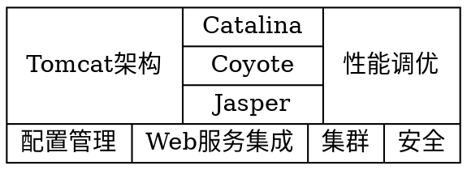

## 第1章 Tomcat介绍
### 1.1 简介
### 1.2 安装和启动
### 1.3 Tomcat目录结构
### 1.4 Tomcat 8.5之后的新特性

## 第2章 Tomat总体架构
### 2.1 总体设计
#### 2.1.1 Server
#### 2.1.2 Connector和Container
#### 2.1.3 Container设计
#### 2.1.4 Lifecycle
#### 2.1.5 Pipeline和Valve
#### 2.1.6 Connector设计
#### 2.1.7 Executor
#### 2.1.8 Bootstrap和Catalina
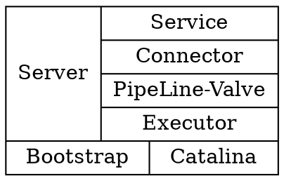

#### 应用服务器设计
```yuml
// {type:class}

// 定义
// 生命周期 还支持组件状态以及状态之间的转换，支持添加事件监听器，用于监听组件的状态变化
[Lifecycle||+init();+start();+stop();+destroy()]
// 连接器 网络协议与应用解耦
// 容器 代表一类组件，处理接收客户端的请求并且返回响应数据。提供后台处理功能，执行异步任务，定期执行
[Container||+addChild();+backgroundProcess()]
// 管道-阀 Pipeline用于构造职责链，Value代表职责链上的每个处理器

// 生命周期
[Lifecycle]^-[Connector{bg:yellow}]
[Lifecycle]^-[Server]
[Lifecycle]^-[Service{bg:violet}]
[Lifecycle]^-[Container]
[Lifecycle]^-[Executor{bg:skyblue}]

// 服务器
[Server]++->[Service]
[Catalina]++->[Server]
[Bootstrap{bg:tomato}]-.->[Catalina]

// 服务
[Service]++->[Connector]
[Service]++->[Executor]
// 引擎负责请求的处理，不需要考虑请求链接、协议等处理
[Service]++->[Engine]
[Service]++->[MapperListener]
[Service]++->[Mapper{bg:sienna}]

// 容器
[Container]++->[Container]
[Container]^-[Engine]
[Container]^-[Host]
[Container]^-[Context]
[Container]^-[Wrapper]
[Engine]++->[Host]
[Host]++->[Context]
[Context]++->[Wrapper]
[Container]++->[Pipeline]
[Pipeline]++->[Valve]

// 连接器
[Connector]-.->[Executor]
[Connector]++->[ProtocolHandler]
[ProtocolHandler]++->[AbstractEndpoint]
[ProtocolHandler]-.->[Processor]

// 请求映射 当processor读取客户端请求后，需要按照请求地址映射到具体的容器进行处理
[MapperListener]++->[Mapper]

// CoyoteAdpater 适配器模式实现Connector与Mapper、Container的解耦
[Processor]-.->[CoyoteAdpater]
[CoyoteAdpater]-.->[Mapper]
[CoyoteAdpater]-.->[Container]
```

#### Tomcat服务器中的组件
| 组件名称  | 说明                                              | 其他                                     |
| :-------- | :------------------------------------------------ | :--------------------------------------- |
| Server    | 整个Servlet容器                                   | 唯一一个                                 |
| Service   | 一个或多个Connector的集合                         | 一个Tomcat实例包含任意多个，它们彼此独立 |
| Connector | 监听并转化Socket请求，同时将请求交由Container处理 | 支持不同协议以及不同的IO方式             |
| Container | 能够执行客户端请求并返回响应的一类对象            | Engine Host Context Wrapper              |
| Engine    | 整个Servlet引擎                                   |                                          |
| Host      | 引擎中的虚拟机，与一个服务器的网络名有关          | dns                                      |
| Context   | ServletContext，一个独立的Web应用                 |                                          |
| Wrapper   | Web应用中定义的Servlet                            |                                          |
| Executor  | 共享的线程池                                      |                                          |


### 2.2 Tomcat启动
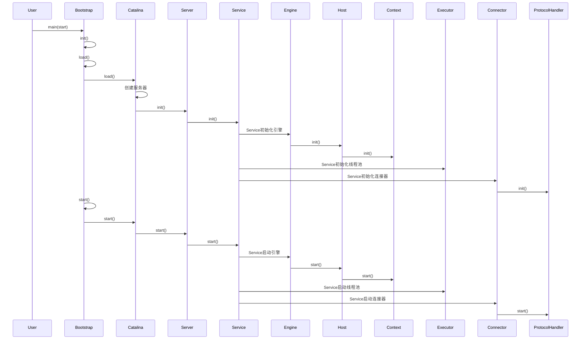

### 2.3 请求处理
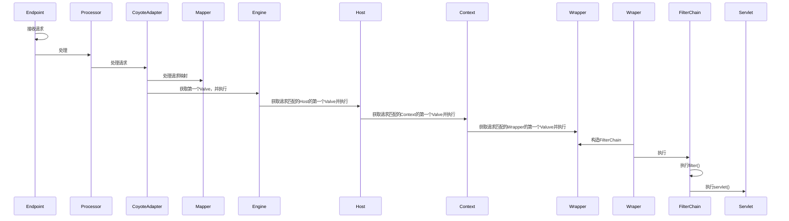

### 2.4 类加载器
#### 2.4.1 J2SE标准类加载器
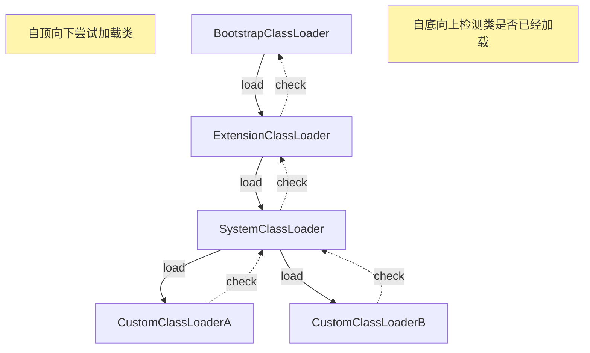

#### 2.4.2 Tomcat加载器
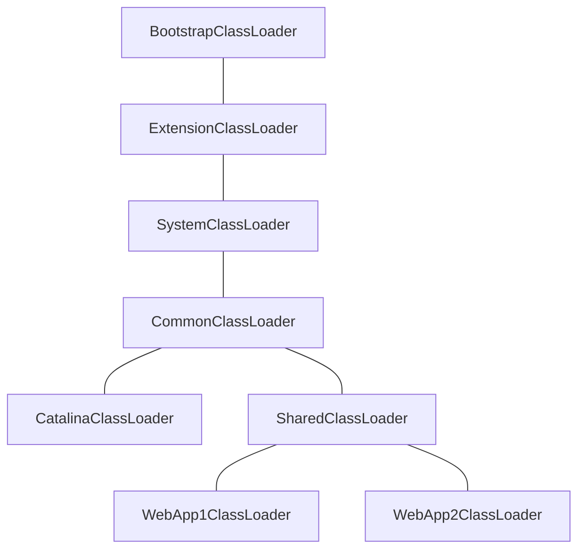

##### 共享 
Common类加载器实现了jar包在应用服务器以及web应用之间共享，
通过shared类加载器实现了jar包在web应用之间的共享，
通过catalina类加载器加载服务器依赖的类
##### 隔离性
服务器与web应用的隔离。

#### 2.4.3 Web应用类加载器
Java默认的类加载机制
1. 从缓存中加载
2. 如果缓存中没有，则从父类加载器中加载
3. 如果父类加载器没有，则从当前类加载器加载
4. 如果没有，则抛出异常

Web应用类加载器默认加载顺序
1. 从缓存中加载
2. 如果没有，则从JVM的Bootstrap类加载器加载
3. 如果没有，则从当前类加载器加载（按照WEB-INF/classes、WEB-INF/lib的顺序）
4. 如果没有，则从父类加载器加载，由于父类加载器采用默认的委派模式，所以加载顺序为System、Common、Shared

## 第3章 Catalina
### 3.1 什么是Ctalina
Catalina包含了所有容器组件，涉及安全、会话、集群、部署、管理等Servlet容器的各个方面。
通过松耦合的方式集成Coyote。

Tomcat本质上是一款Servlet容器，因此Catalina是Tomcat的核心，其他模块均为Catalina提供支撑。
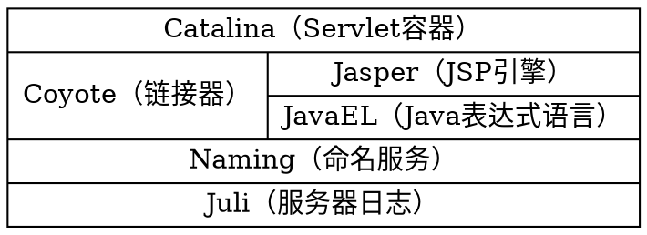
### 3.2 Digester
### 3.3 创建Server
#### 3.3.1 Server的解析
#### 3.3.2 Engine的解析
#### 3.3.3 Host的解析
#### 3.3.4 Context的解析

### 3.4 Web应用加载
Catalina对Web应用的加载主要由StandardHost、HostConfig、StandardContext、ContextConfig、StandardWrapper这个5个类完成。

```mermaid
sequenceDiagram
    participant Actor
    participant StandardHost
    participant ContainerBase
    participant HostConfig

    Actor->>StandardHost:start

    %% 标准虚拟机启动
    StandardHost->>StandardHost:添加ErrorReportValve
    StandardHost->>ContainerBase:super.startInternal

    %% 基本容器启动
    ContainerBase->>ContainerBase:cluster.start
    ContainerBase->>ContainerBase:realm.start
    ContainerBase->>StandardContext:children.start

     %% 标准上下文发布事件。上下文配置监听到事件并启动、解析web.xml、创建Wrapper
    StandardContext->>StandardContext:nameResources.start resources.start loader.start realm.start
    StandardContext->>ContextConfig:fireLiecycleEvent(CONFIGURE_START_EVENT)
    ContextConfig->>ContextConfig:configureStart webConfig
    ContextConfig->>WebXml:解析web.xml，创建WebXml对象
    ContextConfig->>StandardWrapper:根据WebXml中的Servlet定义创建Wrapper

    %% 标准上下文启动
    StandardContext->>StandardContext:children.start 创建并启动会话管理器 初始化filter loadOnStartup load
    ContextConfig-->>StandardContext:addChild(Wrapper)

    %% 管道启动
    ContainerBase->>ContainerBase:pipeline.start
    ContainerBase->>HostConfig:fireLifecycleEvent(START_EVENT)
    ContainerBase->>ContainerBase:启动后台线程

    %% HostConfig 部署war包、目录
    HostConfig->>HostConfig:deployDescriptors
    HostConfig->>HostConfig:deployWARs
    HostConfig->>HostConfig:deployDirectories
    
    %% HostConfig 返回
    HostConfig-->>StandardHost:addChild(context)
    HostConfig-->>StandardHost:addChild(context)
    HostConfig-->>StandardHost:addChild(context)
    StandardHost->>StandardContext:child.start
```

#### 3.4.1 StandardHost
#### 3.4.2 HostConfig
#### 3.4.3 StandardContext
#### 3.4.4 ContextConfig
#### 3.4.5 StandardWrapper
#### 3.4.6 Context命名规则

### 3.5 Web请求处理
#### 3.5.1 总体过程
#### 3.5.2 请求映射
#### 3.5.3 Catalina请求处理
Tomcat的每一级容器均提供了基础的Valve实现以完成当前容器的请求处理过程，而且基础Valve实现始终位于职责链的末尾，以确保最后执行。
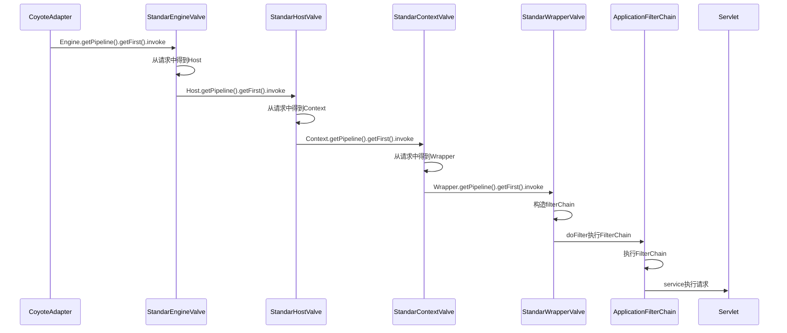

### 3.6 DefaultServlet和JspServlet
* DefaultServlet 处理静态资源；支持输出文件目录列表
* JspServlet 处理所有jsp文件的请求；
  - 根据jsp文件生成对应的servlet的java代码
  - 将java代码编译为java类
  - 构造servlet实例并执行请求


## 第4章 Coyote
Servlet容器和链接器是Tomcat最核心的两个组件，它们是构成一款Java应用服务器的基础。

### 4.1 什么是Coyote
1. Coyote是tomcat服务器提供的供客户端访问的外部接口。客户端通过Coyote与服务器建立链接、发送请求并接收响应。
2. Coyote封装了底层的网络通信（Socket请求及响应处理），为Catalina容器提供了统一的接口，使Catalina容器与具体的请求协议及I/O方式解耦。
3. Coyote将Socket输入转换为Request对象，交由Catalina容器进行处理，处理请求完成后，Catalina通过Coyote提供的Response对象将结果写入输出流。
4. Coyote作为独立的模块，只负责具体协议和I/O的处理，与Servlet规范实现没有直接关系。

Tomcat对协议及I/O方式的支持
* 应用层 http, ajp, http2
* 传输层 nio, nio2, apr    

### 4.2 Web 请求处理
#### 4.2.1 主要概念
* Endpoint Coyote通信端点，通信监听的接口，Socket接收处理类，是对传输层的抽象
* Processor Coyote协议处理接口，负责构造Request和Response对象，并通过Adapter将其提交到Catalina容器处理，应用层的抽象
  - Http11Processor
  - AjpProcessor
  - StreamProcessor 
* ProtocolHandler Coyote协议接口，通过封装Endpoint和Processor，实现针对具体协议的处理功能。
  - Http11NioProtocol
  - Http11ArpProtocol
  - Http11Nio2Protocol
  - AjpNioProtocol
  - AjpAprProtocol
  - AjpNio2Protocol
* UpgradeProtocol 表示HTTP升级协议 

#### 4.2.2 请求处理
Connector请求处理过程
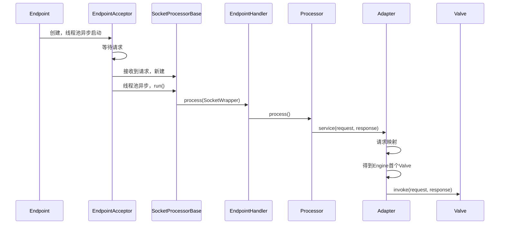

### 4.3 HTTP
### 4.4 AJP
### 4.5 HTTP/2.0

### 4.6 I/O 
传统上说的I/O涵盖文件、网络、内存以及标准输入输出等不同种类，本节主要侧重网络I/O。
#### 4.6.1 BIO
#### 4.6.2 NIO
* 通道 Channel 双向的
* 缓冲区 Buffer 容器对象
* 多路复用器 Selector 同时检测多个通道的事件以实现异步I/O

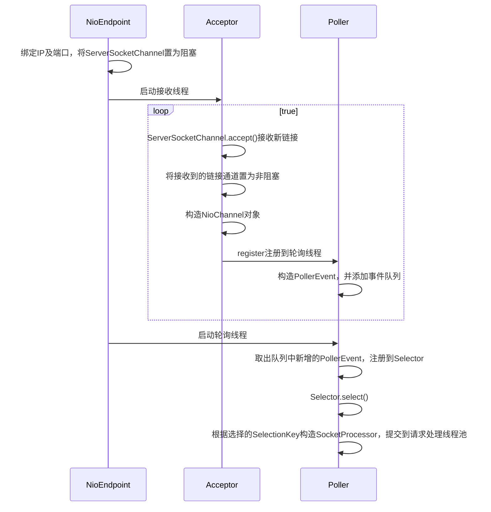
#### 4.6.3 NIO2
* 异步通道 AsynchronousChannel
* 缓冲区
* Future Future自己检测IO状态或者直接future.get()方法等待IO操作结束。
* CompletableHandler 由JDK检测IO状态，实现回调接口进行处理
* 异步通道组 AsynchronousChannelGroup 每个异步通道均属于一个指定的异步通道组，同一个通道组内的通道共享一个线程池。
线程池内的线程接收指令来执行IO事件并将结果分发到CompletionHandler。

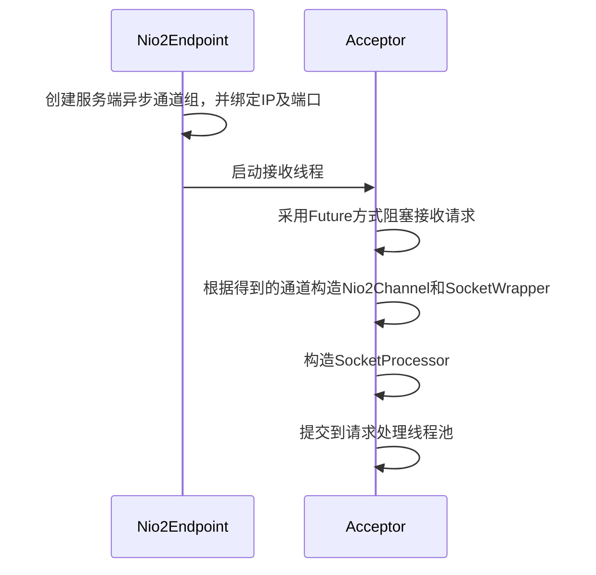

#### 4.6.4 APR
1. Apache Portable Runtime，使命是创建和维护一套软件库，以便在不同操作系统底层实现的基础上提供统一的API。
2. 为应用程序开发提供统一API，对于某些不支持的功能，APR则进行模拟实现

## 第5章 Jasper
### 5.2 JSP编译方式
#### 5.2.1 运行时编译
#### 5.2.2 预编译
### 5.3 JSP编译原理

## 第6章 Tomcat配置管理
### 6.1 JVM配置
### 6.2 服务器配置
### 6.3 Web应用配置
### 6.4 Web应用过滤器
### 6.5 Tomcat管理

## 第7章 Web服务器集成
### 7.1 Web服务器与应用服务器的区别
### 7.2 集成应用场景
### 7.3 与Apache HTTP Server集成
### 7.4 与Nginx集成
### 7.5 与IIS集成

## 第8章 Tomcat集群
### 8.1 Tomcat集群介绍
### 8.2 集群配置
### 8.3 会话同步
### 8.4 集群部署

## 第9章 Tomcat安全
### 9.1 配置安全
### 9.2 应用安全
### 9.3 传输安全（SSL）
### 9.4 Java安全策略

## 第10章 Tomcat性能调优
### 10.1 Tomcat性能测试及诊断
* 响应时间
* 吞吐量 tps

### 10.1.1 测试方法
* 负载测试
* 压力测试
* 持续运行时间测试

### 10.1.2 性能测试工具
* ApacheBench
```
ab -n 500 -c 5 http://localhost:8080/sample/index.jsp
```
* Apache JMeter

### 10.1.3 数据采集及分析
* 网络

带宽   nload, bmon, slurm
套接字 iftop, iptraf, tcptrack, pkstat, netwatch
* 内存/CPU
top
vmstat
* java
```
jstat   查看内存统计（javaHeap）、GC
jmap    进程内堆详情、对象数量、内存使用；jhat；eclipse mat
jstack  栈信息
jconsole
visualvm
```

### 10.2 Tomcat性能优化
### 10.2.1 JVM优化
jvm垃圾回收性能度量：吞吐量；暂停
```
-Xms
-Xmx
-Xmn
-XX:NewSize=
-XX:MaxNewSize=
-XX:MetaspaceSize=
-XX:MaxMetaspaceSize=
-Xss
```

### 10.2.2 Tomcat配置
#### 调整server.xml配置
* maxConnection
* tcpNoDelay
* maxKeepAliveRequest
* socketBuffer
* enableLookups
* http静态文件压缩
* 高性能链接器提升IO效率
* 关闭自动部署autoDeploy

#### 调整JSP页面设置
* jsp标签body池

#### 与Web服务器集成
* 动静分离
* 集群、负载均衡

### 10.3 应用性能优化建议

## 第11章 Tomcat附加功能
### 11.1 Tomcat的嵌入式启动
### 11.2 Tomcat中的JNDI
Java应用通过JNDI API按照命名查找数据和对象。可对比zookeeper的统一命名服务（Name Service）

### 11.3 Comet和WebSocket
服务器推送技术

#### 11.3.3 WebSocket
基于TCP的协议，建立WebSocket链接时，客户端首先发送一个握手请求，服务器返回一个握手响应，握手为HTTP Upgrade请求，因此服务器可以通过HTTP端口进行处理，并将通信方式切换至WebSocket协议。

