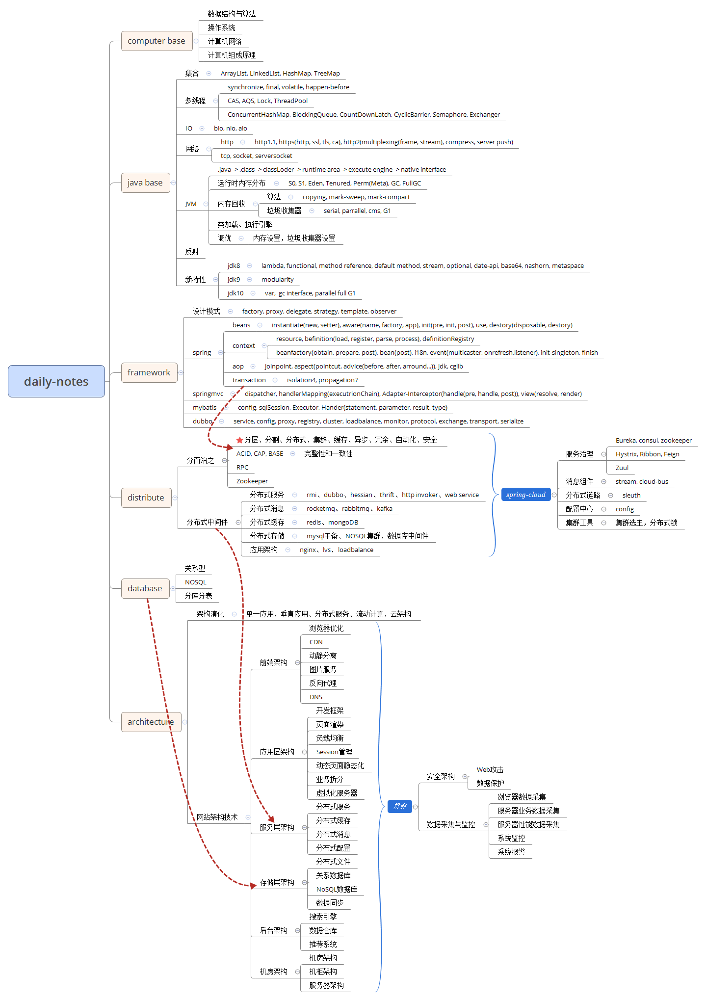

[gitee-onlyonion-development](https://gitee.com/onlyonion/development "hello") 

This is my daily notes, enriching the mind....

## introduce

* [java](https://gitee.com/onlyonion/development/tree/master/10-java)

* [framework](https://gitee.com/onlyonion/development/tree/master/20-framework)

* [distributed](https://gitee.com/onlyonion/development/tree/master/30-distributed)

* [architecture](https://gitee.com/onlyonion/development/tree/master/40-architecture)

* [database](https://gitee.com/onlyonion/development/tree/master/50-database)

* [dev-ops](https://gitee.com/onlyonion/development/tree/master/70-dev-ops)

* [book](https://gitee.com/onlyonion/development/tree/master/99-book)

 

