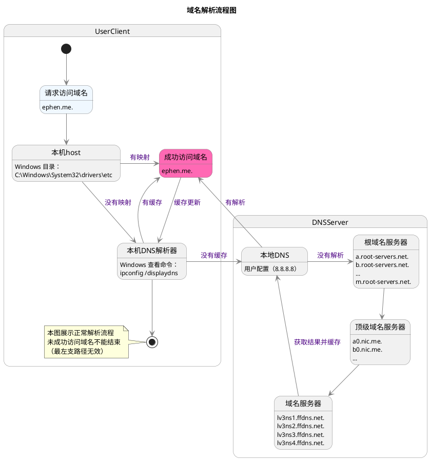

网络知识

## 4/7层网络模型

## 物理层

## 数据链路层

## 网络层

### 本地回环地址
127.0.0.1，通常被称为本地回环地址(Loopback Address)，不属于任何一个有类别地址类。它代表设备的本地虚拟接口，所以默认被看作是永远不会宕掉的接口。

一般都会用来检查本地网络协议、基本数据接口等是否正常的。

## TCP协议 
### 建立链接三次握手 
```
 Client                       Server
            
SYN_SEND    ---  SYN    -->   LISTEN
SYN_SEND    <-- SYN,ACK ---   SYN_RCVD
ESTABLISHED ---  ACK    -->   ESTABLISHED
```

[调优](https://blog.csdn.net/erlib/article/details/50236919 )
开启SYN Cookies。当出现SYN等待队列溢出时，启用cookies来处理，可防范少量SYN攻击，默认为0，表示关闭；
net.ipv4.tcp_syncookies = 1  
  
其他调优参数
tcp_syn_retries ：INTEGER
默认值是5
对于一个新建连接，内核要发送多少个 SYN 连接请求才决定放弃。不应该大于255，默认值是5，对应于180秒左右时间。
(对于大负载而物理通信良好的网络而言,这个值偏高,可修改为2.这个值仅仅是针对对外的连接,对进来的连接,是由tcp_retries1 决定的)
  
tcp_max_syn_backlog ：INTEGER
对于那些依然还未获得客户端确认的连接请求﹐需要保存在队列中最大数目。对于超过 128Mb 内存的系统﹐默认值是 1024 ﹐低于 128Mb 的则为 128。
如果服务器经常出现过载﹐可以尝试增加这个数字。  
  
### 关闭链接四次握手

```
 Client                           Server

ESTABLISHED                     ESTABLISHED
FIN_WAIT_1   ---  FIN   -->     ESTABLISHED    
FIN_WAIT_2   <--  ACK   ---     CLOSE_WAIT
TIME_WAIT    <--  FIN   ---     LAST_ACK
TIME_WAIT    ---  ACK   -->     CLOSED
2MSL
CLOSED
```

为什么等待2倍的2MSL，才能关闭
* 保证TCP的全双工连接能够可靠关闭
* 保证这次连接中重复的数据段在网络中消失，防止端口重用的时候可能产生混淆

大量Socket处理CLOSE_WAIT或TIME_WAIT状态处理
```
vi /etc/sysctl.conf

net.ipv4.tcp_tw_reuse = 0 表示开启重用。允许将TIME-WAIT sockets重新用于新的TCP连接，默认为0，表示关闭
net.ipv4.tcp_tw_recycle = 0 表示开启TCP连接中TIME-WAIT sockets的快速回收，默认为0，表示关闭
net.ipv4.tcp_fin_timeout = 60 表示如果套接字由本端要求关闭，这个参数决定了它保持在FIN-WAIT-2状态的时间（可改为30，一般来说FIN-WAIT-2的连接也极少）
```

### 报文状态标志与链接状态

### Nagel算法与ACK延迟

### Keepalive

### 滑动窗口与流量控制
  
## UDP
* 非连接
* 非可靠传输
* 效率高

## HTTP
* 协议 method、header、cookies
* UrlEncode、状态码、HTTPS
* HTTP2 
  * 多路复用
  * Stream
  * 流量控制
  * 头部压缩
  * 服务端推送
  
## QUIK
* 避免前序包阻塞（HOL阻塞）
* 零RTT建连
* FEC前向纠错


### 名词
* TTL Time To Live      生存时间
* RTT Round-Trip Time   往返时延

### dns
