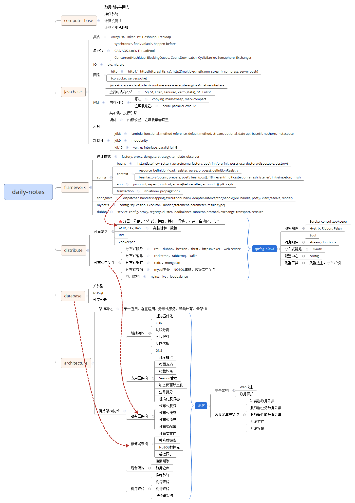
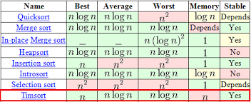

# View Image

this is generated files, just for view image conveniently...

## 10-sort.png

## daily-notes.png

## java.png

## knowledge.png

## kubernetes.png

## sort-time-complexity.png

## url.jpg

