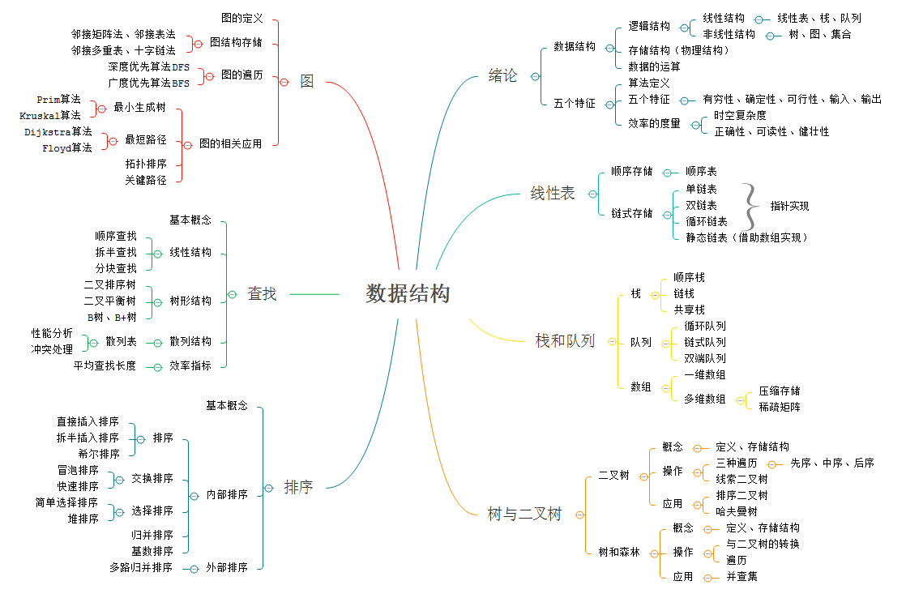
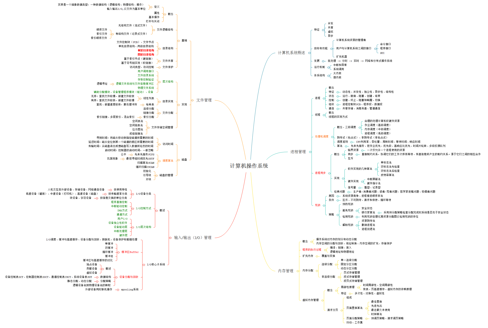
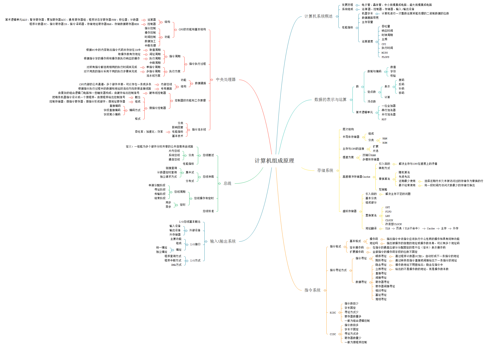
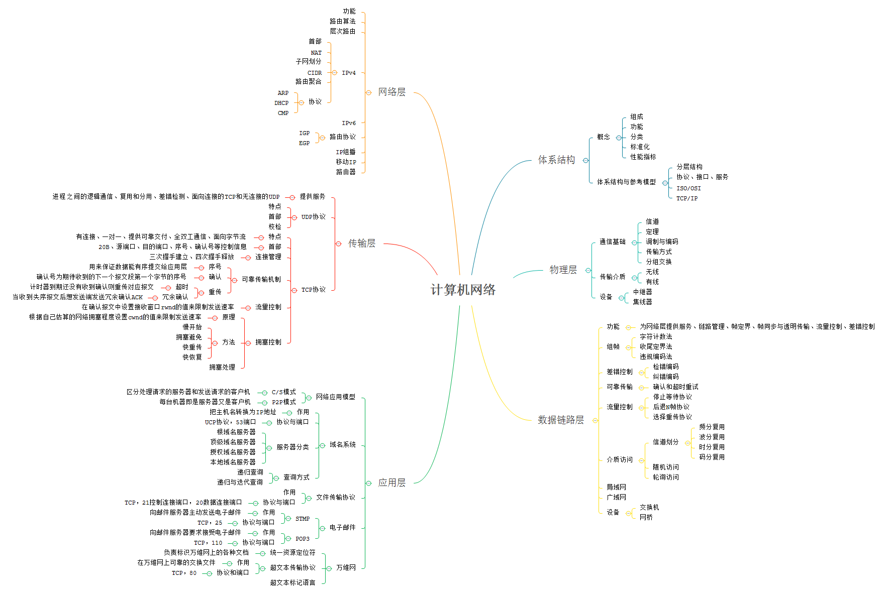

# View Image

this is generated files, just for view image conveniently...

## 10-sort.png

## daily-notes.png

## knowledge.png

## knowledge.rp

## 数据结构.png

## 计算机操作系统.png

## 计算机组成原理.png

## 计算机网络.png

