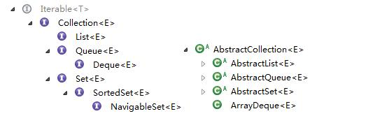
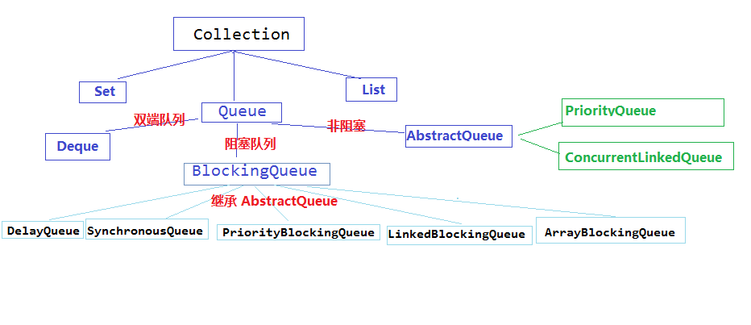

## 集合框架与数据结构
Java集合对应实现了常见的数据结构，如线性表、树形结构、图形结构。

 
* List ArrayList, LinkedList
* Set SortedSet, HashSet, LinkedHashSet, TreeSet
* Queue
* Stack
### List

###  Set
Set集合特点就是没有重复的内容，其实现是通过map的键来实现的
1. HashSet 由HashMap实现
2. LinkedHashSet 由LinkedHashMap实现，LinkedHashMap的特性是其值是有序的，默认是insert顺序
3. TreeSet LinkedHashSet只能按照先后顺序来进行排序，TreeSet则是按照比较器给的比较规则进行从小到大排序。其实现也就是借助于TreeMap
4. EnumSet
3. Queue Queue接口与List、Set同一级别，都是继承了Collection接口。LinkedList实现了Deque接口。
[Java之集合(一)接口及抽象类](http://www.cnblogs.com/lighten/p/7278655.html)   
 

## Queue

