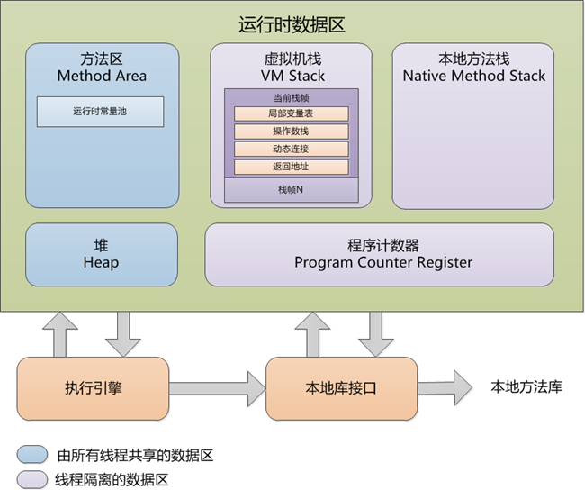
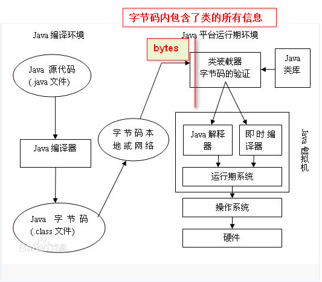
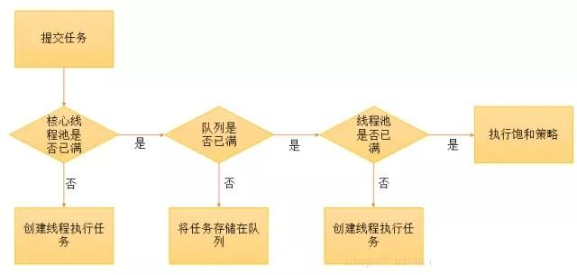
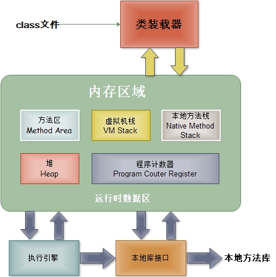
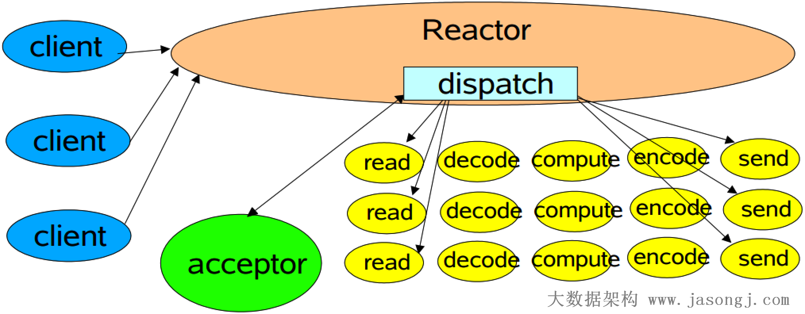
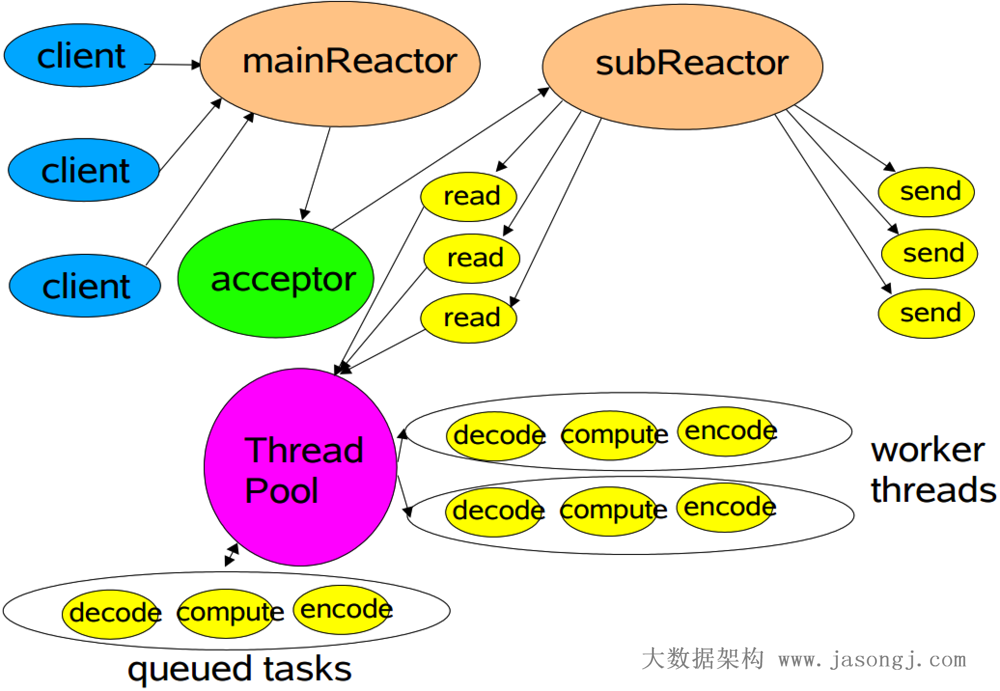
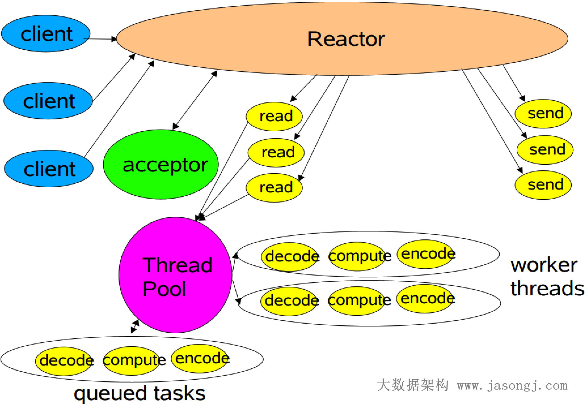
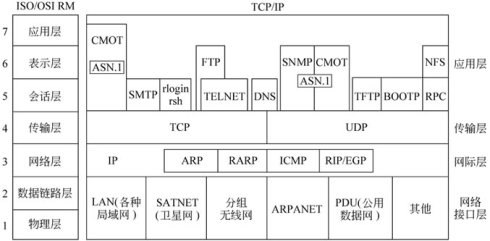

# View Image

this is generated files, just for view image conveniently...

## apache-common-pool.jpg

## java-collecions-interfaces-all.jpg

## java-collecions-interfaces-alt.jpg

## java-collecions-interfaces.png

## java-collections-ConcurrentHashMap-class.jpg

## java-collections-ConcurrentHashMap.jpg

## java-collections-interfaces.jpg

## java-collections-LinkedList.jpg

## java-concurrent-AQS-queue.jpg

## java-concurrent-AQS.jpg

## java-concurrent-countdownlanch.png

## java-concurrent-lock.jpg

## java-memory-runtime.jpg

## java-proxy-bytes.png

## java-proxy-help.png

## java-proxy-invocationhandler-class.jpg

## java-proxy-invocationhandler.jpg

## java-proxy.jpg

## java-queue.png

## java-refection-class.jpg

## java-thread-ScheduleThreadPoolExecutor.jpg

## java-thread-status.jpg

## java-thread-status.png

## java-threadpool.png

## java-threadpoolexecutor-process.jpg

## java-threadpoolexecutor.jpg

## java-throwable.jpg

## java-throwable.png

## java-xml-transform.jpg

## java-xml.jpg

## java.util.concurrent.jpg

## java7-map-ConcurrentHashMap.png

## java7-map-HashMap.png

## java8-map-ConcurrentHashMap.png

## java8-map-HashMap.png

## jvm-architecture.png

## jvm-memory-logic.jpg

## jvm-memory.jpg

## jvm-memory.png

## jvm-sun-jdk-memory-area.png

## jvm.jpg

## LinkedHashMap.png

## nio-classic-reactor.png

## nio-client-reactor-thread-iohandler.jpg

## nio-multi-reactor.png

## nio-multithread-reactor.png

## tcp-ip-all-protocols.jpg

## 观察者模式.jpg

