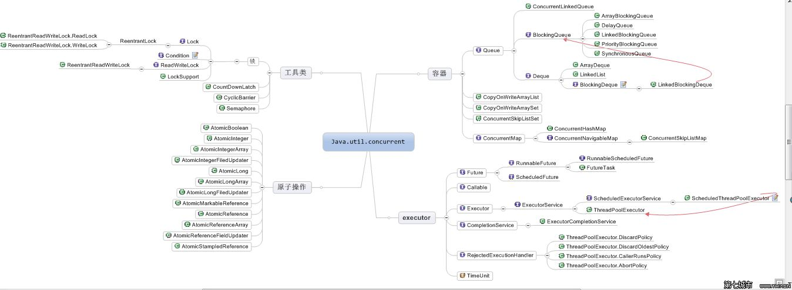

## java.util.concurrent
* 并发容器 Queue Map List
* 并发工具 Lock
* 原子操作
* 线程池

 

## 核心实现
* volatile
* CAS（Compare And Swap/Set）操作，CPU级别的指令

### CPU与缓存
越靠近CPU的缓存越快也越小。所以L1缓存很小但很快(译注：L1表示一级缓存)，并且紧靠着在使用它的CPU内核。
L2大一些，也慢一些，并且仍然只能被一个单独的 CPU 核使用。
L3在现代多核机器中更普遍，仍然更大，更慢，并且被单个插槽上的所有 CPU 核共享。
最后，你拥有一块主存，由全部插槽上的所有 CPU 核共享。

### 缓存行 	Cache line
数据在缓存中不是以独立的项来存储的，如不是一个单独的变量，也不是一个单独的指针。
缓存是由缓存行组成的，通常是64字节（译注：这篇文章发表时常用处理器的缓存行是64字节的，比较旧的处理器缓存行是32字节），并且它有效地引用主内存中的一块地址。
一个Java的long类型是8字节，因此在一个缓存行中可以存8个long类型的变量。

### 缓存行填充 cache line fill
增加补全来确保ring buffer的序列号不会和其他东西同时存在于一个缓存行中

### 内存屏障 Memory Barriers
1. 确保一些特定操作执行的顺序
2. 影响一些数据的可见性(可能是某些指令执行后的结果)

内存屏障另一个作用是强制更新一次不同CPU的缓存。
例如，一个写屏障会把这个屏障前写入的数据刷新到缓存，这样任何试图读取该数据的线程将得到最新值，而不用考虑到底是被哪个cpu核心或者哪颗CPU执行的。

字段是volatile，Java内存模型将在写操作后插入一个写屏障指令，在读操作前插入一个读屏障指令。

内存屏障的确是有开销的——编译器/cpu不能重排序指令，导致不可以尽可能地高效利用CPU，另外刷新缓存亦会有开销。所以不要以为用volatile代替锁操作就一点事都没。

### 伪共享(False Sharing)
缓存系统中是以缓存行（cache line）为单位存储的。缓存行是2的整数幂个连续字节，一般为32-256个字节。最常见的缓存行大小是64个字节。
当多线程修改互相独立的变量时，如果这些变量共享同一个缓存行，就会无意中影响彼此的性能，这就是伪共享。

当多个线程同时修改一个缓存行里面的多个变量时候，由于同时只能有一个线程操作缓存行，所以相比每个变量放到一个缓存行性能会有所下降，这就是伪共享。

### java 对象内存布局
HotSpot虚拟机中，对象在内存中的布局分为三块区域：对象头、实例数据和对齐填充。

对于HotSpot JVM，所有对象都有两个字长的对象头。
第一个字是由24位哈希码和8位标志位（如锁的状态或作为锁对象）组成的Mark Word。
第二个字是对象所属类的引用。如果是数组对象还需要一个额外的字来存储数组的长度。每个对象的起始地址都对齐于8字节以提高性能。

### CAS问题
CAS的缺点有如ABA问题，自旋锁消耗问题、多变量共享一致性问题.
1.ABA：
问题描述：线程t1将它的值从A变为B，再从B变为A。同时有线程t2要将值从A变为C。但CAS检查的时候会发现没有改变，但是实质上它已经发生了改变 。可能会造成数据的缺失。
解决方法：CAS还是类似于乐观锁，同数据乐观锁的方式给它加一个版本号或者时间戳，如AtomicStampedReference

2.自旋消耗资源：
问题描述：多个线程争夺同一个资源时，如果自旋一直不成功，将会一直占用CPU。
解决方法：破坏掉for死循环，当超过一定时间或者一定次数时，return退出。JDK8新增的LongAddr,和ConcurrentHashMap类似的方法。当多个线程竞争时，将粒度变小，将一个变量拆分为多个变量，达到多个线程访问多个资源的效果，最后再调用sum把它合起来。
虽然base和cells都是volatile修饰的，但感觉这个sum操作没有加锁，可能sum的结果不是那么精确。

2.多变量共享一致性问题：
解决方法： CAS操作是针对一个变量的，如果对多个变量操作，
1) 可以加锁来解决。`synchronized`
2) 封装成对象类解决。